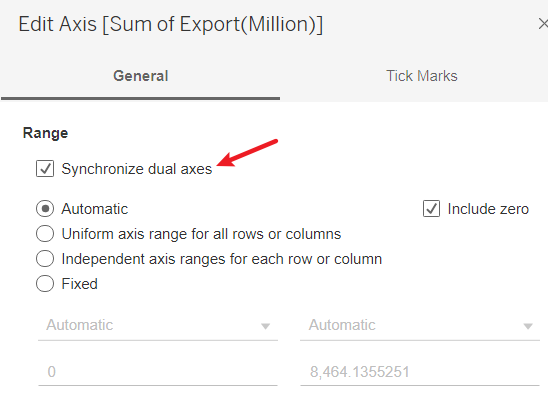

```{r setup, include=FALSE}
knitr::opts_chunk$set(echo = FALSE)
```

# 1. Introduction


This post is part of the submission for ISSS608 DataViz Makeover assignment 1.This data visualisation is created by using data provided by Department of Statistics, Singapore (DOS). The data are available under the sub-section of [**Merchandise Trade by Region/Market**](https://www.singstat.gov.sg/find-data/search-by-theme/trade-and-investment/merchandise-trade/latest-data).

However, this post was not well organized. There are several problems with this data visualization. In the following passage, I will explain the aspects where the post could improve and show how I can visualize this data.


# 2. Critique and suggestion

We were exposing that the correct type of presentation is essential in clarifying the information we need to convey. A good idea should guide the reader to the right conclusion as intended by the author. In addition, visual impairment is an essential role for the speaker and four to a joyful, positive experience concerning vision. It can be in the proper form and location, as well as reducing/eliminating dangerous “junk”.


It's important for the post to be both clear and beautiful. However, the above post does not satisfied with those requirements.

* **CLARITY**

  * The Time Period is not consistent. Some countries are from 2019 to 2021, and some countries just show the year around 2020.

  * The x-axis does not have enough scale. Readers could not tell which part is exactly the year, for example, 2019. It’s not clear.

  * The y-axis of Import and y-axis of Export’s unit of measurement are different. This will mislead readers to the wrong observations.

  * Using area to display leads to the chart quite a mess. Readers could not observe results directly.

* **BEAUTY**

  * The post ranks countries randomly. It’s not beautiful.

  * The length of six counties’ x-axis is not consistent.


  

# 3 Alternative Graphical Representation
Following pic shows the alternative graphical representation proposed for the makeover.


According to the original post of the visualization, the author intends to compare the six countries' import and export relationship between 2019 and 2020.

So, I will correct the mistakes in the original post and choose line chart to visualize the data.


# 4 Data preparation
After downloading the data set(in .xlsx format) from the official site. I opened it with **Microsoft excel software**. This file has 3 sheet pages, Content Page, Import Page, Export Page. Take a look at Import Data and Export Data. There are some irrelevant columns(column 1~5 & columns after 127). So I selected them and deleted.


Then I noticed that the date of Import Data is arranged horizontal. So I copied it and created a new sheet to paste with transform function.


Since I only analysis the year from Jan 2019 to Dec 2020, I selected all time rows except the year between 2019 and 2020, and delete them.

Now your data table should look like this.

Good! The next step is to select all the countries except 6 countries in red color(America, Malaysia, Japan, HongKong, Taiwan, and Mainland China) and delete those countries as well.
p.s. I use red color just to make it easier to distinguish, which means you don't have to do this.

now your data table should look like this.

I noticed that the unit of measurement of these counties are different. Except America, other countries are count in “Thousand Dollar”. So I calculated them in same format. You can use function to calculate and replace the original data.

you date should look like this.

Then, I duplicated the variable(time) column, stacked all countries data and added a new “country” column. After processing, the data should look like the following image’s format.

I did the same thing to the “T2” table(Export Data).

OK, finally I created a new sheet(Name:Total) and brought them(Import and Export data) together into the "Total". **Be noticed: match data with right countries**

Save the processed data.

# 5 visualize data by Tableau
## 5.1 Process date column
Drag and import processed to Tableau. Noticed that I could not simply change "Time" column from character(string) type to date type. So I right click "Time column and choose "split" function.

After split time column you will get 2 new column, "Time - Split 1" shows the year, "Time - Split 2" shows the month. "Time - Split 1" is in number format, however, "Time - Split 2" is in character format which could not be simply changed to number format as well. So again, I right clicked "Time - Split 2" column and created a new calculate field. 

I used the following codes to change the month value into number format.
```{}
IF [Time - Split 2] =="Jan"
    then 1
ELSEIF [Time - Split 2]=="Feb"
    then 2
ELSEIF [Time - Split 2]=="Mar"
    then 3
ELSEIF [Time - Split 2]=="Apr"
    then 4
ELSEIF [Time - Split 2]=="May"
    then 5
ELSEIF [Time - Split 2]=="Jun"
    then 6
ELSEIF [Time - Split 2]=="Jul"
    then 7
ELSEIF [Time - Split 2]=="Aug"
    then 8
ELSEIF [Time - Split 2]=="Sep"
    then 9
ELSEIF [Time - Split 2]=="Oct"
    then 10
ELSEIF [Time - Split 2]=="Nov"
    then 11
ELSEIF [Time - Split 2]=="Dec"
    then 12
ELSE
    0
END
```

Now I get 2 numeric column of year and month. What I need to do is trying to combine them together with calculate function,
Right click any column and create a new calculate field(here I name it "Date") and use following codes to join month and year.
```{}
MAKEDATE([Time - Split 1],[Calculation1],1)
```


## 5.2 Process Import & Export columns

Currently, the import and export column was in character type. So, change Import & Export columns to "Number(decimal)" by right click the type icon on the left up corner.


## 5.3 Visualize date in worksheet
Create a new worksheet. Drag Export & Import columns into rows and change them into continuous and measure by "Sum".


Drag Date column twice into Columns and change one of them into month in continuous type.

Then you need to create two parameter value to separate countries horizontally. It could help chart much more clear and beautiful.

```{}
Column:
(INDEX()-1)%ROUND(SQRT(SIZE()))
Row:
INT((INDEX()-1)/ROUND(SQRT(SIZE())))
```

Drag 2 Calculate field in Columns and Rows separately. Input Country value into "Detail".

Then change the value in "compute using" to "Country" 

Now your chart should lool like following pic.

Do like the next two images, drag Export column to the right side of the chart and let chart to be **dual axis**.


Right click right side y-axis, choose "Synchronize dual axes" in "Edit axis...".


Right click Country in "Detail" and choose "sort" from "Marks-All".

Sort By "Field". Sort Order "Descending". Field Name "Import". Aggregation "Sum".

Right click two side headers and cancel them. This will chart clearer.

Change "Tooltip" and let it much clearer.
```{}
Month of Date:	<MONTH(Date)>
Country:<Country>
Sum of Import(million):	<SUM(Import(million))>
Sum of Export(Million):	<SUM(Export(Million))>
```

Finally, add "Annotate" to show countries and change sheet name. Let readers much easier to observe the result.


# 6 Final Dashboard
[**Link to Tableau Public**](https://public.tableau.com/app/profile/jiayi.wang5053/viz/Book1_16223712999290/MerchandiseTradeofTopSixTradingCountries2019-2020)


# 7 Insights
* China has the highest import amount among six countries even larger than US. And China's trade amount is keep climbing with fluctuations. Although US's import amount ranking second place, its import amount is gradually going down under current trend.

* The import values of China, US, Malaysia and Japan are quite close to those countries 's export values. Those countries' trades are balanced. However, Taiwan and Hong Kong's export value are relatively larger than their import value, which shows Taiwan and Hong Kong mostly do export trades.

* China's export amount(including Taiwan and Hong Kong) are gradually going high. It might be facing overcapacity problems. This also show the economic condition in China  goes well. This trade trend might influence the Currency Exchange Rate in the furture.