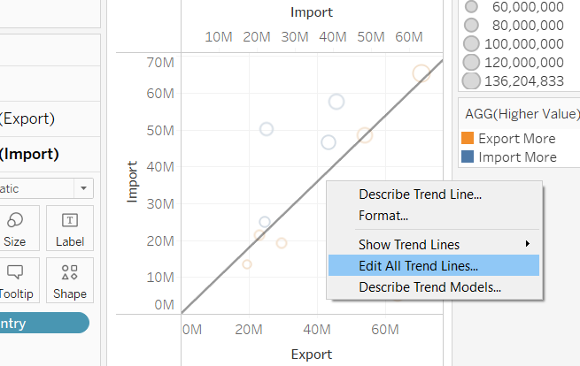

# 1. Introduction
{width=45%} {width=50%}

This post is downloaded from [**Singapore Statistics Official Website**](https://www.singstat.gov.sg/modules/infographics/singapore-international-trade), which is created by using data provided by Department of Statistics, Singapore (DOS). This visualization shows different countries' merchandise trade with Singapore. The data are available under the sub-section of [**Merchandise Trade by Region**](https://www.singstat.gov.sg/find-data/search-by-theme/trade-and-investment/merchandise-trade/latest-data).

However, this post was not well organized. There are several problems with this data visualization. In the following passage, I will explain the aspects where the post could improve and show how I can visualize this data.


# 2. Critique and suggestion
We were exposing that the correct type of presentation is essential in clarifying the information we need to convey. A good idea should guide the reader to the right conclusion as intended by the author. In addition, visual impairment is an essential role for the speaker and four to a joyful, positive experience concerning vision. It can be in the proper form and location, as well as reducing/eliminating dangerous “junk”.


Although the original animation post is easy to show circles when users hover mouse to them, it becomes hard to read when we turn this post into a still image. 

* **CLARITY**

  * **TAG.** The tag of each country makes this post look pretty messy. A part of tags display in an empty area; however, the others are put over the circle. Those tags, which are above rings, make the post difficult to read.
  
  * **VALUE.** This post only shows the sum of import and export value in 2020. The original data also provide the data for each month. Thus, this post does not make good use of the time series of original data, telling the trend of import & export value. And we even could use those trends to predict the following year. 
  
  * **CIRCLE.** All the circles are too large to present clearly. Many countries like Malaysia, the EU, Korea are blocked by other countries like the United States and Japan.
  
* **BEAUTY**

  * **REMEMBER.** I have to admit that the original post looks quite beautiful. And it is far more beautiful. A too colorful graph might make readers tough to remember the result and what each color stands for.
  
  * **BACKGROUND.** It unnecessary to make the background has color.
  

# 3 Alternative Graphical Representation
Following pic shows the alternative graphical representation proposed for the makeover.
Besides improving the original post, I will also take a new graph into the post, showing the time series of different partners with their merchandise trade.
After joining them to the dashboard, I believe the new post will make good use of the original data.


# 4 Data preparation
After downloading the data set(in .xlsx format) from [**the official site**](https://www.singstat.gov.sg/find-data/search-by-theme/trade-and-investment/merchandise-trade/latest-data). I opened it with **Microsoft excel software**. This file has 3 sheet pages, Content Page, Import Page, Export Page. Take a look at Import Data and Export Data. There are some irrelevant columns(columns 1~5 & columns after 127). So after selected them and deleted those columns, I saved it as a new file.


> **This time, ~~instead of using Excel to manipulate cleanning process,~~ I will use Tableau Prep to clean and extract data.**

The whole Prep process would look like the following picture.


First, open Tableau Prep and import the new file which I have processed in Excel. Drag T1 and T2 from the sidebar and put them in the main window. If you have to look at the original file, you would know many columns we don't need. Thus, I need to create a few clean steps to remove them. And this process will speed up following process steps as well.

Select all the columns except the year of 2020 and right click-remove them. I only want data which between 01-01-2020 and 12-01-2020. 

In the column, which contains the country value, click the side icon and choose "Filter"-"Selected Values." I choose 10 countries, the same countries as the original post.

{width=55%} {width=40%}
Then, I use Pivot function to make the date value into a single column. Select all the "2020" values and drag to the middle window.

{width=45%} {width=50%}
Check the Pivot result, change the columns to appropriate names, and type. Do the same thing to another table T2(copy clean step and pivot, paste, and link to T2).  

**Be noticed: T1-Trade Import/T2-Trade Export**

Now your data should look like the following picture.

Great! It's time to join T1 and T2 together. Drag one of the pivot values and put it to the right side of another pivot value. In the settings, I match Country and Date. Noticed there are duplicate columns in the table, I removed those columns as well.

Be cautious, if you take a close look at countries, you will notice that the European Union is in **(Million Dollars)**. I create a new clean step and add new calculate fields to correct Import & Export values. Then, I delete the original wrong data.
{width=70%}

```{}
IF CONTAINS([Country],'Million')
THEN [Import]*1000
ELSE [Import]
END
```
{width=35%} {width=50%}

Pleases correct "Country" column after changing value by Split function. 
Finally, add Output at the end of flow. Change file setting and check data before clicking "Run Flow". And you will get the cleaned data!

{width=60%}  {width=30%}

# 5 visualize data by Tableau

## 5.1 Build Circle Plot
The first target is to build a circle plot. This graph will present different countries' trade performance with Singapore, like how much they trade and which kind of trade has a higher percentage in total merchandise trade.
Create 2 calculate fields to get the total merchandise trade performance and whether Import is greater than Export.

**Higher Value**
```{}
IF SUM([Export])>SUM([Import])
THEN 'Export More'
ELSEIF SUM([Export])<SUM([Import])
THEN 'Import More'
ELSE 'Equal'
END
```

**SumIE**
```{}
SUM([Export])+SUM([Import])
```

After getting those two values, I can drag and drop Import and Export to x, y-axis separately. And put Country in Detail to differentiate each country.


Next, I place the SumIE, which I calculated in Size, and place Higher Value in Color.

In order to let readers differentiate different types conveniently, I will add a diagonal line to separate the table to be two parts. The countries in the circles which belong to the above part are more likely to export their goods to Singapore. This also means Singapore will import much more goods from them than export goods to them. The countries in the circles that belong to the beneath part buy Singapore goods more than export goods to Singapore.
To create this diagonal line, I put Import to columns. Then I remove the Size and color from Import Marks.


After making the Size smaller and change the color, I Dual Axis Import and make the 2 tables become 1. Finally, we could add a Trend Line to those transparent plots. You also could remove Tooltip from Trend Line to make it much more beautiful.
{width=50%} {width=45%}

It suddenly hit me that I could get more information from this graph if I use the Filters function. So I put Time into Filters and make it visible. You also need to change the Time in the Filter into Month-Discrete. After you do this, you can change the filter type to Single Value (Slider). 
{width=60%}

>Using Animations from Format will make the change quite frequent.

{width=70%}

Last but not least, make some changes in:

  * Filter Name
  * Table Title
  * Synchronize Axis
  * Circle Size

To make the post clearer. 

Well done~ Now, your chart should look like the following picture.

{width=70%}

## 5.2 Build Line Plot
In this part, we will create a line graph to observe the volatility of Import and Export values of different countries in 2020.
Please create a new sheet and bring Import and Export value into rows, make them into a dual axis. In the columns, put Time-month.
{width=70%}
Now, this post shows all countries' Import and Export in 2020. Take Time into Filters and make it visible. Then I can display different counties separately by changing the filter.
{width=70%}
Remember to change your title. Your post should look like the following graph.
{width=70%}

## 5.3 Build Box Plot
In order to have a clearer understanding of the overview, I decided to create a box plot to show the result.
I use the in-build function to do this. Create a new sheet and choose box plot from "Show me".


## 5.4 Build Dash Board
To put the above 3 posts together, I build a dashboard to gather them together. You can see this from the following picture.


# 6 Final Dashboard

>[**Link to Tableau Public**](https://public.tableau.com/app/profile/jiayi.wang5053/viz/Book1_16241075361940/Dashboard2)


# 7 Insights
* From the box plot, we could draw a conclusion that Singapore's biggest merchandise trade partner is Mainland China. China is one of the essential merchandise countries in the world. And Singapore has a good trade relationship with China. It is relatively steady of Singapore's import volume from China. However, the export amount fluctuates significantly over 2020. 

{width=45%}

* From the line graph, it is apparently that Singapore is gradually increasing the export volume to China from July. That's the reason why the export value fluctuated a lot in 2020. In the meantime, Hong Kong and Taiwan's performances are pretty interesting. Exports dominate Singapore's trade with Hong Kong. On the other side, imports dominate Singapore's trade with Taiwan. They compensate each other for transaction volume and keep a healthy increase.

{width=45%} {width=45%}

* The circle plot could show the distribution of different countries' trade amounts clearly. If you click the circle or change the filter's time, it will show each country's dominant trade type according to the time. Since Japan and Korea locate next to each other and they have the relatively same size. Let's take a look at them. Japan mainly could be found above the diagonal line, but Korea mostly stays below the line. Besides that, their paths are pretty stable. It shows that theirs trade performances are quite similar, just opposite trade kinds. Singapore import from Japan more and export to Korea more. We could treat them as the same country pattern.


{width=45%} {width=45%}