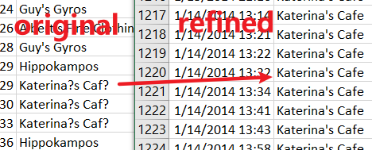
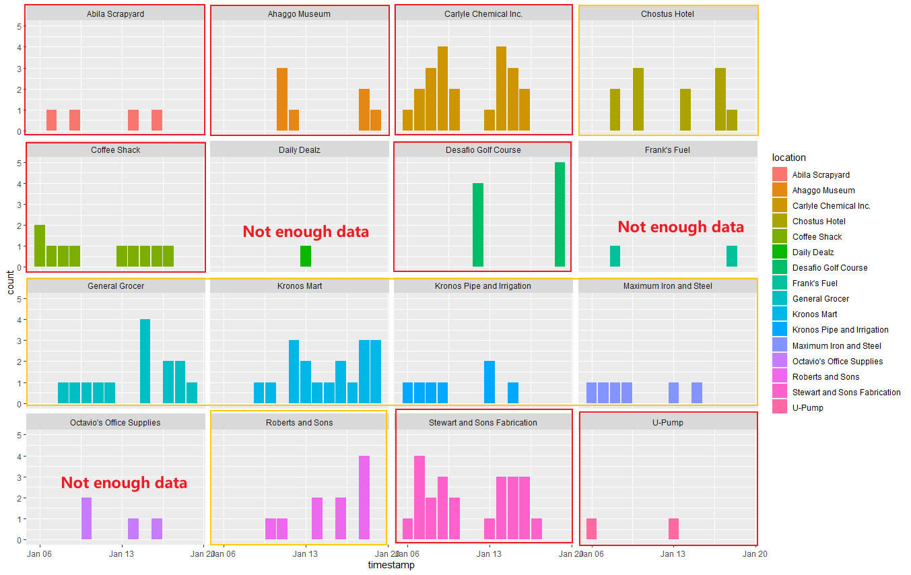
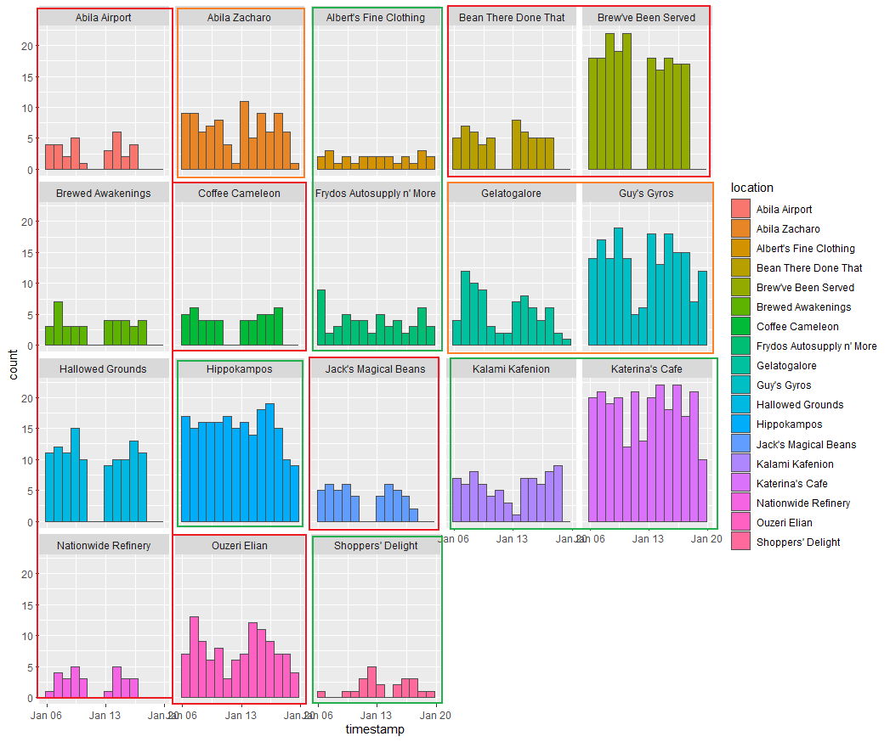
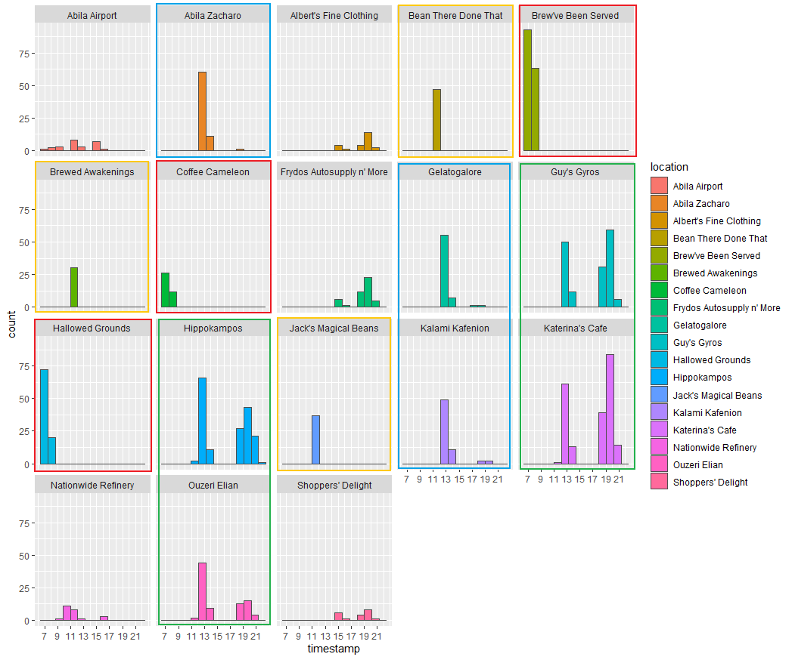
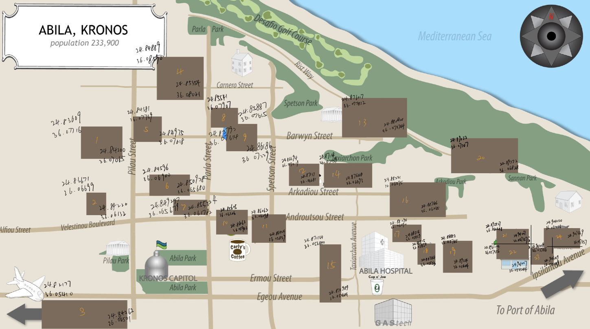
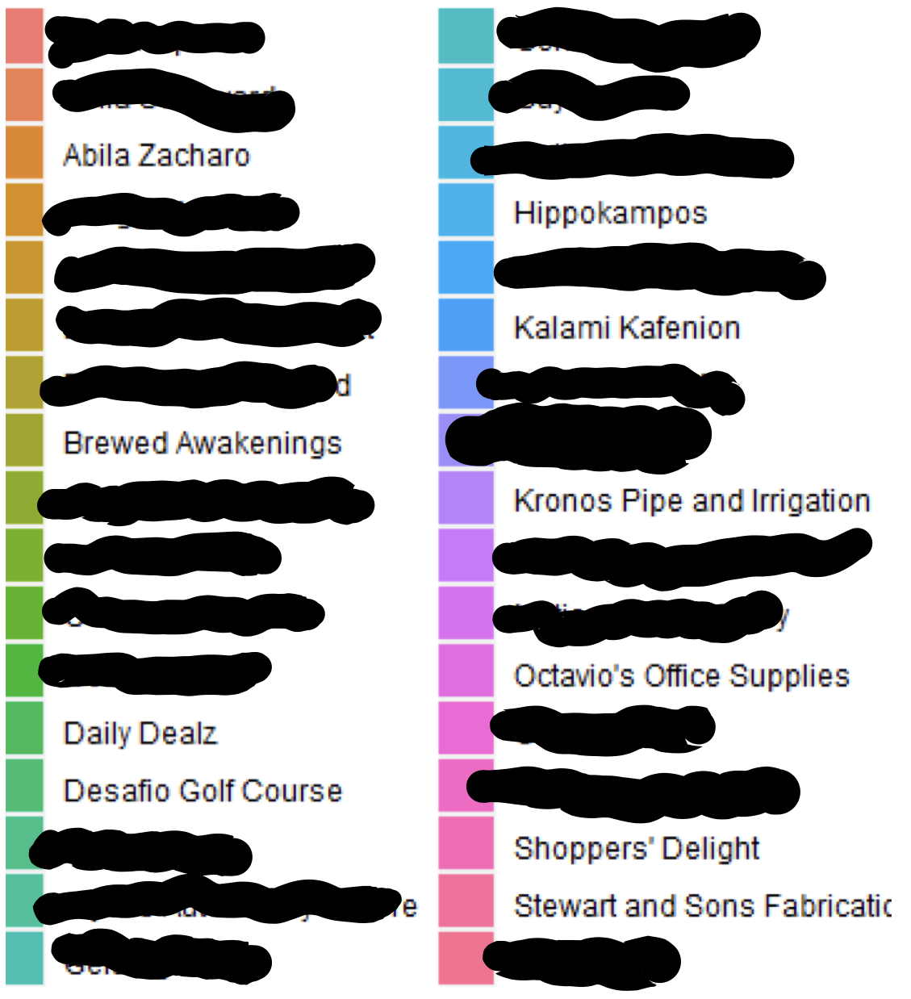

```{r setup,include=FALSE}
options(htmltools.dir.version=FALSE)
knitr::opts_chunk$set(fig.retina=3,#resolution high
                     echo=TRUE,
                     eval=TRUE,
                     message=FALSE,
                     warning=FALSE)
```

# VAST Challenge 2021 Overview


[**The 2021 IEEE VAST Challenge**](https://vast-challenge.github.io/2021/index.html) brings back a classic challenge to see how approaches and techniques have developed since its original release. This year’s challenge will be a variation on a previous year’s challenge, with modified data and new questions.

The VAST Challenge is open to participation by individuals and teams in industry, government, and academia. We encourage your submissions and look forward to seeing your innovative visual analytics approaches.

In order to handle this challenge, [our team]() assigned 3 tasks to each member. In this article, I will explain the methods I used to figure out the reasonable results. 

# Mini-Challenge 2
## Background
{width=30%}

Many of the Abila, Kronos-based employees of GAStech have company cars which are approved for both personal and business use. Those who do not have company cars have the ability to check out company trucks for business use, but these trucks cannot be used for personal business.

Employees with company cars are happy to have these vehicles, because the company cars are generally much higher quality than the cars they would be able to afford otherwise. However, GAStech does not trust their employees. Without the employees? knowledge, GAStech has installed geospatial tracking software in the company vehicles. The vehicles are tracked periodically as long as they are moving.

This vehicle tracking data has been made available to law enforcement to support their investigation. Unfortunately, data is not available for the day the GAStech employees went missing. Data is only available for the two weeks prior to the disappearance.

To promote local businesses, Kronos based companies provide a Kronos Kares benefit card to GASTech employees giving them discounts and rewards in exchange for collecting information about their credit card purchases and preferences as recorded on loyalty cards. This data has been made available to investigators in the hopes that it can help resolve the situation. However, Kronos Kares does not collect personal information beyond purchases.

As a visual analytics expert assisting law enforcement, your mission is to identify which GASTech employees made which purchases and identify suspicious patterns of behavior. You must cope with uncertainties that result from missing, conflicting, and imperfect data to make recommendations for further investigation.

## Tasks and Questions
* **Task 1** Using just the credit and loyalty card data, identify the most popular locations, and when they are popular. What anomalies do you see? What corrections would you recommend to correct these anomalies?
* **Task 2** Add the vehicle data to your analysis of the credit and loyalty card data. How does your assessment of the anomalies in question 1 change based on this new data? What discrepancies between vehicle, credit, and loyalty card data do you find?
* **Task 3** Can you infer the owners of each credit card and loyalty card? What is your evidence? Where are there uncertainties in your method? Where are there uncertainties in the data?
* **Task 4** Given the data sources provided, identify potential informal or unofficial relationships among GASTech personnel. Provide evidence for these relationships.
* **Task 5** Do you see evidence of suspicious activity? Identify 1- 10 locations where you believe the suspicious activity is occurring, and why

# Basic preparation

All data extraction and wrangling are done in R using the tidyverse suite of packages.

## Install and load all necessary packages
Besides the mentioned packages, the following packages are also loaded:

* **DT**: DT provides an R interface to the JavaScript library DataTables.
* **sp**: Provide classes and methods for spatial data; the classes document where the spatial location information resides, for 2D or 3D data.
* **ggiraph**: Create interactive 'ggplot2' graphics using 'htmlwidgets'.
* **ggraph**: ggraph is an extension of the ggplot2 API tailored to graph visualizations and provides the same flexible approach to building up plots layer by layer
* **plyr**: A set of tools that solves a common set of problems
* **sf**: Simple Features for R. Support for simple features, a standardized way to encode spatial vector data
* **spdep**: A collection of functions to create spatial weights matrix objects from polygon 'contiguities', from point patterns by distance and tessellations
* **maptools**: Set of tools for manipulating geographic data
* **raster**: The raster package provides classes and functions to manipulate geographic (spatial) data in 'raster' format
* **tidyverse**: The core tidyverse includes the packages that users’re likely to use in everyday data analyses
* **spatstat**: Fpr spatial Point Pattern Analysis, Model-Fitting, Simulation, Tests
* **tmap**: This package offers a flexible, layer-based, and easy to use approach to create thematic maps
* **clock**: Date-Time Types and Tools. Provides a comprehensive library for date-time manipulations
* **rgdal**: Provides bindings to the 'Geospatial' Data Abstraction Library and access to projection/transformation operations from the 'PROJ' library
* **igraph**: Network Analysis and Visualization. Routines for simple graphs and network analysis
* **visNetwork**: visNetwork is an R package for network visualization, using vis.js javascript library
* **rgeos**: The 'GEOS' library is external to the package, and, when installing the package from source, must be correctly installed first
* **lubridate**: Functions to work with date-times and time-spans
* **tidygraph**: A tidy API for Graph Manipulation

The code chunk below is used to install and load the packages.

```{r echo=TRUE, eval=TRUE,results='hide'}
packages=c('DT','sp','ggiraph','ggraph','plyr','sf','spdep','maptools',
           'raster','tidyverse','spatstat','tmap','clock','rgdal',
           'igraph','visNetwork','rgeos','lubridate','tidygraph')
for (p in packages){
  if(!require(p,character.only=T)){
    install.packages(p)
  }
  library(p,character.only = T)
}
```

## Understand data provided
There are several files that official VAST site provided. 
They are:

File name | content
------------- | -------------
loyalty_data.csv | The file containing loyalty card transaction data
cc_data.csv | The file containing credit and debit card transaction data 
gps.csv | Location tracking data of cars
car-assignments.csv | A list of vehicle assignments by employee
ESRI shapefiles | Provide shapefiles of Abila and Kronos
MC2-Tourist.jpg | A tourist map of Abila with locations of interest identified
{width=50%} {width=45%}

The left graph show the data structure of basic data files. I refined cc_data.csv, loyalty_data.csv, and created cc_data2.csv, loyalty_data2.csv. It show in the right graph. The original data could not be read by R properly for the special characters. After changing the name of "Katerina's Cafe", now R could read and output the result correctly. And the following picture is "MC2-tourist.jpg" which provided to us as Abila Map.


# Task 1
Using just the credit and loyalty card data, identify the most popular locations, and when they are popular. What anomalies do you see? What corrections would you recommend to correct these anomalies?

## Import relevant data

The first step is importing all relevant data which we will use later.

```{r}
loyalty_data=read_csv("data2/loyalty_data2.csv")
loyalty_data$timestamp=date_time_parse(loyalty_data$timestamp,
                                       zone = "",
                                       format="%m/%d/%Y")
cc_data_origin=read_csv("data2/cc_data2.csv")
cc_data_origin$timestamp=date_time_parse(cc_data_origin$timestamp,
                                       zone = "",
                                       format="%m/%d/%Y %H:%M")
cc_data=read_csv("data2/cc_data2.csv")
cc_data$timestamp=date_time_parse(cc_data$timestamp,
                                  zone = "",
                                  format="%m/%d/%Y")
```

Here I import cc_data twice(cc_data_origin, cc_data) because the time formats of loyalty_data and cc_data are different. The loyalty_data's time data only provides month-day-year, while cc_data is more accurate to each second. Thus, I will read cc_data in two ways(1.Month-day-year format to match loyalty data; 2.Month-day-year hour: minute format to match GPS data in the following questions) for better analysis by *date_time_parse()* function.

Next, I use *merge()* function to combine cc_data and loyalty_data together. *merge()* will automatically match the relative columns from two data.frames and links them into one data.frame if you don't specifically select the column's name. 
Here, *merge()* will match **location**(the shop's name when purchase happened), **time**, **price**(the amount clients paid).

```{r}
joined_data=merge(cc_data,loyalty_data,all=TRUE)
glimpse(joined_data)
```
## Overview look

First, let's take an overall look at the joined data set.
This could give us a basic concept of the data content.

```{r fig.show='hide'}
ggplot(data=joined_data, 
       aes(x=timestamp, 
           fill = location)) +
  geom_histogram(bins=14, 
                 color="grey30")
```

```{r}
ggplot(data=joined_data, 
       aes(x=reorder(location,location,
                     function(x)-length(x)))) +
  theme(axis.text.x = element_text(angle = 90, hjust = 1))+
  geom_bar(fill = "grey", alpha = 1)+
  
  geom_text(stat="count", 
            aes(label=paste0(..count..)),
            vjust=-1) +
  ylab("No. of\n purchase") +
  theme(axis.title.y=element_text(angle = 0))

```
From the number of records aspect, the top 5 popular locations are "Katerina's Cafe", "Hippokampos", "Guy's Gyros", "Brewed Awakenings" and "Hallowed Grounds". Their purchase records are apparently greater than others.

The visualization also tell us that the result has too many records to get insights from the graph. The next thing I will do is making some data cleaning steps to make the graph clearer.
I select the records which only have few purchases and display them(Records account for less than around 20% of the total). After analyzing those records with few numbers, I will remove them. Keeping too many different purchase records will make the graph look like a mess.

## Outlier analysis

The analysis will be carried out in 2 ways:

* The first way is analysis records by weekdays. We can use joined_data to do this.
* The second way is by hours. This requirement needs us to use cc_data(only cc_data has values about hour&minute)

### Analysis by weekdays

I am using pipe-filter function to choose the locations with few records. Then I apply "ggplot()" to visualize the result by date and locations.

```{r fig.show='hide'}
strange_joined_data=joined_data %>%
  filter(location %in% c("Stewart and Sons Fabrication",
                         "Carlyle Chemical Inc.","Kronos Mart",
                         "General Grocer","Chostus Hotel",
                         "Coffee Shack","Roberts and Sons",
                         "Desafio Golf Course","Ahaggo Museum",
                         "Kronos Pipe and Irrigation",
                         "Maximum Iron and Steel",
                         "Abila Scrapyard","Octavio's Office Supplies",
                         "Frank's Fuel","U-Pump","Daily Dealz"))

p=ggplot(strange_joined_data, 
       aes(x=timestamp)) +
  geom_bar()
ggplot(strange_joined_data, 
       aes(x=timestamp, 
           fill = location)) +
  geom_bar() +
  facet_wrap(~ location)

```



From the above graph, I divide them into 3 types:

* Could not predict any patterns, like "Daily Dealz", "Frank's Fuel" and "Octavio's Office Supplies". We could not find helpful information since the number of records is too small.

* Normal patterns shops(In orange rectangle). Because the workers from the company go to those shops randomly, the records are distributed in the graph evenly.

> Jan 06 2016 is Monday

{width=40%}

* Shops with particular pattern(In red rectangle). Those shops might be much more prevalent on a specific weekday. For example, "Abila Scrapyard" might get more customers on Tuesday and Thursday. "Ahaggo Museum" is much more popular on Friday and Saturday, this might be caused by the museum just opens on those two days. "Carlyle Chemical Inc.", "Coffee Shack", "Stewart and Sons Fabrication" might be the companies(shops) available on workdays. "Desafio Golf Course" is the place for playing golf. The workers prefer going there on Sunday because the records have an apparent high value only on Sunday and 0 records except for Sunday.

### Analysis by hours

I re-import cc_data and use pipe-filter function again to choose the locations with few records because I need to arrange data by hours. Then I apply "ggplot()" to visualize the result by date and locations. 

```{r}
strange_joined_data=read_csv("data2/cc_data2.csv")
strange_joined_data$timestamp=strsplit(strange_joined_data$timestamp, "[/ :]")
for(n in 1:length(strange_joined_data$timestamp))
  strange_joined_data$timestamp[n]=strange_joined_data$timestamp[[n]][4]
strange_joined_data$timestamp=unlist(strange_joined_data$timestamp)
strange_joined_data$timestamp=as.numeric(strange_joined_data$timestamp)
strange_joined_data=strange_joined_data %>%
  filter(location %in% c("Stewart and Sons Fabrication",
                         "Carlyle Chemical Inc.","Kronos Mart",
                         "General Grocer","Chostus Hotel",
                         "Coffee Shack","Roberts and Sons",
                         "Desafio Golf Course","Ahaggo Museum",
                         "Kronos Pipe and Irrigation",
                         "Maximum Iron and Steel","Abila Scrapyard",
                         "Octavio's Office Supplies",
                         "Frank's Fuel","U-Pump","Daily Dealz"))
ggplot(data=strange_joined_data, 
       aes(x=timestamp, 
           fill = location)) +
  geom_histogram(bins=19,
                 color="grey30")+
  scale_x_continuous(breaks = round(seq(min(strange_joined_data$timestamp), max(strange_joined_data$timestamp), by = 2),1))
```

I observe an **anomaly** from this graph. You could notice that there is 5 records at 3 am in "Kronos Mart". From my point of view, it's strange for workers to visit there at midnight. If we look at "Kronos Mart"'s other records, there are around 8 o'clock. To fix this **anomaly**, I'd prefer to switch records at 3 am to morning. Other records look just normal.

## Main data analysis

The analysis will be carried out in 2 ways:

* The first way is analysis records by weekdays. We can use joined_data to do this.
* The second way is by hours. This requirement needs us to use cc_data(only cc_data has values about hour&minute)

### Analysis by weekdays

This time, I use pipe-filter function but add "subset()" to choose the locations with more records. Then I apply the same "ggplot()" function to visualize the result by date and locations.

```{r fig.show='hide'}
nstrange_joined_data = subset(joined_data,
                     !(location %in% c("Stewart and Sons Fabrication",
                                     "Carlyle Chemical Inc.",
                                     "Kronos Mart","General Grocer",
                                    "Chostus Hotel","Coffee Shack",
                                  "Roberts and Sons","Desafio Golf Course",
                              "Ahaggo Museum","Kronos Pipe and Irrigation",
                                "Maximum Iron and Steel","Abila Scrapyard",
                                 "Octavio's Office Supplies",
                                 "Frank's Fuel","U-Pump","Daily Dealz")))

ggplot(data=nstrange_joined_data, 
       aes(x=timestamp, 
           fill = location)) +
  geom_histogram(bins=14, 
                 color="grey30")+
  facet_wrap(~ location)

```


From this graph, I roughly divided those locations into 3 kinds of regular patterns.

* Locations in red rectangles: The GAStech employees only go there on workdays, from Monday to Friday. Those locations have 0 records on weekends. Most of those shops/companies are cafes which are seen by their names. Stuff might go there to buy food before starting to work or off works at the end of the day. This pattern might also be brought up by the shops/companies that don't open on weekends.

* Locations in orange rectangles: People prefer going there on workdays, but they are also going there on weekends. The number of records on the weekend is obviously less than on workdays.

* Locations in green rectangles: Don't have an obvious pattern. Records distribute evenly.


### Analysis by hours

```{r fig.show='hide'}
nstrange_joined_data=read_csv("data2/cc_data2.csv")
nstrange_joined_data$timestamp=strsplit(nstrange_joined_data$timestamp, "[/ :]")
for(n in 1:length(nstrange_joined_data$timestamp))
  nstrange_joined_data$timestamp[n]=nstrange_joined_data$timestamp[[n]][4]
nstrange_joined_data$timestamp=unlist(nstrange_joined_data$timestamp)
nstrange_joined_data$timestamp=as.numeric(nstrange_joined_data$timestamp)
nstrange_joined_data=subset(nstrange_joined_data,
                     !(location %in% c("Stewart and Sons Fabrication",
                                     "Carlyle Chemical Inc.",
                                     "Kronos Mart","General Grocer",
                                    "Chostus Hotel","Coffee Shack",
                                  "Roberts and Sons","Desafio Golf Course",
                              "Ahaggo Museum","Kronos Pipe and Irrigation",
                                "Maximum Iron and Steel","Abila Scrapyard",
                                 "Octavio's Office Supplies",
                                 "Frank's Fuel","U-Pump","Daily Dealz")))
ggplot(data=nstrange_joined_data, 
       aes(x=timestamp, 
           fill = location)) +
  geom_histogram(bins=14, 
                 color="grey30")+
  facet_wrap(~ location)+
  scale_x_continuous(breaks = round(seq(min(nstrange_joined_data$timestamp), max(nstrange_joined_data$timestamp), by = 2),1))

```




In this analysis, the hour information provides us much more evidence to convenience our previous findings in **Analysis by weekdays**. Like food shops mentioned in the last part, in this graph, the shops in red rectangles, like "Brew've Been Served", which only have records at around 7 o'clock, are like bread shops that only open in the morning workdays. The orange rectangle' shops are more likely restaurants which are only available in the noon. The locations in green rectangles have values both in noon and night. It could be cafes or entertainment places for the staff.
Moreover, the blue rectangles are different from all previous ones. Blue rectangles most accelerate in the afternoon(around 1 pm). They also have a tiny number of records at night. From my point of view, I regard them as working place which GAStech employees need to visit for work because the time allocates at 1 pm which is the moment the staff back to work. Other locations don't have enough records for us to see the pattern. We could conduct analysis in the future if we get more information.

# Task 2

The "gps.csv" only provides us the latitude and longitude, which are difficult to use. Using QGIS software(will mention in Task 5), I could get the range of latitude and longitude about each shop from the graph. Then, we could use the loop function to assign location names to the records if they are within a specific GPS range.

{width=100%}

Anomaly | Graph
------------- | -------------
I found an **anomaly** here. While there are 34 kinds of shops from cc_data and loyalty_data, only 24 shops are showing on the official map, which means there are 10 kinds of records we could not find on the map. Nor could we assign "gps.csv" date with those places' location values. | {width=100%}

```{r}
not_show_data=c("Abila Zacharo",
        "Brewed Awakenings","Daily Dealz","Desafio Golf Course",
        "Hippokampos","Kalami Kafenion","Kronos Pipe and Irrigation",
        "Octavio's Office Supplies","Shoppers' Delight",
        "Stewart and Sons Fabrication")
anomaly_location=cc_data_origin%>%
  filter(cc_data_origin$location %in% not_show_data)
anomaly_location=anomaly_location[c("timestamp","location")]
#Basic setting for gps
gps=read_csv("data2/gps.csv")
names(gps)[names(gps) == 'Timestamp'] = 'timestamp'
#----------------------
gps_temp=gps
gps_temp$timestamp=date_time_parse(gps_temp$timestamp,
                              zone = "",
                              format="%m/%d/%Y %H:%M")
anomaly_location=merge(anomaly_location,gps_temp,all.x=TRUE)
anomaly_location=na.omit(anomaly_location)
```


```{r}
ggplot(anomaly_location,
       aes(y=lat,
           x=location))+
  geom_boxplot()+
  stat_summary(fun = mean, colour="darkred", geom="point", 
               shape=18, size=3, show.legend=FALSE)+
  stat_summary(fun =quantile, colour="red", geom="text", 
               vjust=0, aes(label=round(..y.., digits=6)))

ggplot(anomaly_location,
       aes(y=long,
           x=location))+
  geom_boxplot()+
  stat_summary(fun = mean, colour="darkred", geom="point", 
               shape=18, size=3, show.legend=FALSE)+
  stat_summary(fun =quantile, colour="red", geom="text", 
               vjust=0, aes(label=round(..y.., digits=6)))

```

```{r}
ap=raster("Geospatial/MC2-tourist.tif")

Ablia_st=st_read(dsn="Geospatial",layer="Abila")
anomaly_location$id=as_factor(anomaly_location$id)
glimpse(anomaly_location)
anomaly_sf=st_as_sf(anomaly_location,
                coords = c("long","lat"),
                crs=4326)
anomaly_path=anomaly_sf %>%
  group_by(location) %>%
  summarize(m=mean(timestamp),
            do_union=FALSE) %>%
              st_cast("POINT")
anomaly_path_selected=anomaly_path %>%
  filter(location=="Desafio Golf Course")
#"Abila Zacharo","Brewed Awakenings","Daily Dealz","Desafio Golf Course",
#"Hippokampos","Kalami Kafenion","Kronos Pipe and Irrigation",
#"Octavio's Office Supplies","Shoppers' Delight","Stewart and Sons Fabrication"
tmap_mode("view")
tm_shape(ap)+
  tm_rgb(ap,r=1,g=2,b=3,
         alpha=NA,
         saturation=1,
         interpolate=TRUE,
         max.value=255)+
  tm_shape(anomaly_path_selected)+
  tm_dots()
#+tm_lines()


```


```{r}
#plot
#p=ggplot(gps_guess, 
#       aes(x=long_min,y=lat_max, 
#           fill = location)) +
#  geom_point()
#q=ggplot(gps_guess, 
#       aes(x=long_max,y=lat_min, 
#           fill = location)) 
#
#p+  geom_point() +
#  facet_wrap(~ location)
```

```{r}
#p+  geom_point() +
#  facet_wrap(~ location)
```


gps_location: 

gps_temp$timestamp=date_time_parse(gps_temp$timestamp,
                              zone = "",
                              format="%m/%d/%Y %H:%M")
```{r eval=FALSE,echo=TRUE}
gps=read_csv("gps.csv")
gps_location=gps

gps_location$timestamp=date_time_parse(gps_hm$timestamp,
                              zone = "",
                              format="%m/%d/%Y %H:%M")

gps_hm$id=as_factor(gps_hm$id)
glimpse(gps_hm)
#The following line is just used for checking process step
#Because the "for" loop would take quite a while to run
gps_location$location=1

for (n in 1:length(gps_location$timestamp)){
  if(24.83609<gps_location$long[n]&gps_location$long[n]<24.84200&
     36.07065<gps_location$lat[n]&gps_location$lat[n]<36.07716)
    gps_location$location[n]="Frank's Fuel"
  else if(24.83671<gps_location$long[n]&gps_location$long[n]<24.84220&
          36.06132<gps_location$lat[n]&gps_location$lat[n]<36.06699)
    gps_location$location[n]="Maximum Iron and Steel"
  else if(24.82177<gps_location$long[n]&gps_location$long[n]<24.84262&
          36.04501<gps_location$lat[n]&gps_location$lat[n]<36.05410)
    gps_location$location[n]="Abila Airport"
  else if((24.84889<gps_location$long[n]&gps_location$long[n]<24.85354)&(
          36.08021<gps_location$lat[n]&gps_location$lat[n]<36.08590))
    gps_location$location[n]="Bean There Done That"
  else if(24.84381<gps_location$long[n]&gps_location$long[n]<24.84975&
          36.07218<gps_location$lat[n]&gps_location$lat[n]<36.07739)
    gps_location$location[n]="Abila Scrapyard"
  else if(24.84596<gps_location$long[n]&gps_location$long[n]<24.850978&
          36.065680<gps_location$lat[n]&gps_location$lat[n]<36.06900)
    gps_location$location[n]="Kronos Mart"
  else if(24.849297<gps_location$long[n]&gps_location$long[n]<24.855324&
          36.061782<gps_location$lat[n]&gps_location$lat[n]<36.065679)
    gps_location$location[n]="Roberts and Sons"
  else if(24.85541<gps_location$long[n]&gps_location$long[n]<24.85887&
          36.07615<gps_location$lat[n]&gps_location$lat[n]<36.07907)
    gps_location$location[n]="Albert's Fine Clothing"
  else if(24.85792<gps_location$long[n]&gps_location$long[n]<24.86186&
          36.07229<gps_location$lat[n]&gps_location$lat[n]<36.07614)
    gps_location$location[n]="Coffee Shack"
  else if(24.85605<gps_location$long[n]&gps_location$long[n]<24.86062&
          36.05942<gps_location$lat[n]&gps_location$lat[n]<36.06306)
    gps_location$location[n]="General Grocer"
  else if(24.86063<gps_location$long[n]&gps_location$long[n]<24.86424&
          36.05839<gps_location$lat[n]&gps_location$lat[n]<36.06298)
    gps_location$location[n]="Gelatogalore"
  else if(24.86694<gps_location$long[n]&gps_location$long[n]<24.87137&
          36.06681<gps_location$lat[n]&gps_location$lat[n]<36.07019)
    gps_location$location[n]="U-Pump"
  else if(24.876017<gps_location$long[n]&gps_location$long[n]<24.880820&
          36.073744<gps_location$lat[n]&gps_location$lat[n]<36.077812)
    gps_location$location[n]="Ahaggo Museum"
  else if(24.87138<gps_location$long[n]&gps_location$long[n]<24.87648&
          36.06693<gps_location$lat[n]&gps_location$lat[n]<36.07059)
    gps_location$location[n]="Jack's Magical Beans"
  else if(24.871164<gps_location$long[n]&gps_location$long[n]<24.873989&
          36.050644<gps_location$lat[n]&gps_location$lat[n]<36.056840)
    gps_location$location[n]="Ouzeri Elian"
  else if(24.88231<gps_location$long[n]&gps_location$long[n]<24.88746&
          36.06265<gps_location$lat[n]&gps_location$lat[n]<36.06575)
    gps_location$location[n]="Hallowed Grounds"
  else if(24.88094<gps_location$long[n]&gps_location$long[n]<24.88514&
          36.05859<gps_location$lat[n]&gps_location$lat[n]<36.06090)
    gps_location$location[n]="Carlyle Chemical Inc."
  else if(24.88515<gps_location$long[n]&gps_location$long[n]<24.88764&
          36.05533<gps_location$lat[n]&gps_location$lat[n]<36.05858)
    gps_location$location[n]="Nationwide Refinery"
  else if(24.88852<gps_location$long[n]&gps_location$long[n]<24.89234&
          36.05404<gps_location$lat[n]&gps_location$lat[n]<36.05765)
    gps_location$location[n]="Coffee Cameleon"
  else if(24.89022<gps_location$long[n]&gps_location$long[n]<24.89772&
          36.06828<gps_location$lat[n]&gps_location$lat[n]<36.07207)
    gps_location$location[n]="Chostus Hotel"
  else if(24.895537<gps_location$long[n]&gps_location$long[n]<24.901007&
          36.057357<gps_location$lat[n]&gps_location$lat[n]<36.060688)
    gps_location$location[n]="Guy's Gyros"
  else if(24.896204<gps_location$long[n]&gps_location$long[n]<24.901007&
          36.054244<gps_location$lat[n]&gps_location$lat[n]<36.057356)
    gps_location$location[n]="Katerina's Cafe"
  else if(24.901008<gps_location$long[n]&gps_location$long[n]<24.904149&
          36.055189<gps_location$lat[n]&gps_location$lat[n]<36.057356)
    gps_location$location[n]="Brew've Been Served"
  else if(24.904150<gps_location$long[n]&gps_location$long[n]<24.907669&
          36.057357<gps_location$lat[n]&gps_location$lat[n]<36.061026)
    gps_location$location[n]="Frydos Autosupply n' More"
  else
    gps_location$location[n]=NA
  
}

```
> In order to save the running time, I have exported the above result as "gps_location.csv". You could just import "gps_location.csv" and use for following process.

```{r}
gps_hm=read_csv("data2/gps_hm.csv")
gps=read_csv("data2/gps.csv")
glimpse(gps_hm)
```


# Task 3

```{r}

ndt_in_last4=function(n){
  return(length(which(dictionary$card_num == joined_data[[4]][n]))>0)
}     
ndt_in_loyal=function(n){
  return(length(which(dictionary$loyalty_num == joined_data[[5]][n]))>0)
}
```
