```{r setup,include=FALSE}
options(htmltools.dir.version=FALSE)
knitr::opts_chunk$set(fig.retina=3,#resolution high
                     echo=TRUE,
                     eval=TRUE,
                     message=FALSE,
                     warning=FALSE)
```

# VAST Challenge 2021 Overview


[**The 2021 IEEE VAST Challenge**](https://vast-challenge.github.io/2021/index.html) brings back a classic challenge to see how approaches and techniques have developed since its original release. This year’s challenge will be a variation on a previous year’s challenge, with modified data and new questions.

The VAST Challenge is open to participation by individuals and teams in industry, government, and academia. We encourage your submissions and look forward to seeing your innovative visual analytics approaches.

In order to handle this challenge, [our team]() assigned 3 tasks to each member. In this article, I will explain the methods I used to figure out the reasonable results. 

# Mini-Challenge 2
## Background
{width=30%}

Many of the Abila, Kronos-based employees of GAStech have company cars which are approved for both personal and business use. Those who do not have company cars have the ability to check out company trucks for business use, but these trucks cannot be used for personal business.

Employees with company cars are happy to have these vehicles, because the company cars are generally much higher quality than the cars they would be able to afford otherwise. However, GAStech does not trust their employees. Without the employees? knowledge, GAStech has installed geospatial tracking software in the company vehicles. The vehicles are tracked periodically as long as they are moving.

This vehicle tracking data has been made available to law enforcement to support their investigation. Unfortunately, data is not available for the day the GAStech employees went missing. Data is only available for the two weeks prior to the disappearance.

To promote local businesses, Kronos based companies provide a Kronos Kares benefit card to GASTech employees giving them discounts and rewards in exchange for collecting information about their credit card purchases and preferences as recorded on loyalty cards. This data has been made available to investigators in the hopes that it can help resolve the situation. However, Kronos Kares does not collect personal information beyond purchases.

As a visual analytics expert assisting law enforcement, your mission is to identify which GASTech employees made which purchases and identify suspicious patterns of behavior. You must cope with uncertainties that result from missing, conflicting, and imperfect data to make recommendations for further investigation.

## Tasks and Questions
* **Task 1** Using just the credit and loyalty card data, identify the most popular locations, and when they are popular. What anomalies do you see? What corrections would you recommend to correct these anomalies?
* **Task 2** Add the vehicle data to your analysis of the credit and loyalty card data. How does your assessment of the anomalies in question 1 change based on this new data? What discrepancies between vehicle, credit, and loyalty card data do you find?
* **Task 3** Can you infer the owners of each credit card and loyalty card? What is your evidence? Where are there uncertainties in your method? Where are there uncertainties in the data?
* **Task 4** Given the data sources provided, identify potential informal or unofficial relationships among GASTech personnel. Provide evidence for these relationships.
* **Task 5** Do you see evidence of suspicious activity? Identify 1- 10 locations where you believe the suspicious activity is occurring, and why?

# Basic preparation

## Literature review
In this project, all data extraction and wrangling are done in R using the tidyverse suite of packages. Basing on several data files the official site provided, I will use different functions, like *link()*, *merge()* and formulas coded by myself, to visualize data and find the invisible information under the numbers. 

## Install and load all necessary packages
Besides the mentioned packages, the following packages are also loaded:

* **DT**: DT provides an R interface to the JavaScript library DataTables.
* **sp**: Provide classes and methods for spatial data; the classes document where the spatial location information resides, for 2D or 3D data.
* **ggiraph**: Create interactive 'ggplot2' graphics using 'htmlwidgets'.
* **ggraph**: ggraph is an extension of the ggplot2 API tailored to graph visualizations and provides the same flexible approach to building up plots layer by layer
* **plyr**: A set of tools that solves a common set of problems
* **sf**: Simple Features for R. Support for simple features, a standardized way to encode spatial vector data
* **spdep**: A collection of functions to create spatial weights matrix objects from polygon 'contiguities', from point patterns by distance and tessellations
* **maptools**: Set of tools for manipulating geographic data
* **raster**: The raster package provides classes and functions to manipulate geographic (spatial) data in 'raster' format
* **tidyverse**: The core tidyverse includes the packages that users’re likely to use in everyday data analyses
* **spatstat**: Fpr spatial Point Pattern Analysis, Model-Fitting, Simulation, Tests
* **tmap**: This package offers a flexible, layer-based, and easy to use approach to create thematic maps
* **clock**: Date-Time Types and Tools. Provides a comprehensive library for date-time manipulations
* **rgdal**: Provides bindings to the 'Geospatial' Data Abstraction Library and access to projection/transformation operations from the 'PROJ' library
* **igraph**: Network Analysis and Visualization. Routines for simple graphs and network analysis
* **visNetwork**: visNetwork is an R package for network visualization, using vis.js javascript library
* **rgeos**: The 'GEOS' library is external to the package, and, when installing the package from source, must be correctly installed first
* **lubridate**: Functions to work with date-times and time-spans
* **tidygraph**: A tidy API for Graph Manipulation

The code chunk below is used to install and load the packages.

```{r echo=TRUE, eval=TRUE,results='hide'}
packages=c('DT','sp','ggiraph','ggraph','plyr','sf','spdep','maptools',
           'raster','tidyverse','spatstat','tmap','clock','rgdal',
           'igraph','visNetwork','rgeos','lubridate','tidygraph')
for (p in packages){
  if(!require(p,character.only=T)){
    install.packages(p)
  }
  library(p,character.only = T)
}
```

## Understand data provided
There are several files that official VAST site provided. 
They are:

File name | content
------------- | -------------
loyalty_data.csv | The file containing loyalty card transaction data
cc_data.csv | The file containing credit and debit card transaction data 
gps.csv | Location tracking data of cars
car-assignments.csv | A list of vehicle assignments by employee
ESRI shapefiles | Provide shapefiles of Abila and Kronos
MC2-Tourist.jpg | A tourist map of Abila with locations of interest identified
{width=50%} {width=45%}

The left graph show the data structure of basic data files. I refined cc_data.csv, loyalty_data.csv, and created cc_data2.csv, loyalty_data2.csv. It show in the right graph. The original data could not be read by R properly for the special characters. After changing the name of "Katerina's Cafe", now R could read and output the result correctly. And the following picture is "MC2-tourist.jpg" which provided to us as Abila Map.


# Task 1
Using just the credit and loyalty card data, identify the most popular locations, and when they are popular. What anomalies do you see? What corrections would you recommend to correct these anomalies?

## Import relevant data

The first step is importing all relevant data which we will use later.

```{r}
loyalty_data=read_csv("data2/loyalty_data2.csv")
loyalty_data$timestamp=date_time_parse(loyalty_data$timestamp,
                                       zone = "",
                                       format="%m/%d/%Y")
cc_data_origin=read_csv("data2/cc_data2.csv")
cc_data_hm=cc_data_origin
cc_data_hm$timestamp=date_time_parse(cc_data_hm$timestamp,
                                       zone = "",
                                       format="%m/%d/%Y %H:%M")
cc_data_mdy=cc_data_origin
cc_data_mdy$timestamp=date_time_parse(cc_data_mdy$timestamp,
                                  zone = "",
                                  format="%m/%d/%Y")
```

Here I import cc_data and change its format because the time formats of loyalty_data and cc_data are different. The loyalty_data's time data only provides month-day-year, while cc_data is more accurate to each second. Thus, I will read cc_data in two ways(1.Month-day-year format to match loyalty data; 2.Month-day-year hour: minute format to match GPS data in the following questions) for better analysis by *date_time_parse()* function.

Next, I use *merge()* function to combine cc_data and loyalty_data together. *merge()* will automatically match the relative columns from two data.frames and links them into one data.frame if you don't specifically select the column's name. 
Here, *merge()* will match **location**(the shop's name when purchase happened), **time**, **price**(the amount clients paid).

```{r}
joined_data=merge(cc_data_mdy,loyalty_data,all=TRUE)
glimpse(joined_data)
```

## Overview look

First, let's take an overall look at the joined data set.
This could give us a basic concept of the data content.

```{r}
ggplot(data=joined_data, 
       aes(x=timestamp, 
           fill = location)) +
  geom_histogram(bins=14, 
                 color="grey30")
```

```{r}
ggplot(data=joined_data, 
       aes(x=reorder(location,location,
                     function(x)-length(x)))) +
  theme(axis.text.x = element_text(angle = 90, hjust = 1))+
  geom_bar(fill = "grey", alpha = 1)+
  
  geom_text(stat="count", 
            aes(label=paste0(..count..)),
            vjust=-1) +
  ylab("No. of\n purchase") +
  theme(axis.title.y=element_text(angle = 0))

```
From the number of records aspect, the top 5 popular locations are "Katerina's Cafe", "Hippokampos", "Guy's Gyros", "Brewed Awakenings" and "Hallowed Grounds". Their purchase records are apparently greater than others.

The visualization also tell us that the result has too many records to get insights from the graph. The next thing I will do is making some data cleaning steps to make the graph clearer.
I select the records which only have few purchases and display them(Records account for less than around 20% of the total). After analyzing those records with few numbers, I will remove them. Keeping too many different purchase records will make the graph look like a mess.

## Outlier analysis

The analysis will be carried out in 2 ways:

* The first way is analysis records by weekdays. We can use joined_data to do this.
* The second way is by hours. This requirement needs us to use cc_data(only cc_data has values about hour&minute)

### Analysis by weekdays

I am using pipe-filter function to choose the locations with few records. Then I apply *ggplot()* to visualize the result by date and locations.

```{r fig.show='hide'}
strange_joined_data=joined_data %>%
  filter(location %in% c("Stewart and Sons Fabrication",
                         "Carlyle Chemical Inc.","Kronos Mart",
                         "General Grocer","Chostus Hotel",
                         "Coffee Shack","Roberts and Sons",
                         "Desafio Golf Course","Ahaggo Museum",
                         "Kronos Pipe and Irrigation",
                         "Maximum Iron and Steel",
                         "Abila Scrapyard","Octavio's Office Supplies",
                         "Frank's Fuel","U-Pump","Daily Dealz"))

p=ggplot(strange_joined_data, 
       aes(x=timestamp)) +
  geom_bar()
ggplot(strange_joined_data, 
       aes(x=timestamp, 
           fill = location)) +
  geom_bar() +
  facet_wrap(~ location)

```


From the above graph, I divide them into 3 types:

* Could not predict any patterns, like "Daily Dealz", "Frank's Fuel" and "Octavio's Office Supplies". We could not find helpful information since the number of records is too small.

* Normal patterns shops(In orange rectangle). Because the workers from the company go to those shops randomly, the records are distributed in the graph evenly.

> Jan 06 2016 is Monday

{width=40%}

* Shops with particular pattern(In red rectangle). Those shops might be much more prevalent on a specific weekday. For example, "Abila Scrapyard" might get more customers on Tuesday and Thursday. "Ahaggo Museum" is much more popular on Friday and Saturday, this might be caused by the museum just opens on those two days. "Carlyle Chemical Inc.", "Coffee Shack", "Stewart and Sons Fabrication" might be the companies(shops) available on workdays. "Desafio Golf Course" is the place for playing golf. The workers prefer going there on Sunday because the records have an apparent high value only on Sunday and 0 records except for Sunday.

### Analysis by hours

I re-import cc_data and use pipe-filter function again to choose the locations with few records because I need to arrange data by hours. Then I apply *ggplot()* to visualize the result by date and locations. 

```{r}
strange_joined_data=read_csv("data2/cc_data2.csv")
strange_joined_data$timestamp=strsplit(strange_joined_data$timestamp, "[/ :]")
for(n in 1:length(strange_joined_data$timestamp))
  strange_joined_data$timestamp[n]=strange_joined_data$timestamp[[n]][4]
strange_joined_data$timestamp=unlist(strange_joined_data$timestamp)
strange_joined_data$timestamp=as.numeric(strange_joined_data$timestamp)
strange_joined_data=strange_joined_data %>%
  filter(location %in% c("Stewart and Sons Fabrication",
                         "Carlyle Chemical Inc.","Kronos Mart",
                         "General Grocer","Chostus Hotel",
                         "Coffee Shack","Roberts and Sons",
                         "Desafio Golf Course","Ahaggo Museum",
                         "Kronos Pipe and Irrigation",
                         "Maximum Iron and Steel","Abila Scrapyard",
                         "Octavio's Office Supplies",
                         "Frank's Fuel","U-Pump","Daily Dealz"))
ggplot(data=strange_joined_data, 
       aes(x=timestamp, 
           fill = location)) +
  geom_histogram(bins=19,
                 color="grey30")+
  scale_x_continuous(breaks = round(seq(min(strange_joined_data$timestamp), max(strange_joined_data$timestamp), by = 2),1))
```

I observe an **anomaly** from this graph. You could notice that there is 5 records at 3 am in "Kronos Mart". From my point of view, it's strange for workers to visit there at midnight. If we look at "Kronos Mart"'s other records, there are around 8 o'clock. To fix this **anomaly**, I'd prefer to switch records at 3 am to morning. Other records look just normal.

## Main data analysis

The analysis will be carried out in 2 ways:

* The first way is analysis records by weekdays. We can use joined_data to do this.
* The second way is by hours. This requirement needs us to use cc_data(only cc_data has values about hour&minute)

### Analysis by weekdays

This time, I use pipe-filter function but add *subset()* to choose the locations with more records. Then I apply the same *ggplot()* function to visualize the result by date and locations.

```{r fig.show='hide'}
nstrange_joined_data = subset(joined_data,
                     !(location %in% c("Stewart and Sons Fabrication",
                                     "Carlyle Chemical Inc.",
                                     "Kronos Mart","General Grocer",
                                    "Chostus Hotel","Coffee Shack",
                                  "Roberts and Sons","Desafio Golf Course",
                              "Ahaggo Museum","Kronos Pipe and Irrigation",
                                "Maximum Iron and Steel","Abila Scrapyard",
                                 "Octavio's Office Supplies",
                                 "Frank's Fuel","U-Pump","Daily Dealz")))

ggplot(data=nstrange_joined_data, 
       aes(x=timestamp, 
           fill = location)) +
  geom_histogram(bins=14, 
                 color="grey30")+
  facet_wrap(~ location)

```


From this graph, I roughly divided those locations into 3 kinds of regular patterns.

* Locations in red rectangles: The GAStech employees only go there on workdays, from Monday to Friday. Those locations have 0 records on weekends. Most of those shops/companies are cafes which are seen by their names. Stuff might go there to buy food before starting to work or off works at the end of the day. This pattern might also be brought up by the shops/companies that don't open on weekends.

* Locations in orange rectangles: People prefer going there on workdays, but they are also going there on weekends. The number of records on the weekend is obviously less than on workdays.

* Locations in green rectangles: Don't have an obvious pattern. Records distribute evenly.


### Analysis by hours

```{r fig.show='hide'}
nstrange_joined_data=read_csv("data2/cc_data2.csv")
nstrange_joined_data$timestamp=strsplit(nstrange_joined_data$timestamp, "[/ :]")
for(n in 1:length(nstrange_joined_data$timestamp))
  nstrange_joined_data$timestamp[n]=nstrange_joined_data$timestamp[[n]][4]
nstrange_joined_data$timestamp=unlist(nstrange_joined_data$timestamp)
nstrange_joined_data$timestamp=as.numeric(nstrange_joined_data$timestamp)
nstrange_joined_data=subset(nstrange_joined_data,
                     !(location %in% c("Stewart and Sons Fabrication",
                                     "Carlyle Chemical Inc.",
                                     "Kronos Mart","General Grocer",
                                    "Chostus Hotel","Coffee Shack",
                                  "Roberts and Sons","Desafio Golf Course",
                              "Ahaggo Museum","Kronos Pipe and Irrigation",
                                "Maximum Iron and Steel","Abila Scrapyard",
                                 "Octavio's Office Supplies",
                                 "Frank's Fuel","U-Pump","Daily Dealz")))
ggplot(data=nstrange_joined_data, 
       aes(x=timestamp, 
           fill = location)) +
  geom_histogram(bins=14, 
                 color="grey30")+
  facet_wrap(~ location)+
  scale_x_continuous(breaks = round(seq(min(nstrange_joined_data$timestamp), max(nstrange_joined_data$timestamp), by = 2),1))

```


In this analysis, the hour information provides us much more evidence to convenience our previous findings in **Analysis by weekdays**. Like food shops mentioned in the last part, in this graph, the shops in red rectangles, like "Brew've Been Served", which only have records at around 7 o'clock, are like bread shops that only open in the morning workdays. The orange rectangle' shops are more likely restaurants which are only available in the noon. The locations in green rectangles have values both in noon and night. It could be cafes or entertainment places for the staff.
Moreover, the blue rectangles are different from all previous ones. Blue rectangles most accelerate in the afternoon(around 1 pm). They also have a tiny number of records at night. From my point of view, I regard them as working place which GAStech employees need to visit for work because the time allocates at 1 pm which is the moment the staff back to work. Other locations don't have enough records for us to see the pattern. We could conduct analysis in the future if we get more information.

## Conclusion
By using credit and loyalty card data, the top 3 popular locations are "Katerina's Cafe", "Hippokampos" and "Guy's Gyros" which have quite several records around 12 pm and 7 pm alL the week. Depend on those patterns, and I suppose those shops are cafes/restaurants where GAStech employees would go there for lunch and supper. "Brew've Been Served" and "Hallowed Grounds", which only have records in the morning, are also popular shops among GAStech staff. Those two shops mainly provide breakfast or sell bread to customers who need to wake up to work in the morning for their records all happened in the workday(Monday to Friday). And the records also show that their products sell pretty well.

However, I also spot an anomaly. That there are 5 records at 3 am in "Kronos Mart". Personally speaking, it's strange for GAStech workers to visit there at midnight. Other records of "Kronos Mart" are more likely to happen around 8 o'clock. To fix this anomaly, I'd prefer to move records from 3 am to morning since there is no more information.

# Task 2

The "gps.csv" only provides us the latitude and longitude data, which means it could not tell us where the records happened in "gps.csv". The official site provided us Abila map and Abila geo shapefile. However, the graph does not have any geo information, which makes the analysis difficult to visualize. In order to solve this problem. By using QGIS software, I could create a tif file to combine the above 2 data together. Furthermore, the tif file could let us get any point's latitude and longitude from the graph. Then, we could use the loop function to assign records with location names if they are within a specific GPS range.

## QGIS: Create tif file

In this session, I will explain how I combine shapefile and map picture to get the tif file. I have already provided the tif file under Geospatial folder. You also could create on your own tif file with the help of this part.

1. Open QGIS software and create a new file.

{width=100%}

2. Select *Add Layer* in the submenu of *Layer* under the menu bar. Choose *Add Vector Layer*

3. In the *Source*, choose **Abila.shp** file which locates under our Geospatial folder. Then, click *Add* and close the window when you successfully import data.

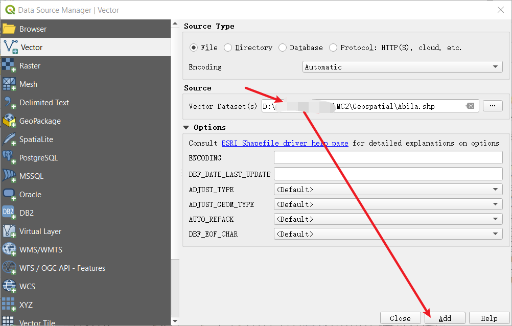{width=100%}

4. Then select *Georeferencer* in the submenu of *Raster* under the menu bar. Select the **MC2-tourist.jpg** which under the same Geospatial folder.

{width=100%}
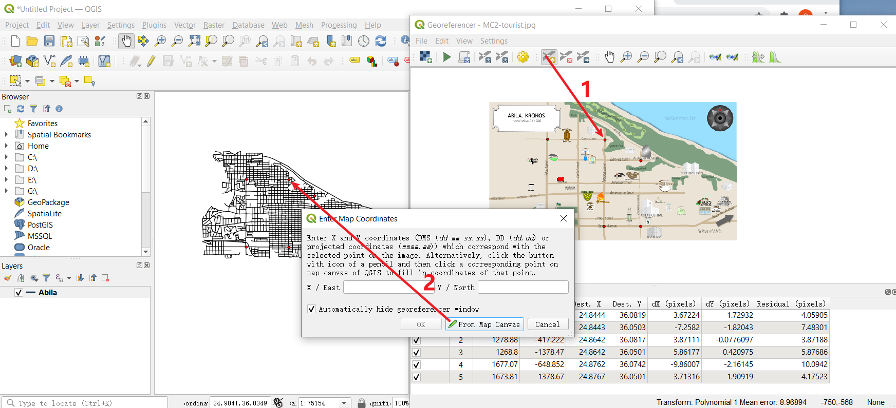{width=100%}

5. You could see two windows here. The left is the data we import from Abila shapefile, and the right is the Abila map. To match their records, you need to find the same Geographical point from both windows. 

6. Choose *Add point*, select that point from the map. Then click *From map canvas* to choose matched point in the left window. You could repeat this step several times(here, I use 6 points to match them) to let the output file more accurately.

7. When you finish this repeat steps. Choose *Transformation Settings* and select the settings as showed in the right picture.

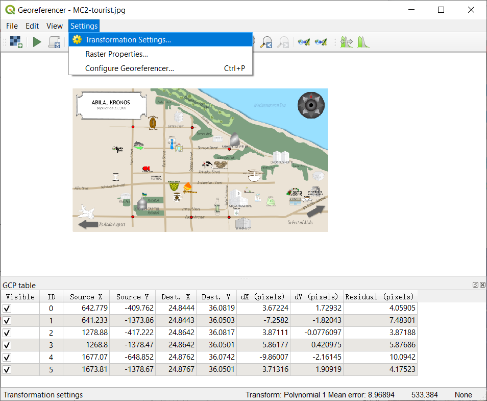{width=55%} 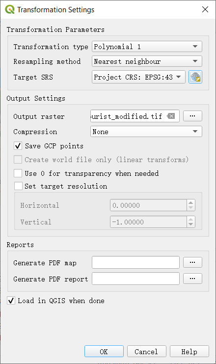{width=40%}

8. Finally, please run the *Start Georeferencing*. The tif will be created under the same folder(Here, Geospatial folder) when the process finishes. Now, you could close this and back to the main window. If you bring Abila layer to the front, you will see the two files have already matched pretty well.

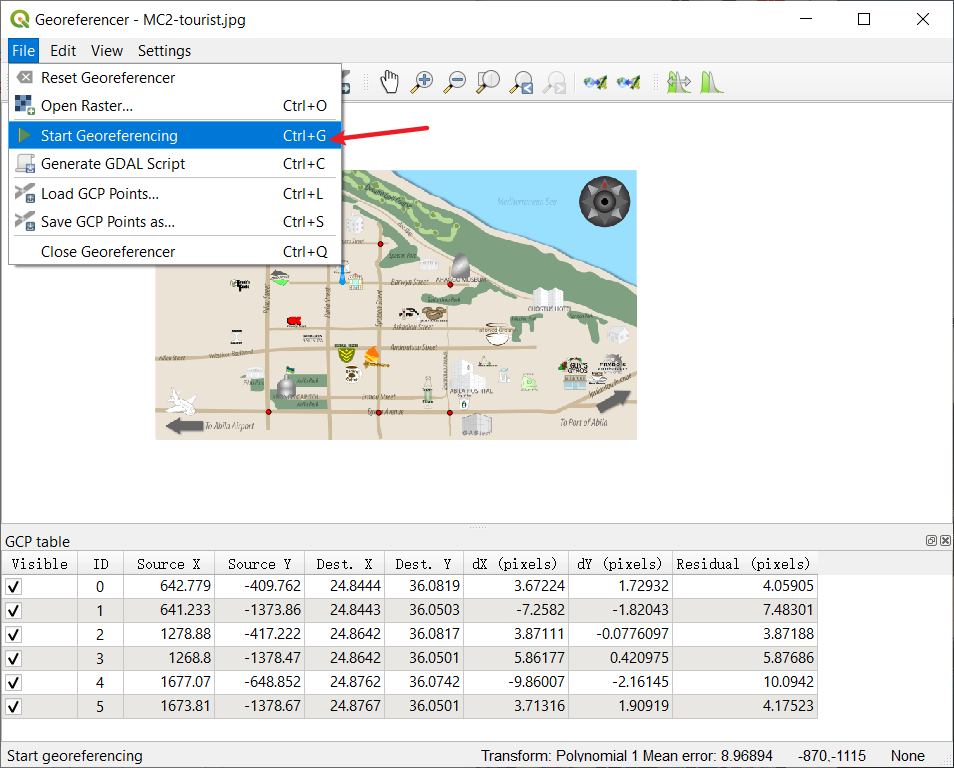{width=100%}
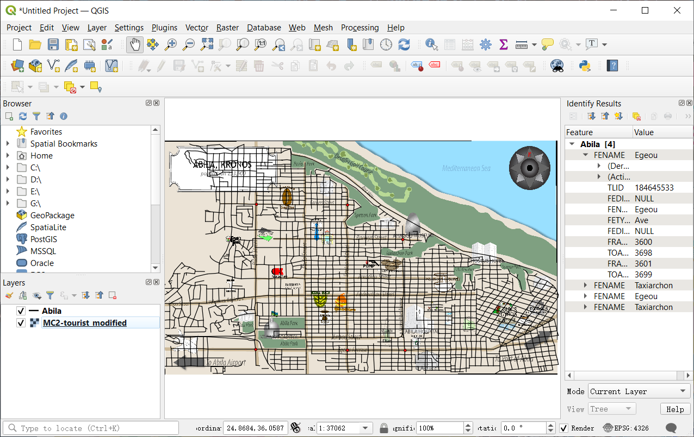{width=100%}

## Overview look

With the help of QGIS, we can get latitude and longitude data from the map. In the meanwhile, we could find an anomaly here.

{width=100%}

Anomaly | Graph
------------- | -------------
I found an **anomaly** here. While there are 34 kinds of shops from cc_data and loyalty_data, only 24 shops are showing on the official map, which means there are 10 kinds of records we could not find on the map. Nor could we assign "gps.csv" date with those places' location values. | {width=100%}

In order to add the vehicle data to the analysis of the credit and loyalty card data, we need to allocate each record in "gps.csv" with relatively correct locations. However, this anomaly will make our allocation miss targets which do not show on the map(we could not tell the shop's range of latitude and longitude if it does not show in tif directly).

So I tried to solve this problem. What I was thinking is trying to let cc_date to tell me the latitude and longitude of those shops because both cc_data and car gps data have **timestamp** which accurates to minutes. If I could merge them together, the output should provide me some useful hints. The loyalty_data only specific to days, thus I won't use loyalty_data here. 

```{r}
not_show_data=c("Abila Zacharo",
        "Brewed Awakenings","Daily Dealz","Desafio Golf Course",
        "Hippokampos","Kalami Kafenion","Kronos Pipe and Irrigation",
        "Octavio's Office Supplies","Shoppers' Delight",
        "Stewart and Sons Fabrication")
anomaly_location=cc_data_hm%>%
  filter(cc_data_hm$location %in% not_show_data)
anomaly_location=anomaly_location[c("timestamp","location")]
#Basic setting for gps
gps=read_csv("data2/gps.csv")
names(gps)[names(gps) == 'Timestamp'] = 'timestamp'
#----------------------
gps_temp=gps
gps_temp$timestamp=date_time_parse(gps_temp$timestamp,
                              zone = "",
                              format="%m/%d/%Y %H:%M")
anomaly_location=merge(anomaly_location,gps_temp,all.x=TRUE)
anomaly_location=na.omit(anomaly_location)
```

I use *boxplot()* to see my result. However, the output is not satisfactory for me. From the following graph, you could see that each location's GPS range varies greatly, which means there are overwhelming data from cc_data, which matches the gps data. So, I need to take a look at it to see what's going on.

```{r}
ggplot(anomaly_location,
       aes(y=lat,
           x=location))+
  geom_boxplot()+
  stat_summary(fun = mean, colour="darkred", geom="point", 
               shape=18, size=3, show.legend=FALSE)+
  stat_summary(fun =quantile, colour="red", geom="text", 
               vjust=0, aes(label=round(..y.., digits=6)))

ggplot(anomaly_location,
       aes(y=long,
           x=location))+
  geom_boxplot()+
  stat_summary(fun = mean, colour="darkred", geom="point", 
               shape=18, size=3, show.legend=FALSE)+
  stat_summary(fun =quantile, colour="red", geom="text", 
               vjust=0, aes(label=round(..y.., digits=6)))

```

By **raster, sf, sp packages**, we could read tif file and visualize the data. In the following code, you can change names in *filter()* to see the distribution of different places(could remove the filter to see total records). After looking at those records, I found that except "Desafio Golf Course", there are still too many matched records for most locations or don't have obvious gathered clusters. Thus, we could modify "Desafio Golf Course"'s GPS information to the map.

Besides that, I also found an **anomaly** in the visualization. Not like other records, the result id:28 plot on the map is discrete. While other records are more likely to be plotted to a line(continuous plot). I guess this happened in two way:

* The GPS device on Car-id:28 was broken down. It could tell the accurate GPS to GAStech company.

* The Car-id:28 might not be the same kind of car as others. It might be a motorcycle which is convenient to go to the place that standard vehicles couldn't.

```{r}
ap=raster("Geospatial/MC2-tourist.tif")
Ablia_st=st_read(dsn="Geospatial",layer="Abila")
```

```{r}
#Code Chunk A
anomaly_location$id=as_factor(anomaly_location$id)
anomaly_sf=st_as_sf(anomaly_location,
                coords = c("long","lat"),
                crs=4326)
anomaly_path=anomaly_sf %>%
  group_by(location) %>%
  summarize(m=mean(timestamp),
            do_union=FALSE) %>%
              st_cast("POINT")
anomaly_path_selected=anomaly_path %>%
  filter(location=="Desafio Golf Course")

#"Abila Zacharo","Brewed Awakenings","Daily Dealz","Desafio Golf Course",
#"Hippokampos","Kalami Kafenion","Kronos Pipe and Irrigation",
#"Octavio's Office Supplies","Shoppers' Delight","Stewart and Sons Fabrication"

tmap_mode("view")
tm_shape(ap)+
  tm_rgb(ap,r=1,g=2,b=3,
         alpha=NA,
         saturation=1,
         interpolate=TRUE,
         max.value=255)+
  tm_shape(anomaly_path_selected)+
  tm_dots()

```

Since the prediction of "Desafio Golf Course" could not be 100% sure. In the next codes, I would not use it to determine the location of gps data.

```{r eval=FALSE,echo=TRUE}
gps_location=gps
#The following one line is just used for checking process step
#Because the "for" loop would take quite a while to run
gps_location$location=1

for (n in 1:length(gps_location$timestamp)){
  if(24.83609<gps_location$long[n]&gps_location$long[n]<24.84200&
     36.07065<gps_location$lat[n]&gps_location$lat[n]<36.07716)
    gps_location$location[n]="Frank's Fuel"
  else if(24.83671<gps_location$long[n]&gps_location$long[n]<24.84220&
          36.06132<gps_location$lat[n]&gps_location$lat[n]<36.06699)
    gps_location$location[n]="Maximum Iron and Steel"
  else if(24.82177<gps_location$long[n]&gps_location$long[n]<24.84262&
          36.04501<gps_location$lat[n]&gps_location$lat[n]<36.05410)
    gps_location$location[n]="Abila Airport"
  else if((24.84889<gps_location$long[n]&gps_location$long[n]<24.85354)&(
          36.08021<gps_location$lat[n]&gps_location$lat[n]<36.08590))
    gps_location$location[n]="Bean There Done That"
  else if(24.84381<gps_location$long[n]&gps_location$long[n]<24.84975&
          36.07218<gps_location$lat[n]&gps_location$lat[n]<36.07739)
    gps_location$location[n]="Abila Scrapyard"
  else if(24.84596<gps_location$long[n]&gps_location$long[n]<24.850978&
          36.065680<gps_location$lat[n]&gps_location$lat[n]<36.06900)
    gps_location$location[n]="Kronos Mart"
  else if(24.849297<gps_location$long[n]&gps_location$long[n]<24.855324&
          36.061782<gps_location$lat[n]&gps_location$lat[n]<36.065679)
    gps_location$location[n]="Roberts and Sons"
  else if(24.85541<gps_location$long[n]&gps_location$long[n]<24.85887&
          36.07615<gps_location$lat[n]&gps_location$lat[n]<36.07907)
    gps_location$location[n]="Albert's Fine Clothing"
  else if(24.85792<gps_location$long[n]&gps_location$long[n]<24.86186&
          36.07229<gps_location$lat[n]&gps_location$lat[n]<36.07614)
    gps_location$location[n]="Coffee Shack"
  else if(24.85605<gps_location$long[n]&gps_location$long[n]<24.86062&
          36.05942<gps_location$lat[n]&gps_location$lat[n]<36.06306)
    gps_location$location[n]="General Grocer"
  else if(24.86063<gps_location$long[n]&gps_location$long[n]<24.86424&
          36.05839<gps_location$lat[n]&gps_location$lat[n]<36.06298)
    gps_location$location[n]="Gelatogalore"
  else if(24.86694<gps_location$long[n]&gps_location$long[n]<24.87137&
          36.06681<gps_location$lat[n]&gps_location$lat[n]<36.07019)
    gps_location$location[n]="U-Pump"
  else if(24.876017<gps_location$long[n]&gps_location$long[n]<24.880820&
          36.073744<gps_location$lat[n]&gps_location$lat[n]<36.077812)
    gps_location$location[n]="Ahaggo Museum"
  else if(24.87138<gps_location$long[n]&gps_location$long[n]<24.87648&
          36.06693<gps_location$lat[n]&gps_location$lat[n]<36.07059)
    gps_location$location[n]="Jack's Magical Beans"
  else if(24.871164<gps_location$long[n]&gps_location$long[n]<24.873989&
          36.050644<gps_location$lat[n]&gps_location$lat[n]<36.056840)
    gps_location$location[n]="Ouzeri Elian"
  else if(24.88231<gps_location$long[n]&gps_location$long[n]<24.88746&
          36.06265<gps_location$lat[n]&gps_location$lat[n]<36.06575)
    gps_location$location[n]="Hallowed Grounds"
  else if(24.88094<gps_location$long[n]&gps_location$long[n]<24.88514&
          36.05859<gps_location$lat[n]&gps_location$lat[n]<36.06090)
    gps_location$location[n]="Carlyle Chemical Inc."
  else if(24.88515<gps_location$long[n]&gps_location$long[n]<24.88764&
          36.05533<gps_location$lat[n]&gps_location$lat[n]<36.05858)
    gps_location$location[n]="Nationwide Refinery"
  else if(24.88852<gps_location$long[n]&gps_location$long[n]<24.89234&
          36.05404<gps_location$lat[n]&gps_location$lat[n]<36.05765)
    gps_location$location[n]="Coffee Cameleon"
  else if(24.89022<gps_location$long[n]&gps_location$long[n]<24.89772&
          36.06828<gps_location$lat[n]&gps_location$lat[n]<36.07207)
    gps_location$location[n]="Chostus Hotel"
  else if(24.895537<gps_location$long[n]&gps_location$long[n]<24.901007&
          36.057357<gps_location$lat[n]&gps_location$lat[n]<36.060688)
    gps_location$location[n]="Guy's Gyros"
  else if(24.896204<gps_location$long[n]&gps_location$long[n]<24.901007&
          36.054244<gps_location$lat[n]&gps_location$lat[n]<36.057356)
    gps_location$location[n]="Katerina's Cafe"
  else if(24.901008<gps_location$long[n]&gps_location$long[n]<24.904149&
          36.055189<gps_location$lat[n]&gps_location$lat[n]<36.057356)
    gps_location$location[n]="Brew've Been Served"
  else if(24.904150<gps_location$long[n]&gps_location$long[n]<24.907669&
          36.057357<gps_location$lat[n]&gps_location$lat[n]<36.061026)
    gps_location$location[n]="Frydos Autosupply n' More"
  else
    gps_location$location[n]=NA
  
}

```

> In order to save the running time, I have exported the above result as "gps_location.csv". You could just import "gps_location.csv" and use for following process.

```{r}
gps_location=read_csv("data2/gps_location.csv")
glimpse(gps_location)
```

We could notice there are many NA values whose GPS ranges are not within what we specified. And there are also many duplication records in timestamp because the GPS data is registered in seconds. Thus, I will *use na.omit()* to remove all NA values from gps_location and store the output as gps_popular. Then, change gps_popular's timestamp by hours because it's more reasonable for each record counts by hours per id. Otherwise, if one GAStech worker stays in a location for several minutes, counting by minutes will lead to dozes of records. Counting by day will lead to missing valuable data for analysis.

```{r}
gps_popular=gps_location
gps_popular=na.omit(gps_popular)

gps_popular_d=gps_popular
gps_popular$timestamp=date_time_parse(gps_popular$timestamp,
                              zone = "",
                              format="%m/%d/%Y %H")

gps_popular=gps_popular %>%
  distinct(timestamp,id,location, .keep_all = T)
gps_popular=gps_popular[c('timestamp','location')]

glimpse(gps_popular)
gps_popular_h=gps_popular
gps_popular_h$timestamp=hour(gps_popular$timestamp)
gps_popular_d$timestamp=date_time_parse(gps_popular_d$timestamp,
                              zone = "",
                              format="%m/%d/%Y")
gps_popular_d=gps_popular_d %>%
  distinct(timestamp,id,location, .keep_all = T)
gps_popular_d=gps_popular_d[c('timestamp','location')]
```

Although there are some locations, we could not perform analysis here since we don't know their locations on the map, like "Hippokampos". The majority of charts in the following graph still consist of the visualization from previous sections, like "Brew've Been Served" and "Katerina's Cafe" are also popular among purchase records. 

However, the "Ouzeri Elian"'s value is unusually high this time. If you have tried the above "Code Chunk A", you will find the hints of the answer. There are two aspects. First, the range of "Ouzeri Elian" is more significant than others because it is the only location in that area, and its icon is large on the map. Second, there might be other shops under "Ouzeri Elian" area which do not show on the map. The previous visualization shows that several kinds of plots overlap within "Ouzeri Elian" area in Code Chunk A, which has quite a lot of GPS records, like "Hippokampos".

Same as the previous analysis, we will provide analysis GPS data by hours and day as well.

```{r}
ggplot(data=gps_popular, 
       aes(x=reorder(location,location,
                     function(x)-length(x)))) +
  theme(axis.text.x = element_text(angle = 90, hjust = 1))+
  geom_bar(fill = "grey", alpha = 1)+
  
  geom_text(stat="count", 
            aes(label=paste0(..count..)),
            vjust=-1) +
  ylab("No. of\n records") +
  theme(axis.title.y=element_text(angle = 0))
```

## Analysis by weekdays

```{r fig.show='hide'}
ggplot(data=gps_popular_d, 
       aes(x=timestamp, 
           fill = location)) +
  geom_histogram(bins=14, 
                 color="grey30")+
  facet_wrap(~ location)

```

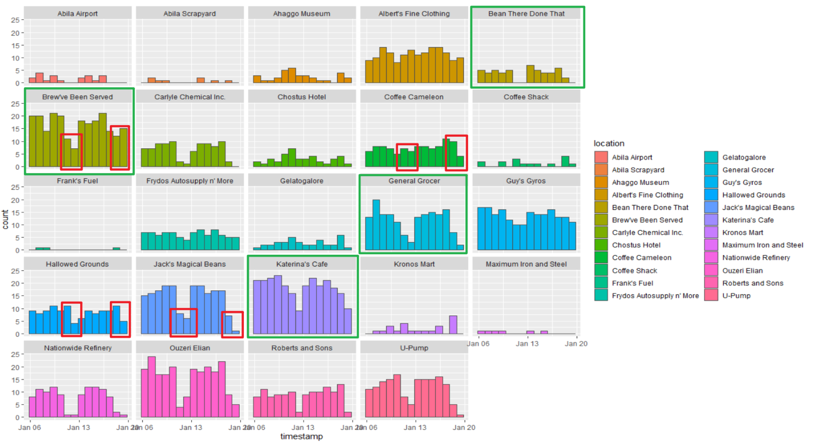

From the graph in weekly view, the GPS records patterns under most locations are similar to the previous visualization. For example, those locations in green rectangles are consistent with joined_data records graph. However, there appear some GPS records on weekends with "Brew've Been Served", "Coffee Cameleon" and "Hallowed Grounds" which should just open on workdays. You could see the anomalies in those red rectangles. This might cause occasion, and if users just drive past those locations, it will be captured as one record in gps.csv. You could not ask nobody to appear in those locations when those shops have not opened. If we treat those data in red rectangles as noise and exclude them, that the results are just the same as in the previous session.

## Analysis by hours

```{r fig.show= 'hide'}
ggplot(data=gps_popular_h, 
       aes(x=timestamp, 
           fill = location)) +
  geom_histogram(bins=14, 
                 color="grey30")+
  facet_wrap(~ location)+
  scale_x_continuous(breaks = round(seq(min(gps_popular_h$timestamp), max(gps_popular_h$timestamp), by = 2),1))
```

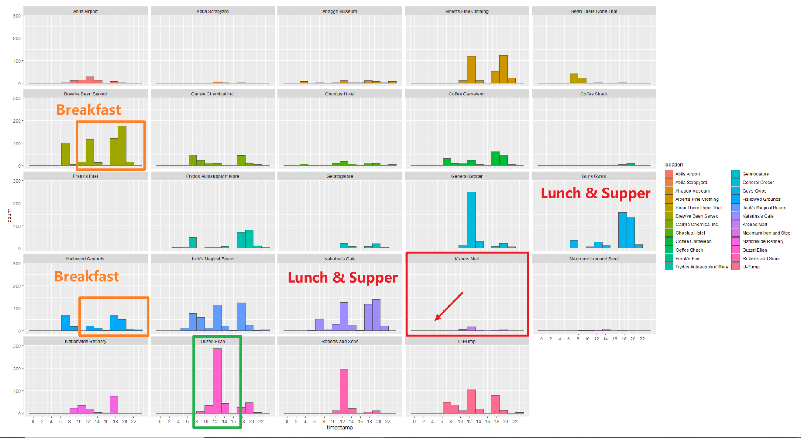

Take relatively popular locations from the graph, and we could find that "Katerina's Cafe" and "Guy's Gyros"'s GPS records patterns similar to the previous visualization. And "Brew've Been Served" and "Hallowed Grounds" which only open in the morning, have abnormal noise data(in orange rectangles) both in the noon and night. Especially in "Brew've Been Served"'s chart. This result might be caused by "Katerina's Cafe" and "Guy's Gyros".

From the map, you could see that "Brew've Been Served" locates next to "Katerina's Cafe" and "Guy's Gyros", which are extremely popular at noon and night. Thus, those customers who are going to "Katerina's Cafe" and "Guy's Gyros" might drive past "Brew've Been Served" would bring records to "Brew've Been Served" for just driving across it.

The "Ouzeri Elian" has explained in the above part. Because we could not convince whether "Hippokampos", which are popular like "Katerina's Cafe", locates within the same area under "Ouzeri Elian", this high value in green rectangles might combine data from "Hippokampos".

## conclusion

After adding the vehicle data to the credit and loyalty card data analysis, we could confirm our findings from Task 1 are correct. The visualization of Task 2 provides us much more evidence about popular locations.

Furthermore, we could update the assessment of the anomalies in question 1 based on GPS data. In Task 1, we found the anomaly; there are 5 records at 3 am in "Kronos Mart". However, in the above graph, there has **0 GPS record** in "Kronos Mart" before 10 o'clock. Most GPS records happen after 10 am. If "Kronos Mart" does is a shop mart, it is hard to imagine a mart would open at 3 am, and someone would go to a mart at midnight to purchase without driving a car. This reasonable doubt makes me more confident to believe this anomaly record has an issue with time. To fix this anomaly, I'd prefer to move records to another time. 

Compared with credit, and loyalty card data, vehicle data, which I called GPS data, are registered much more detailed. In the time column, vehicle data is accurate for each second. And this also caused a lot of records to have duplication because the device sampled the data in seconds. Credit data is accurate to minutes, and loyalty card data is just accurate to days. We need to pay attention when merging them together.

```{r}
#gps_location$id=as_factor(gps_location$id)
#glimpse(gps_location)
```

# Task 3

To infer each credit card and loyalty card owner, there are 3 steps to do.

## Create dictionary

First, I created a dictionary to show their relation between credit card and loyalty card . Since R does not have an official dictionary function for us to use, and the dict package I tested is not good enough to use, I built a data frame to present the result.

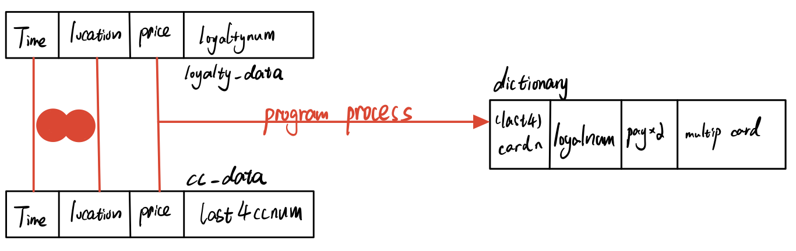

In the previous session, I have merged cc_data and loyalty_data to get the joined_data. Actually, if you look at joined_data, it has a linked credit card and loyalty card, which is exactly what we want. This data is accurate because it relates timestamp, location, and purchase price together. The **last4ccnum** column(credit card) and **loyaltynum** column(loyalty card) will tell us the relationships. However, there might be 3 kinds of problems we need to pay attention to when we write those relationships into our dictionary:

* The owners just use either of credit card and loyalty card when purchase. Sometimes they use both cards again.

* The owners have multiple credit cards or loyalty cards. Or the owners have relationships with each other, which leads to the one credit card might have multiply links with loyalty cards.

In the following code chunk, I create an empty dictionary and 2 functions that could return the result if the new arrow data already has existed in the dictionary. The **pay_without_2card** column in the dictionary counts the times owners purchase with either of credit card or loyalty card. The **multipule_cards** present the times owners purchase with different pair relationships/links.

```{r}
ndt_in_last4=function(n){
  return(length(which(dictionary$card_num == joined_data[[4]][n]))>0)
}     
ndt_in_loyal=function(n){
  return(length(which(dictionary$loyalty_num == joined_data[[5]][n]))>0)
}

i=1
dictionary=as.data.frame(array(,dim=c(0,4)))
  
names(dictionary)[names(dictionary) == 'V1'] = 'card_num'
names(dictionary)[names(dictionary) == 'V2'] = 'loyalty_num'
names(dictionary)[names(dictionary) == 'V3'] = 'pay_without_2card'
names(dictionary)[names(dictionary) == 'V4'] = 'multipule_cards'
```

## Logic to refine data

First, I scan joined_data with each arrow.
The flag will tell us which kind of new data arrow it is.

* flag=1: new arrow data only have value in last4ccnum column(credit card)

* flag=2: new arrow data only have value in loyaltynum column(loyalty card)

* flag=3: new arrow data have both values in last4ccnum and loyaltynum column

If new arrow's flag=1 or 2 and new arrow's value does not exist in the current dictionary, it will search the entire joined_data to find matching pair which have value both in last4ccnum and loyaltynum. If find that relationship, program will register this new link to dictionary and record current new arrow as pay_without_2card. On the contrary, it will register as empty pair in the dictionary.

If new arrow's flag=1 or 2 and new arrow's value exists in the current dictionary, it will calculate the number of relation links. And add to each relation's pay_without_2card.

If flag=3 and new arrow's pair does not exist in the current dictionary, it will register this new pair to dictionary. If new arrow's pair exists in the current dictionary, program will pass because dictionary has registed the same relation.

If flag=3 and new arrow's pair exist in the current dictionary, it will register this new pair to dictionary.

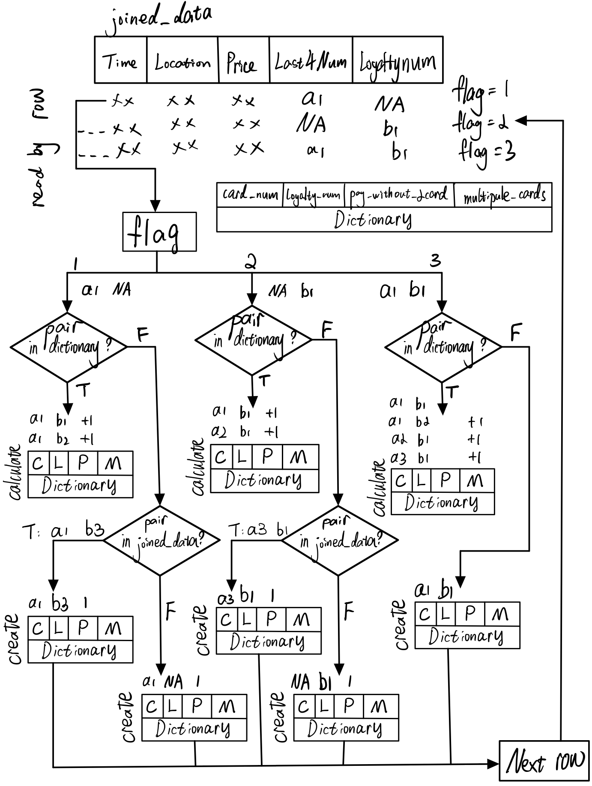

```{r}
for (n in 1:length(joined_data$timestamp)){
  #joined_data flag
  {
    if((is.na(joined_data[[4]][n]) | is.na(joined_data[[5]][n]))==FALSE)
      flag=3  #no NA
    else if(is.na(joined_data[[4]][n]))
      flag=2  #NA in card_num
    else if(is.na(joined_data[[5]][n]))
      flag=1  #NA in loya_num
    else{
      print("Error:Both columns empty.")
      break}
  }
  
  #flag1
  {
    if(flag==1) #NA in loya_num
      if(ndt_in_last4(n)) {
        #exist in dictionary
        index=which(dictionary$card_num == joined_data[[4]][n])[1]
        #if(is.na(joined_data[[5]][index])==FALSE)
        #NA=false
        dictionary$pay_without_2card[index] =as.numeric(dictionary$pay_without_2card[index])+1
      }
    else{   #not exist in dictionary
      for(variable in which(joined_data$last4ccnum == joined_data$last4ccnum[n])) {
        if(is.na(joined_data$loyaltynum[variable])) 
          next
        else {
          dictionary[i,]=c(joined_data[[4]][variable],joined_data[[5]][variable],1,0)
          i=i+1 
          break}
      }
      if(ndt_in_last4(n)==FALSE){
        dictionary[i,]=c(joined_data[[4]][n],joined_data[[5]][n],0,0)
        i=i+1 
      }
    }
  }
  #flag2
  {
    if(flag==2) #NA in card_num
      if(ndt_in_loyal(n)) {
        #exist in dictionary
        index=which(dictionary$loyalty_num == joined_data[[5]][n])[1]
        #if(is.na(joined_data[[4]][index])==FALSE)
        #NA=false
        dictionary$pay_without_2card[index] =as.numeric(dictionary$pay_without_2card[index])+1
      }
    else{   #not exist in dictionary
      for(variable in which(joined_data$loyaltynum == joined_data$loyaltynum[n])) {
        if(is.na(joined_data$last4ccnum[variable])) 
          next
        else {
          dictionary[i,]=c(joined_data[[4]][variable],joined_data[[5]][variable],0,0)
          i=i+1 
          break}
      }
      if(ndt_in_loyal(n)==FALSE){
        dictionary[i,]=c(joined_data[[4]][n],joined_data[[5]][n],0,0)
        i=i+1 
      }
    }  
  }
  #flag3
  {
    if(flag==3){ #no NA
      if(ndt_in_loyal(n)|ndt_in_last4(n)){#exist in dictionary 1?2?
        #only one in the column
        if((ndt_in_last4(n)&(ndt_in_loyal(n)==FALSE))|(ndt_in_loyal(n)&(ndt_in_last4(n)==FALSE))){
          dictionary[i,]=c(joined_data[[4]][n],joined_data[[5]][n],0,1)
          i=i+1
        }
        #both of data in the column
        if(ndt_in_loyal(n)&ndt_in_last4(n)){
          #how many?
          ind_length=length(which(dictionary$card_num == joined_data[[4]][n]))
          ind_length1=length(which(dictionary$loyalty_num == joined_data[[5]][n]))
          #index value which matches
          index=which(dictionary$card_num == joined_data[[4]][n])
          index1=which(dictionary$loyalty_num == joined_data[[5]][n])
          for (x in index) {
            for (y in index1) {
              if(x==y){
                temp=x
              }
            }
          }
          for (x in index) {
            if(x!=temp)
              dictionary$multipule_cards[x] =as.numeric(dictionary$multipule_cards[x])+1
          }
          for (y in index1) {
            if(y!=temp)
              dictionary$multipule_cards[y] =as.numeric(dictionary$multipule_cards[y])+1
          }
        }
      }
      else{   #not exist in dictionary
        dictionary[i,]=c(joined_data[[4]][n],joined_data[[5]][n],0,0)
        i=i+1
      }
    }
  }
}

DT::datatable(dictionary)#[c('card_num','loyalty_num')]
```

## Create gps_h

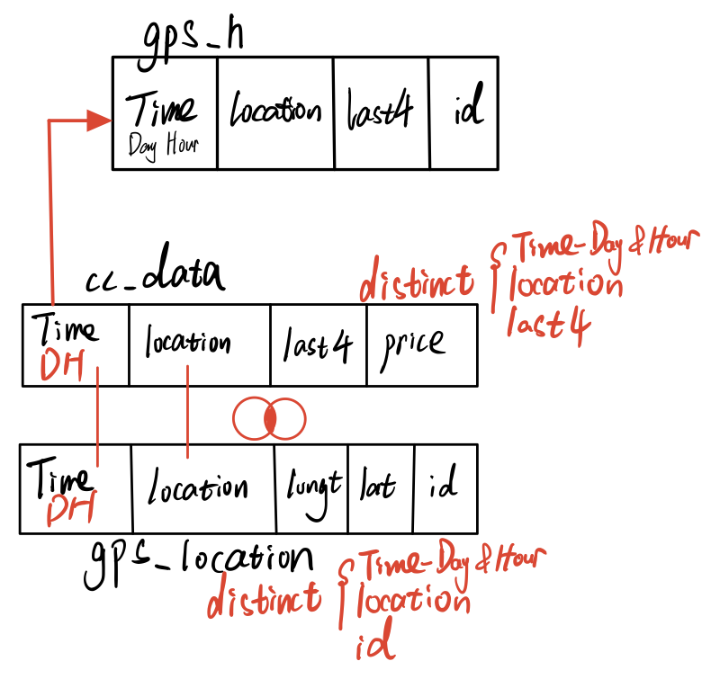{width=60%}

The *gps_h* links gps_location with cc_data by hours. It will provide all possible relationships between credit owner and car id.

The first step is changing cc_data and gps_location to hours format. Then, distinct the records by different values. Since gps_location's records are accurate to seconds, this process will decrease the duplication records and keep helpful information only. Next, combine those two data and calculate the gps_h by inner join function.

```{r}
gps_h=gps_location
cc_data_h=cc_data_origin
#gps_h change gps_location$timestamp to hour format
gps_h$timestamp=date_time_parse(gps_location$timestamp,
                              zone = "",
                              format="%m/%d/%Y %H")
cc_data_h$timestamp=date_time_parse(cc_data_h$timestamp,
                              zone = "",
                              format="%m/%d/%Y %H")
gps_h=gps_h %>%
  distinct(timestamp,id,location, .keep_all = T)
cc_data_h=cc_data_h %>%
  distinct(timestamp,last4ccnum,location, .keep_all = T)
#inner join
gps_h=merge(cc_data_h,gps_h,all=FALSE)
gps_h=gps_h[c("timestamp","location","last4ccnum","id")]
```


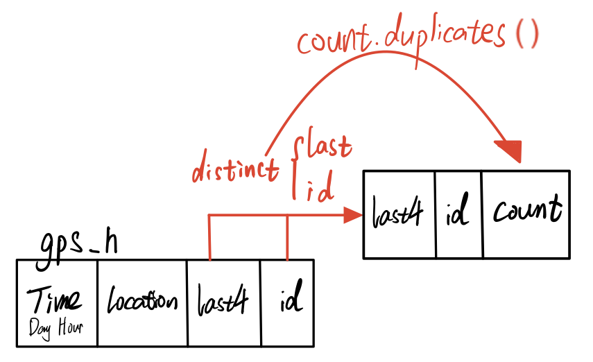{width=60%}

Next, we will particularly calculate the possibility of relationships between credit owner and car id by *count.duplicates()*. The **count** will tell us how many records of one card owner link with one car id. Thus, the greater **count** it is, the higher possibility that credit card user is the owner of that car. 

```{r}
count.duplicates <- function(DF){
  x <- do.call('paste', c(DF, sep = '\r'))
  ox <- order(x)
  rl <- rle(x[ox])
  cbind(DF[ox[cumsum(rl$lengths)],,drop=FALSE],count = rl$lengths)
}
```

```{r}
gps_h2=gps_h[c("last4ccnum","id")]
gps_h2=count.duplicates(gps_h2)
DT::datatable(gps_h2)
```

## Link 3 data

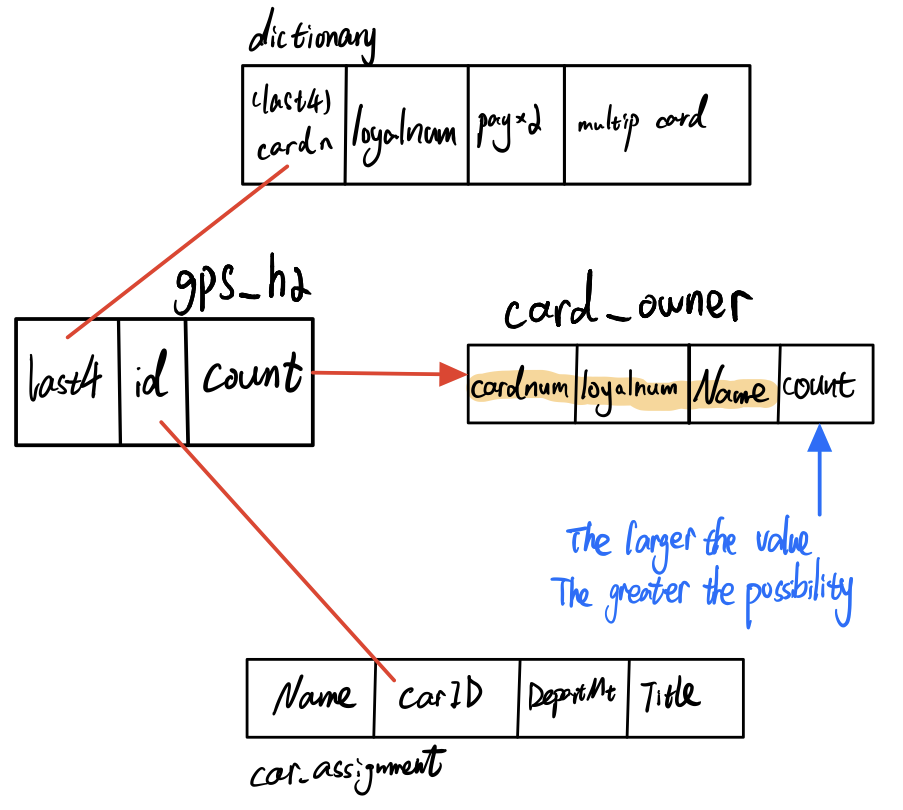{width=60%}

In the last step, after we have got gps_h2 and dictionary, now we could link car_assignment to the dictionary by gps_h2. Car_assignment could tell us the owner of the car. The output is card_owner. Its column, count, is the number of matched records. The larger it is, the higher possibility that the card owner is that person.

```{r}
car_assignm=read_csv("data2/car-assignments.csv")
car_assignm=tidyr::unite(car_assignm, "Fullname", LastName, FirstName,sep = " ", remove = TRUE)
names(car_assignm)[names(car_assignm) == 'CarID'] = 'id'
names(gps_h2)[names(gps_h2) == 'last4ccnum'] = 'card_num'
car_assignm=na.omit(car_assignm)
card_owner=merge(gps_h2,car_assignm,all=FALSE)
card_owner=merge(card_owner,dictionary,all=FALSE)
card_owner=card_owner[c("Fullname","card_num","loyalty_num","count")]
card_owner=card_owner[order(card_owner$Fullname,-card_owner$count),]
DT::datatable(card_owner)
```

## Conclusion 

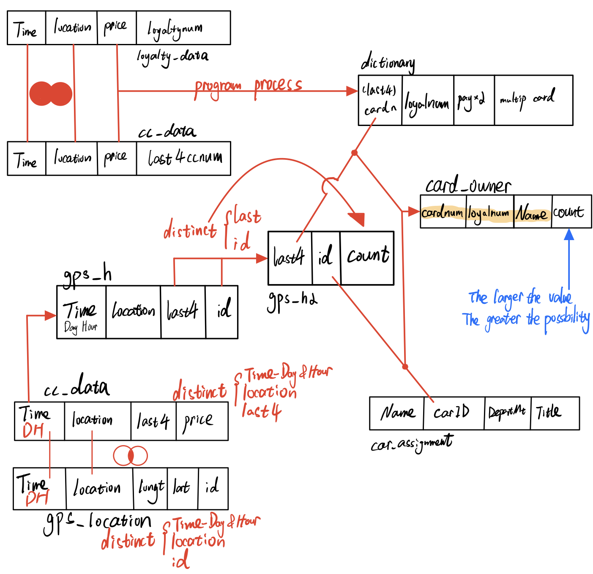

The card_owner table is the result to infer the owners of each credit card and loyalty card. This result links GPS data, cc_data, loyalty_data, and car_assignment together by common attributes. You could see a variety of records in single card_owner, however you could infer the owner by **count** value. Those uncertainties in your method come from 3 aspects.

1. In the dictionary, we could find multiply card owners who might have multiple credit cards or loyalty cars or share cards with others, like "1286" and "L3288". Those cards' records have relationships with other cards, which gives us uncertainties to predict the exact card owner.

2. In the gps file, although we have refined records by hours, duplication records still exist if the car owner coincidentally stays in one location from *xx:59* to *xx+1:00*. The possibility is pretty low, however we need to pay attention to this condition.

3. In car_assignment data, the official site only provides us car id from 1 to 35. On the contrary, the car id range in gps file is significantly larger than car_assignment. Not only from 1 to 35, but also from 35 to 107. Since the car_assignment only provides 35 car id, we could not predict other cards' owners.

# Task 4

In this chapter,given the data sources provided, I will identify potential informal or unofficial relationships among GASTech workers. To visualize the result, I would prefer to use *network graph*.

If the workers have the same living patterns and drive to the same place simultaneously, I would suppose they have relationships. Thus, I would try to link car_assignment and gps_location together to find regulations.

## Get nodes & edges

The first step is to match GPS data with GPS data. This process would provide us all connections which one GASTech staff meet another staff at a specific location at the same time.

Then, by the time they meet, I will use *hour()* to extract time period from each record. Morning: 6am ~ 10am. Noon: 11am ~ 12 pm. Afternoon: 1pm ~ 4pm. Night: 5pm ~ 5am.

```{r}
relation1=na.omit(gps_location)
relation1$timestamp=date_time_parse(relation1$timestamp,
                                       zone = "",
                                       format="%m/%d/%Y %H")
relation1=relation1 %>%
  distinct(timestamp,id,location, .keep_all = T)
relation1=relation1[c("timestamp","id","location")]
relation2=relation1
names(relation2)[names(relation2) == 'id'] = 'id2'
relation2=merge(relation1,relation2,all.x=TRUE)
relation2=relation2%>%
  filter(relation2$id > relation2$id2)
for(n in 1:length(relation2$id2)){
  if(hour(relation2$timestamp[n])>=6 & hour(relation2$timestamp[n])<11)
    relation2$timePeriod[n]='morning'
  else if(hour(relation2$timestamp[n])>=11 & hour(relation2$timestamp[n])<13)
    relation2$timePeriod[n]='noon'
  else if(hour(relation2$timestamp[n])>=13 & hour(relation2$timestamp[n])<17)
    relation2$timePeriod[n]='afternoon'
  else
    relation2$timePeriod[n]='night'
}

relation_mnn=relation2[c('id','id2','timePeriod')]
relation_mnn=count.duplicates(relation_mnn)
relation_wd=relation2[c('id','id2')]
relation_wd=count.duplicates(relation_wd)

relation_nodes=car_assignm[c("id","Fullname")]
relation_nodes=na.omit(relation_nodes)
relation_mnn=relation_mnn%>%
  filter(id<36)%>%
  filter(id2<36)
relation_wd=relation_wd%>%
  filter(id<36)%>%
  filter(id2<36)
car_assignm$id=as.factor(car_assignm$id)
relation_mnn$id=as.factor(relation_mnn$id)
relation_mnn$id2=as.factor(relation_mnn$id2)
relation_wd$id=as.factor(relation_wd$id)
relation_wd$id2=as.factor(relation_wd$id2)

```

## Create network graph

```{r}
GAStech_graph=tbl_graph(nodes=relation_nodes,
                        edges=relation_wd,
                        directed=TRUE)
GAStech_graph

g=GAStech_graph%>%
  #mutate(betweenness_centrality=centrality_betweenness())%>%
  ggraph(layout="fr")+
  geom_edge_link(aes(width=count),
                 alpha=0.2)+
  scale_edge_width(range = c(0.1,5))+#link thickness
  geom_node_point(aes(colour=Fullname,
                      size=centrality_betweenness()))+
  geom_node_text(aes(label = Fullname),vjust = 1.5,
        hjust =0.3,size=3,color='red')
g+theme_graph()
```

```{r}
GAStech_graph=tbl_graph(nodes=relation_nodes,
                        edges=relation_mnn,
                        directed=TRUE)
GAStech_graph


set_graph_style()
g=GAStech_graph%>%
  mutate(betweenness_centrality=centrality_betweenness())%>%
  ggraph(layout="fr")+
  geom_edge_link(aes(width=count),
                 alpha=0.2)+
  scale_edge_width(range = c(0.1,5))+#link thickness
  geom_node_point(aes(colour=Fullname,
                      size=betweenness_centrality))+
  geom_node_text(aes(label = Fullname),vjust = 1.5,
        hjust =0.3,size=3,color='red')
g+facet_edges(~timePeriod)

```

## Conclusion

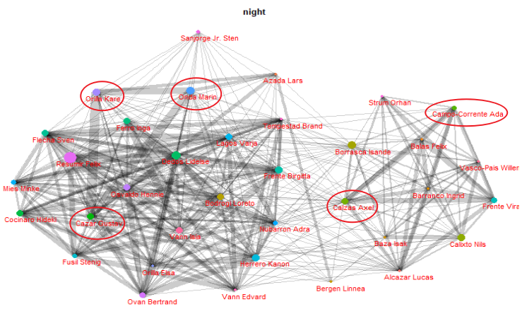

From the network graph, we could see the relationships among GASTech workers. If the line between 2 points is wider, it shows the observation that these 2 persons have closer relationships than others because these two workers have more consistent live routines.

Take the night's chart as an example, Orila Kare, Onda Marin, and Cazar Gustav might have a strong relationship with each other since the width of edges is pretty broad. And this also happens between Calzas Axel and Campo-Corrente Ada. Thus, you could see all relationships between GASTech workers depend on the width of edges.

# Task 5

I will use the map visualization function to see suspicious activity, which has been mentioned in Code Chunk A.

```{r}
gps_t5=gps
gps_t5$timestamp=date_time_parse(gps_t5$timestamp,
                              zone = "",
                              format="%m/%d/%Y %H:%M:%S")
gps_t5$id=as_factor(gps$id)
gps_t5=gps_t5 %>%
  filter(hour(timestamp)>=6)%>%
  filter(hour(timestamp)<11)%>%
  filter(day(timestamp)>=6)%>%
  filter(day(timestamp)<11)
gps_t5_sf=st_as_sf(gps_t5,
                coords = c("long","lat"),
                crs=4326)

gps_t5_path=gps_t5_sf %>%
  group_by(id) %>%
  summarize(m=mean(timestamp),
            do_union=FALSE) %>%
              st_cast("LINESTRING")


gps_t5_path_selected=gps_t5_path %>%
  filter(id==2)

tmap_mode("view")
tm_shape(ap)+
  tm_rgb(ap,r=1,g=2,b=3,
         alpha=NA,
         saturation=1,
         interpolate=TRUE,
         max.value=255)+
  tm_shape(gps_t5_path_selected)+
  #tm_dots(size = 0.01)
  tm_lines()

```

## Staff habits

By changing hours and car id in the codes, we could find useful patterns:

1. Between 6am and 10am in all workdays. Besides staying in homes and the company, employees usually appear in the cafeteria. It indicates that they often eat breakfast or buy the food on the way to the company.

2. All the cars during the period between 4pm and 6pm in all working days. Instead of stopping by the restaurants for dinner, employees usually drive back home directly.

3. GAStech workers rarely have activities during the nights from Monday to Friday.

## Conclusion & Anomalies

1. By filtering the records during the early morning (2am to 4am), I find some anomalies during this special time. Car id: 4, 10, 35, 32, 16, and 21 arrived to place Car id: 16's home at 03:30, Jan 11, 2014. Car id: 21 and 24 arrived to place car id: 17's home at 03:40, Jan 9, 2014.

```{r}
gps_t5=gps
gps_t5$timestamp=date_time_parse(gps_t5$timestamp,
                              zone = "",
                              format="%m/%d/%Y %H:%M:%S")
gps_t5$id=as_factor(gps$id)
gps_t5=gps_t5 %>%
  filter(hour(timestamp)>=2)%>%
  filter(hour(timestamp)<5)
gps_t5_sf=st_as_sf(gps_t5,
                coords = c("long","lat"),
                crs=4326)

gps_t5_path=gps_t5_sf %>%
  group_by(id) %>%
  summarize(m=mean(timestamp),
            do_union=FALSE) %>%
              st_cast("LINESTRING")


gps_t5_path_selected=gps_t5_path %>%
  filter(id %in% c(4,10,35,32,16,21))

tmap_mode("view")
tm_shape(ap)+
  tm_rgb(ap,r=1,g=2,b=3,
         alpha=NA,
         saturation=1,
         interpolate=TRUE,
         max.value=255)+
  tm_shape(gps_t5_path_selected)+
  #tm_dots(size = 0.01)
  tm_lines()

```

2. We find that destinations of workers are located in car id: 2’s home. By observing the time, they all happened at the night, Jan 10, 2014. The involved employees are: 19, 3, 11, 28, 26, 5, 8, 1 and so on. I guess that a party or some kind of meeting happened.

```{r}
gps_t5=gps
gps_t5$timestamp=date_time_parse(gps_t5$timestamp,
                              zone = "",
                              format="%m/%d/%Y %H:%M:%S")
gps_t5$id=as_factor(gps$id)
gps_t5=gps_t5 %>%
  filter(hour(timestamp)>=18)%>%
  filter(hour(timestamp)<24)
gps_t5_sf=st_as_sf(gps_t5,
                coords = c("long","lat"),
                crs=4326)

gps_t5_path=gps_t5_sf %>%
  group_by(id) %>%
  summarize(m=mean(timestamp),
            do_union=FALSE) %>%
              st_cast("LINESTRING")


gps_t5_path_selected=gps_t5_path %>%
  filter(id %in% c(19, 3, 11, 26, 5, 8, 1))

tmap_mode("view")
tm_shape(ap)+
  tm_rgb(ap,r=1,g=2,b=3,
         alpha=NA,
         saturation=1,
         interpolate=TRUE,
         max.value=255)+
  tm_shape(gps_t5_path_selected)+
  #tm_dots(size = 0.01)
  tm_lines()

```


*- End of assignment, thank you! -*


