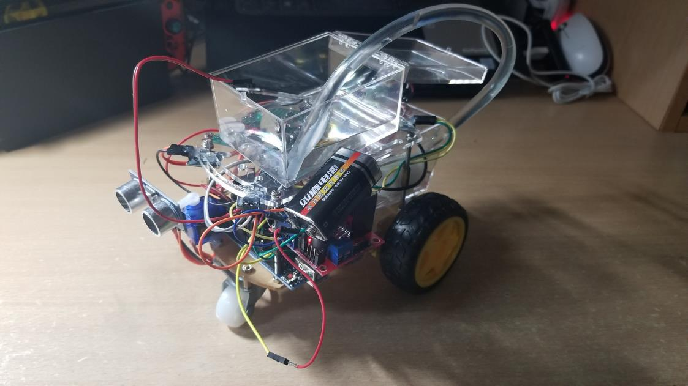
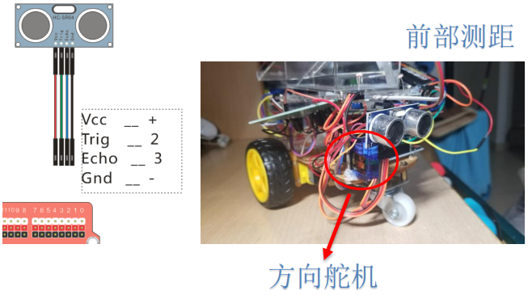

```{r setup, include=FALSE}
options(htmltools.dir.version=FALSE)
knitr::opts_chunk$set(fig.retina=3,#resolution high
                     echo=TRUE,
                     eval=FALSE,
                     message=FALSE,
                     warning=FALSE)
```
# [DOWNLOAD PROJECT](https://github.com/King-S-Wang/Arduino-AutoWaterCar)

## 作品内容
本作品名称为智能盆栽小车。其基于传统的智能小车硬件和自动浇花系统，通过arduino单片机控制多个传感器，使放在智能车上的盆栽能被自动照顾（如：缺水时浇花，选择阳光照射最大处，环境温度过高时前往阴影处等）

## 灵感来源
本项目的智能盆栽小车是同学基于智能家居新的创新尝试，灵感来源于某位同学暑假出门家庭旅行时，自己种植的植物因为在家中无人照顾，导致该其回家时发现植物已经因为缺水而死从而收到的启发，通过以往实训课程和C语言的学习，我们选择 Arduino UNO R3单片机和小车组合的方式来完成整套系统，同时arduino 的多传感器和模拟数字（A/D pin）输入为我们智能盆栽小车提供了更多的功能可行性。


## 设计思路
本项目的智能盆栽小车可分为测距小车系统，自动浇花系统两大部分。
测距小车系统：由马达模块（含继电器模块），双测距模块（含舵机模块），光传感器模块（四个），温度传感器模块组成。首先光传感器模块判断出阳光最强处，通过单片机系统控制马达模块指示小车往阳光最大处移动，在移动前，经双测距模块判断该方向是否可前进，能前进则继续前往该方向，其他情况则中断前进指令。温度传感器负责检测环境温度，若检测到环境温度过高不适合植物生长，则通过马达模块让小车前往阴影处。
自动浇花系统：由土壤湿度传感器模块，水泵模块，水位传感器模块组成。将盆栽放在小车上，将土壤湿度传感器插入泥土并在小车的储水箱内加入足量的水。土壤湿度传感器反馈土壤湿度值给 arduino 单片机，在检测到土壤较干时（植物缺水状态），系统通过在储水箱内的水位传感器判断储水箱内是否有足够的水，若储水量充足，通过给水泵模块使能，经由水管将储水箱的水浇入盆栽，待土壤湿度传感器判断土壤水分充足时停止浇水。
总体来说，本项目首创的智能盆栽小车，类似将家中的植物交给专人管理，应用较广，需求可观，开发前景较大。此原型可编程也可调节各个传感器阈值，适用于其他多种不同植物，如仙人掌、水仙、薄荷、多肉，而目前市场基本空白，存在需求无法满足的情况，而且此项目成本较低，相信在投入市场后会有客观回报。

## 系统解构图
### 整体


### 双测距模块



### 马达模块
{width=40%}{width=60%}


### 光传感器模块


{width=40%}{width=50%}

### 温度传感器模块


### 土壤湿度传感器模块


### 水位传感器模块


### 水泵模块


## 代码

此代码基于Arduino语言，第一部分我们需要定义主板的针脚以及设置通信传输波特率。针脚的定义因人而异，依据自己的接线方法设置对应针脚即可。

```{bash eval=FALSE}
#include <Servo.h>
int motorL1=6; //定义左边轮子前进方向
int motorL2=5; //定义左边轮子后退方向
int motorR1=9; //定义右边轮子前进方向
int motorR2=11; //定义右边轮子后退方向
int water_machine=13; //定义水泵使能管脚
int water_testPin=A4; //定义土壤湿度输入管脚
int water_test=0; //定义土壤湿度全局变量
int water_level=512; //定义土壤湿度判定值
int temP=12; //定义温度输入管脚
int box_level=A5; //定义储水槽水位输入管脚
int box=0; //定义储水槽水位全局变量
Servo s; //超声波转向舵机
int trig_f=4; //发射信号（前部测距）
int echo_f=2; //接收信号（前部测距）
int trig_b=3; //发射信号（后部测距）
int echo_b=7; //接收信号（后部测距）
int level=250;//光阈值
unsigned int S_l; //距离存储（前左）
unsigned int S_r; //距离存储（前右）
unsigned int S_m; //距离存储（前中）
unsigned int S_b; //距离存储（后）
int sensorPin_fl= A0; // 定义光传感器（左前）模拟输入管脚
int sensorValue_fl= 0; // 定义光传感器（左前）模拟输入全局变量
int sensorPin_fr= A1; //定义光传感器（右前）模拟输入管脚
int sensorValue_fr= 0; // 定义光传感器（右前）模拟输入全局变量
int sensorPin_bl= A2; // 定义光传感器（左后）模拟输入管脚
int sensorValue_bl= 0; // 定义光传感器（左后）模拟输入全局变量
int sensorPin_br= A3; //定义光传感器（右后）模拟输入管脚
int sensorValue_br= 0; // 定义光传感器（右后）模拟输入全局变量


void setup() {
Serial.begin(9600); //设置波特率
pinMode(trig_f,OUTPUT); //设置引脚模式
pinMode(echo_f,INPUT); //设置引脚模式
pinMode(trig_b,OUTPUT); //设置引脚模式
pinMode(echo_b,INPUT); //设置引脚模式
pinMode(motorL1,OUTPUT);
pinMode(motorL2,OUTPUT);
pinMode(motorR1,OUTPUT);
pinMode(motorR2,OUTPUT);
pinMode(sensorPin_fl,INPUT);
pinMode(sensorPin_fr,INPUT);
pinMode(sensorPin_bl,INPUT);
pinMode(sensorPin_br,INPUT);
pinMode(water_machine,OUTPUT);
pinMode(water_test,INPUT);
pinMode(temP,INPUT);
pinMode(box_level,INPUT);
  

s.attach(8); //定义舵机所用引脚
s.write(90); //初始化舵机角度
tone(12,800,500);
delay(2000); //开机延时
}
```

下面的代码是主函数，在依次执行完一次上面的初始化设置代码后，主控芯片将会循环执行下面的函数。
实现对小车的操控以及小车对环境的自动识别功能也主要在这一部分通过代码实现。

```{bash eval=FALSE}
void loop() //主函数
{
// read the value from the sensor:   
sensorValue_fl = analogRead(sensorPin_fl);   
Serial.print("sensorValue_fl = ");  //串口输出"Intensity = "   
Serial.println(sensorValue_fl); 
//向串口发送 sensorValue_fl 的值，可以在显示器上显示光强值   
sensorValue_fr = analogRead(sensorPin_fr);   
Serial.print("sensorValue_fr = ");  //串口输出" sensorValue_fr = " 
 
Serial.println(sensorValue_fr);   
sensorValue_bl = analogRead(sensorPin_bl);   
Serial.print("sensorValue_bl = ");     
Serial.println(sensorValue_bl);     
sensorValue_br = analogRead(sensorPin_br);   
Serial.print("sensorValue_br = ");      
Serial.println(sensorValue_br);        
water_test = analogRead(water_testPin);   
Serial.print("water_test = ");   //输出土壤湿度值   
Serial.println(water_test);    
int temP_level = digitalRead(12);   
box = analogRead(box_level);   
Serial.print("box_level = ");   //输出水箱储水值 
 
Serial.println(box);     
delay(500);      
// stop the program for <sensorValue> milliseconds:   
//delay(sensorValue_fl);   
//delay(sensorValue_fr);   
//delay(sensorValue_bl);   
//delay(sensorValue_br); 
 
 
// 
//下面的 XXXX 分别代表小车四个角的光传感器判定的亮暗 
//如 1010 代表小车左前和左后光照更强，小车执行左转指令 
//如 0001 代表小车右后光照更强，小车执行左转指令后再判断执行后退指令 
//   
if(temP_level==HIGH)
	{      
	if(sensorValue_fl<506 && sensorValue_fr<506 && sensorValue_bl<506 && sensorValue_br<506)
		{            
		if(sensorValue_fl<level && sensorValue_fr>level && sensorValue_bl>level && sensorValue_br>level)    //1000               
			{range_f(); //执行测距函数                 
			if(S_l>30 && S_m>30)                    
			L();                  
			}            
		else if(sensorValue_fl>level && sensorValue_fr<level && sensorValue_bl>level && sensorValue_br>level)//0100                
			{range_f(); //执行测距函数                 
			if(S_r>30 && S_m>30)                    
			R(); 
            }            
		else if(sensorValue_fl>level && sensorValue_fr>level && sensorValue_bl<level && sensorValue_br>level)//0010               
			{range_b(); //执行测距函数                 
			if(S_b>30)                   
			{R();
			}                  
			}            
		else if(sensorValue_fl>level && sensorValue_fr>level && sensorValue_bl>level && sensorValue_br<level)//0001                
			{range_b(); //执行测距函数                 
			if(S_b>30)                   
			{L();}                  
			}            
		else if(sensorValue_fl<level && sensorValue_fr<level && sensorValue_bl>level && sensorValue_br>level)//1100                
			{range_f(); //执行测距函数                 
			if(S_r>30 && S_m>30 && S_l>30)                    
				line();                  
			}            
		else if(sensorValue_fl<level && sensorValue_fr>level && sensorValue_bl<level && sensorValue_br>level)//1010                
			{range_f(); //执行测距函数                 
			if(S_l>30 && S_m>30)                    
				{L();}                  
			}            
		//    else if(sensorValue_fl<level && sensorValue_fr>level && sensorValue_bl>level && sensorValue_br<level){}  1001            
		//    else if(sensorValue_fl>level && sensorValue_fr<level && sensorValue_bl<level && sensorValue_br>level){}  0110            
		else if(sensorValue_fl>level && sensorValue_fr<level && sensorValue_bl>level && sensorValue_br<level)//0101                
				{range_f(); //执行测距函数                 
				if(S_r>30 && S_m>30)                    
					{R();}}            
		else if(sensorValue_fl>level && sensorValue_fr>level && sensorValue_bl<level && sensorValue_br<level)//0011                
				{range_b(); //执行测距函数                 
				if(S_b>30)                    
					back();                  
				}            
		else if(sensorValue_fl>level && sensorValue_fr<level && sensorValue_bl<level && sensorValue_br<level)//0111                
				{L();}            
		else if(sensorValue_fl<level && sensorValue_fr>level && sensorValue_bl<level && sensorValue_br<level)//1011                
				{R();}            
		else if(sensorValue_fl<level && sensorValue_fr<level && sensorValue_bl>level && sensorValue_br<level)//1101                
				{R();}            
		else if(sensorValue_fl<level && sensorValue_fr<level && sensorValue_bl<level && sensorValue_br>level)//1110                
				{L();}            
				   
		else   
				{line();    
				delay(5000);    
				lull();}
		}}				
if(water_test>water_level && box>300)//如果土壤湿度值较低且水箱有水   
	{digitalWrite(water_machine,HIGH);}   //给水泵使能给植物浇水   
else   
	digitalWrite(water_machine,LOW);       
	 
}

```

下面这部分定义的代码为实现基本的对小车操作功能，通过集成到一个function，可以让上一部分的代码更加整洁易懂。

```{bash eval=FALSE}
void range_f(){ //测距函数 
s.write(90); //舵机中位 
delay(500); //留时间给舵机转向 
digitalWrite(trig_f,LOW); //测距 
delayMicroseconds(2); //延时 2 微秒 
digitalWrite(trig_f,HIGH); 
delayMicroseconds(20); 
digitalWrite(trig_f,LOW); 
int distance = pulseIn(echo_f,HIGH); //读取高电平时间 
distance = distance/58; //按照公式计算 
S_m = distance; //把值赋给 S 
 
s.write(45); //舵机 
delay(500); //留时间给舵机转向 
digitalWrite(trig_f,LOW); //测距 
delayMicroseconds(2); //延时 2 微秒 
digitalWrite(trig_f,HIGH); 
delayMicroseconds(20); 
digitalWrite(trig_f,LOW); 
distance = pulseIn(echo_f,HIGH); //读取高电平时间 
distance = distance/58; //按照公式计算 
S_l = distance; //把值赋给 S 
 
s.write(135); //舵机 
delay(500); //留时间给舵机转向 
digitalWrite(trig_f,LOW); //测距 
delayMicroseconds(2); //延时 2 微秒 
digitalWrite(trig_f,HIGH); 
delayMicroseconds(20); 
digitalWrite(trig_f,LOW); 
distance = pulseIn(echo_f,HIGH); //读取高电平时间 
distance = distance/58; //按照公式计算 
S_r = distance; //把值赋给 S 
//Serial.println(S); //向串口发送 S 的值，可以在显示器上显示距离 
//if (S<30){ 
//tone(12,800,50); 
//delay(50); 
//延时 
//} 

} 
 
void range_b(){ //测距函数 
digitalWrite(trig_b,LOW); //测距 
delayMicroseconds(2); //延时 2 微秒 
digitalWrite(trig_b,HIGH); 
delayMicroseconds(20); 
digitalWrite(trig_b,LOW); 
int distanceb = pulseIn(echo_b,HIGH); //读取高电平时间 
distanceb = distanceb/58; //按照公式计算 
S_b = distanceb; //把值赋给 S 
//Serial.println(S); //向串口发送 S 的值，可以在显示器上显示距离 
//if (S<30){ 
//tone(12,800,50); 
//delay(50); 
//延时} 
} 
 
 
 
void line(){//前进 
digitalWrite(motorR1,HIGH); //启动所有电机向前 
digitalWrite(motorL1,HIGH); 
digitalWrite(motorR2,LOW); 
digitalWrite(motorL2,LOW); 
} 
 
void L(){//左转 
digitalWrite(motorL1,LOW); 
digitalWrite(motorR2,LOW); 
analogWrite(motorL2,100); 
analogWrite(motorR1,100); 
//delay(500); 
//lull(); 
//暂停所有电机 
} 
 
 
void R(){//右转 
digitalWrite(motorL2,LOW); 
digitalWrite(motorR1,LOW); 
analogWrite(motorL1,100); 
analogWrite(motorR2,100); 
//delay(500); 
//lull(); } 
 
 
 
void back(){ //后退函数 
digitalWrite(motorL1,LOW); 
digitalWrite(motorR1,LOW); 
analogWrite(motorL2,100); 
analogWrite(motorR2,100); 
//delay(500); 
} 
 
void lull(){//停止 
digitalWrite(motorL1,LOW); 
digitalWrite(motorL2,LOW); 
digitalWrite(motorR1,LOW); 
digitalWrite(motorR2,LOW); 
} 
```

## 创新点

* 在传统的浇花系统上加入水位传感器，检测储水箱真实水位，防止水泵空
转，节约系统电能让系统可以持续运行更长的时间。

* 在智能小车的基础上增加智能浇花系统，实现了两套系统的结合与创新。

* 在智能盆栽小车的四个角上加入了光传感器，并设定阈值。只有在白天，
小车才会通过检测光强，自动前往光线最强处进行光合作用。

* 整套系统通过温度传感器能对环境温度做出反应，温度过高能前往阴影处，
多种传感器都是围绕能让植物实现自己照顾自己而设计，完全实现托管植物或懒
人法养植物。

## 技术总结

目前市场上暂无同类可照顾植物的智能家居，本项目首创的智能盆栽小车，
类似将家中的植物交给专人管理，应用较广，需求可观，开发前景较大。此原型
可编程也可调节各个传感器阈值，可以控制土壤的湿度，后期也可拓展做温箱从
而控制环境温度，可适用于其他多种不同植物，如仙人掌、水仙、多肉、热带植
物，而目前市场基本空白，存在需求无法满足的情况，而且此项目成本较低，可
拓展功能多，针对不同人士对不同植物的养殖要求，可定制不同的智能盆栽小车，
相信在投入市场后会有客观回报。

同时小车现在 demo 只是初步模型，完成了功能但是做工较为粗糙，当时选
材导致体型的限制让小车走线较乱，样貌不佳，而且代码因为时间有限原因较为
简单，后期还有改进空间。若能成功商用，可通过 PCB 和集成电路优化系统，使
小车更加精简漂亮、电能节约，后期还可加入太阳能模块等，完全真正自主