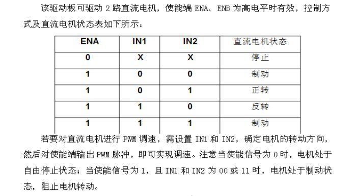
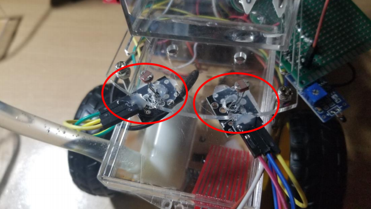
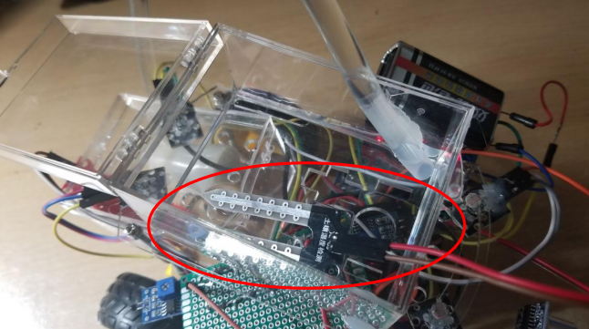

```{r setup, include=FALSE}
options(htmltools.dir.version=FALSE)
knitr::opts_chunk$set(fig.retina=3,#resolution high
                     echo=TRUE,
                     eval=FALSE,
                     message=FALSE,
                     warning=FALSE)
```
# [DOWNLOAD PROJECT](https://github.com/King-S-Wang/Arduino-AutoWaterCar)

## Work content
The name of this work is Smart Potted Car. Based on traditional smart car hardware and automatic watering system, multiple sensors are controlled by the Arduino microcontroller, so that the potted plants placed on the smart car can be automatically taken care of (such as: watering the flowers when there is water shortage, choosing the place where the sun is the most exposed, the ambient temperature Go to the shade when it is too high, etc.)

## Source of inspiration
The smart potted car in this project is a new innovative attempt by students based on smart homes. It was inspired by a student who planted his own plants during a family trip during the summer vacation because there was no one to take care of them at home. As a result, when he returned home, he found that the plants were already lacking. Inspired by the death of water, through previous training courses and C language learning, we chose the combination of Arduino UNO R3 microcontroller and trolley to complete the whole system. At the same time, Arduino's multi-sensor and analog-digital (A/D pin) inputs provide more functional feasibility for our smart potted car.


## Design ideas
The intelligent potted car in this project can be divided into two parts: the distance measuring car system and the automatic watering system.
Ranging trolley system: It is composed of motor module (including relay module), dual ranging module (including steering gear module), optical sensor module (four), and temperature sensor module. First, the light sensor module determines the most vital sunlight, and the single-chip microcomputer system controls the motor module to instruct the car to move to the most vital sunlight. Before proceeding, the dual-ranging module determines whether the direction can be moved forward, and if it can move forward, continue in the direction. Others, In this case, the forward instruction is interrupted. The temperature sensor is responsible for detecting the ambient temperature. If it detects that the ambient temperature is too high and not suitable for plant growth, the motor module will let the car goes to the shade.

Automatic watering system: consists of soil moisture sensor module, water pump module, and water level sensor module. Put the potted plant on the trolley, insert the soil moisture sensor into the soil and add sufficient water to the water storage tank of the trolley. The soil moisture sensor feeds back the soil moisture value to the Arduino microcontroller. When it detects that the soil is dry (the plant lacks water), the system uses the water level sensor in the water storage tank to determine whether there is enough water in the water storage tank. If the water storage is sufficient, pass The water supply pump module is enabled, and the water from the water storage tank is poured into the potted plant through the water pipe, and the watering is stopped when the soil moisture sensor determines that the soil moisture is sufficient.

In general, the smart potted car pioneered by this project is similar to handing over the plants at home to a dedicated person for management. It is widely used, has considerable demand, and has a brighter development prospect. This prototype is programmable and can also adjust the threshold of each sensor. It is suitable for many other different plants, such as cacti, narcissus, mint, and succulents. However, the current market is basically blank, and there are situations where the demand cannot be met, and the cost of this project is relatively low. There will be objective returns after entering the market.

## System Deconstruction Diagram
### Overall


### Dual-ranging module


### Motor module
{width=40%}{width=60%}




### Light sensor module


{width=40%}{width=50%}

### Temperature sensor module


### Soil moisture sensor module


### Water level sensor module


### Water pump module


## Codes

This code is based on the Arduino language. In the first part, we need to define the pins of the motherboard and set the communication baud rate. The definition of the pins varies from person to person, just set the corresponding pins according to your own wiring method.

```{bash eval=FALSE}
#include <Servo.h>
int motorL1=6; //定义左边轮子前进方向
int motorL2=5; //定义左边轮子后退方向
int motorR1=9; //定义右边轮子前进方向
int motorR2=11; //定义右边轮子后退方向
int water_machine=13; //定义水泵使能管脚
int water_testPin=A4; //定义土壤湿度输入管脚
int water_test=0; //定义土壤湿度全局变量
int water_level=512; //定义土壤湿度判定值
int temP=12; //定义温度输入管脚
int box_level=A5; //定义储水槽水位输入管脚
int box=0; //定义储水槽水位全局变量
Servo s; //超声波转向舵机
int trig_f=4; //发射信号（前部测距）
int echo_f=2; //接收信号（前部测距）
int trig_b=3; //发射信号（后部测距）
int echo_b=7; //接收信号（后部测距）
int level=250;//光阈值
unsigned int S_l; //距离存储（前左）
unsigned int S_r; //距离存储（前右）
unsigned int S_m; //距离存储（前中）
unsigned int S_b; //距离存储（后）
int sensorPin_fl= A0; // 定义光传感器（左前）模拟输入管脚
int sensorValue_fl= 0; // 定义光传感器（左前）模拟输入全局变量
int sensorPin_fr= A1; //定义光传感器（右前）模拟输入管脚
int sensorValue_fr= 0; // 定义光传感器（右前）模拟输入全局变量
int sensorPin_bl= A2; // 定义光传感器（左后）模拟输入管脚
int sensorValue_bl= 0; // 定义光传感器（左后）模拟输入全局变量
int sensorPin_br= A3; //定义光传感器（右后）模拟输入管脚
int sensorValue_br= 0; // 定义光传感器（右后）模拟输入全局变量


void setup() {
Serial.begin(9600); //设置波特率
pinMode(trig_f,OUTPUT); //设置引脚模式
pinMode(echo_f,INPUT); //设置引脚模式
pinMode(trig_b,OUTPUT); //设置引脚模式
pinMode(echo_b,INPUT); //设置引脚模式
pinMode(motorL1,OUTPUT);
pinMode(motorL2,OUTPUT);
pinMode(motorR1,OUTPUT);
pinMode(motorR2,OUTPUT);
pinMode(sensorPin_fl,INPUT);
pinMode(sensorPin_fr,INPUT);
pinMode(sensorPin_bl,INPUT);
pinMode(sensorPin_br,INPUT);
pinMode(water_machine,OUTPUT);
pinMode(water_test,INPUT);
pinMode(temP,INPUT);
pinMode(box_level,INPUT);
  

s.attach(8); //定义舵机所用引脚
s.write(90); //初始化舵机角度
tone(12,800,500);
delay(2000); //开机延时
}
```

The following code is the main function. After the above initialization setting code is executed one time in sequence, the main control chip will execute the following function in a loop.

The realization of the control of the car and the automatic identification of the car to the environment are also mainly realized through code in this part.

```{bash eval=FALSE}
void loop() //主函数
{
// read the value from the sensor:   
sensorValue_fl = analogRead(sensorPin_fl);   
Serial.print("sensorValue_fl = ");  //串口输出"Intensity = "   
Serial.println(sensorValue_fl); 
//向串口发送 sensorValue_fl 的值，可以在显示器上显示光强值   
sensorValue_fr = analogRead(sensorPin_fr);   
Serial.print("sensorValue_fr = ");  //串口输出" sensorValue_fr = " 
 
Serial.println(sensorValue_fr);   
sensorValue_bl = analogRead(sensorPin_bl);   
Serial.print("sensorValue_bl = ");     
Serial.println(sensorValue_bl);     
sensorValue_br = analogRead(sensorPin_br);   
Serial.print("sensorValue_br = ");      
Serial.println(sensorValue_br);        
water_test = analogRead(water_testPin);   
Serial.print("water_test = ");   //输出土壤湿度值   
Serial.println(water_test);    
int temP_level = digitalRead(12);   
box = analogRead(box_level);   
Serial.print("box_level = ");   //输出水箱储水值 
 
Serial.println(box);     
delay(500);      
// stop the program for <sensorValue> milliseconds:   
//delay(sensorValue_fl);   
//delay(sensorValue_fr);   
//delay(sensorValue_bl);   
//delay(sensorValue_br); 
 
 
// 
//下面的 XXXX 分别代表小车四个角的光传感器判定的亮暗 
//如 1010 代表小车左前和左后光照更强，小车执行左转指令 
//如 0001 代表小车右后光照更强，小车执行左转指令后再判断执行后退指令 
//   
if(temP_level==HIGH)
	{      
	if(sensorValue_fl<506 && sensorValue_fr<506 && sensorValue_bl<506 && sensorValue_br<506)
		{            
		if(sensorValue_fl<level && sensorValue_fr>level && sensorValue_bl>level && sensorValue_br>level)    //1000               
			{range_f(); //执行测距函数                 
			if(S_l>30 && S_m>30)                    
			L();                  
			}            
		else if(sensorValue_fl>level && sensorValue_fr<level && sensorValue_bl>level && sensorValue_br>level)//0100                
			{range_f(); //执行测距函数                 
			if(S_r>30 && S_m>30)                    
			R(); 
            }            
		else if(sensorValue_fl>level && sensorValue_fr>level && sensorValue_bl<level && sensorValue_br>level)//0010               
			{range_b(); //执行测距函数                 
			if(S_b>30)                   
			{R();
			}                  
			}            
		else if(sensorValue_fl>level && sensorValue_fr>level && sensorValue_bl>level && sensorValue_br<level)//0001                
			{range_b(); //执行测距函数                 
			if(S_b>30)                   
			{L();}                  
			}            
		else if(sensorValue_fl<level && sensorValue_fr<level && sensorValue_bl>level && sensorValue_br>level)//1100                
			{range_f(); //执行测距函数                 
			if(S_r>30 && S_m>30 && S_l>30)                    
				line();                  
			}            
		else if(sensorValue_fl<level && sensorValue_fr>level && sensorValue_bl<level && sensorValue_br>level)//1010                
			{range_f(); //执行测距函数                 
			if(S_l>30 && S_m>30)                    
				{L();}                  
			}            
		//    else if(sensorValue_fl<level && sensorValue_fr>level && sensorValue_bl>level && sensorValue_br<level){}  1001            
		//    else if(sensorValue_fl>level && sensorValue_fr<level && sensorValue_bl<level && sensorValue_br>level){}  0110            
		else if(sensorValue_fl>level && sensorValue_fr<level && sensorValue_bl>level && sensorValue_br<level)//0101                
				{range_f(); //执行测距函数                 
				if(S_r>30 && S_m>30)                    
					{R();}}            
		else if(sensorValue_fl>level && sensorValue_fr>level && sensorValue_bl<level && sensorValue_br<level)//0011                
				{range_b(); //执行测距函数                 
				if(S_b>30)                    
					back();                  
				}            
		else if(sensorValue_fl>level && sensorValue_fr<level && sensorValue_bl<level && sensorValue_br<level)//0111                
				{L();}            
		else if(sensorValue_fl<level && sensorValue_fr>level && sensorValue_bl<level && sensorValue_br<level)//1011                
				{R();}            
		else if(sensorValue_fl<level && sensorValue_fr<level && sensorValue_bl>level && sensorValue_br<level)//1101                
				{R();}            
		else if(sensorValue_fl<level && sensorValue_fr<level && sensorValue_bl<level && sensorValue_br>level)//1110                
				{L();}            
				   
		else   
				{line();    
				delay(5000);    
				lull();}
		}}				
if(water_test>water_level && box>300)//如果土壤湿度值较低且水箱有水   
	{digitalWrite(water_machine,HIGH);}   //给水泵使能给植物浇水   
else   
	digitalWrite(water_machine,LOW);       
	 
}

```

The code defined in the following part is to realize the basic function of operating the car. By integrating it into a function, the code in the previous part can be more clean and easy to understand.

```{bash eval=FALSE}
void range_f(){ //测距函数 
s.write(90); //舵机中位 
delay(500); //留时间给舵机转向 
digitalWrite(trig_f,LOW); //测距 
delayMicroseconds(2); //延时 2 微秒 
digitalWrite(trig_f,HIGH); 
delayMicroseconds(20); 
digitalWrite(trig_f,LOW); 
int distance = pulseIn(echo_f,HIGH); //读取高电平时间 
distance = distance/58; //按照公式计算 
S_m = distance; //把值赋给 S 
 
s.write(45); //舵机 
delay(500); //留时间给舵机转向 
digitalWrite(trig_f,LOW); //测距 
delayMicroseconds(2); //延时 2 微秒 
digitalWrite(trig_f,HIGH); 
delayMicroseconds(20); 
digitalWrite(trig_f,LOW); 
distance = pulseIn(echo_f,HIGH); //读取高电平时间 
distance = distance/58; //按照公式计算 
S_l = distance; //把值赋给 S 
 
s.write(135); //舵机 
delay(500); //留时间给舵机转向 
digitalWrite(trig_f,LOW); //测距 
delayMicroseconds(2); //延时 2 微秒 
digitalWrite(trig_f,HIGH); 
delayMicroseconds(20); 
digitalWrite(trig_f,LOW); 
distance = pulseIn(echo_f,HIGH); //读取高电平时间 
distance = distance/58; //按照公式计算 
S_r = distance; //把值赋给 S 
//Serial.println(S); //向串口发送 S 的值，可以在显示器上显示距离 
//if (S<30){ 
//tone(12,800,50); 
//delay(50); 
//延时 
//} 

} 
 
void range_b(){ //测距函数 
digitalWrite(trig_b,LOW); //测距 
delayMicroseconds(2); //延时 2 微秒 
digitalWrite(trig_b,HIGH); 
delayMicroseconds(20); 
digitalWrite(trig_b,LOW); 
int distanceb = pulseIn(echo_b,HIGH); //读取高电平时间 
distanceb = distanceb/58; //按照公式计算 
S_b = distanceb; //把值赋给 S 
//Serial.println(S); //向串口发送 S 的值，可以在显示器上显示距离 
//if (S<30){ 
//tone(12,800,50); 
//delay(50); 
//延时} 
} 
 
 
 
void line(){//前进 
digitalWrite(motorR1,HIGH); //启动所有电机向前 
digitalWrite(motorL1,HIGH); 
digitalWrite(motorR2,LOW); 
digitalWrite(motorL2,LOW); 
} 
 
void L(){//左转 
digitalWrite(motorL1,LOW); 
digitalWrite(motorR2,LOW); 
analogWrite(motorL2,100); 
analogWrite(motorR1,100); 
//delay(500); 
//lull(); 
//暂停所有电机 
} 
 
 
void R(){//右转 
digitalWrite(motorL2,LOW); 
digitalWrite(motorR1,LOW); 
analogWrite(motorL1,100); 
analogWrite(motorR2,100); 
//delay(500); 
//lull(); } 
 
 
 
void back(){ //后退函数 
digitalWrite(motorL1,LOW); 
digitalWrite(motorR1,LOW); 
analogWrite(motorL2,100); 
analogWrite(motorR2,100); 
//delay(500); 
} 
 
void lull(){//停止 
digitalWrite(motorL1,LOW); 
digitalWrite(motorL2,LOW); 
digitalWrite(motorR1,LOW); 
digitalWrite(motorR2,LOW); 
} 
```

## Innovation

* Add a water level sensor to the traditional watering system to detect the actual water level of the water storage tank and prevent the water pump from being empty. This could avoid unnecessary energy costs and let the system continue running for a more extended time.

* The intelligent flower watering system is added based on the intelligent car, which realizes the combination and innovation of the two systems.

* Light sensors are added to the four corners of the intelligent potted car, and thresholds are set. Only during the day,
Only by detecting the light intensity, the car will automatically go to the place with the strongest light for photosynthesis.

* The whole system can react to the ambient temperature through the temperature sensor. If the temperature is too high, it can go to the shadow.
A variety of sensors are designed around allowing plants to take care of themselves, fully realizing managed plants or lazy people grow plants.

## Technical Summary

At present, there is no smart home that can take care of plants of the same kind on the market. The smart potted car invented by this project. It is similar to handing over the plants in the home to a dedicated person for management, which has a wide range of applications, considerable demand, and great development prospects. This prototype programmable and adjustable thresholds of each sensor. It can control the humidity of the soil and can also be expanded as a thermostat. The environmental temperature control can be applied to many other different plants, such as cacti, narcissus, succulent, tropical plants.

However, the current market is basically blank, and there is a situation where the demand cannot be met, and the cost of this project is relatively low.

There are many expansion functions, and different intelligent potted carts can be customized according to the cultivation requirements of different people for different plants. I believe there will be objective returns after being put into the market.

At the same time, the demo of the car is only a preliminary model. The function is completed, but the workmanship is relatively rough.

The limitation of the size caused by the material makes the trolley's wiring disorderly, the appearance is not good, and the code is relatively more due to the limited time.
Simple, there is room for improvement later. If it can be commercialized successfully, the system can be optimized through PCB and integrated circuits to make the car is more streamlined and beautiful, saves electricity, and can be added with solar modules in the later stage, which can take care of plants completely and independently.