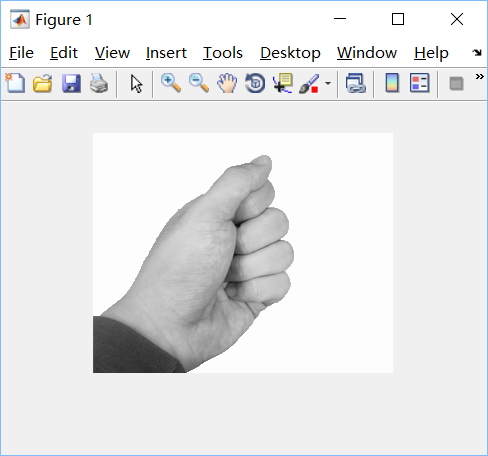

# [工程下载](https://github.com/King-S-Wang/MATLAB-Hand)

# 摘要1

图片识别总看起来遥不可及，为了更好得接触了解图片识别，我们从手势识别出发，从简单的猜拳问题——只有的三个不同可能性的情况，通过算法实现对图片内容的识别和在此基础上的猜拳结果判断。判断除了要能区分石头、剪刀、布的情况外，对错误的手势也要能识别并反馈。

# 模型和方法
猜拳的结果从总体上来说只有三种可能性——拳头，剪刀，布。因此我们要进行图像识别必须要让机器知道这三者的区别。
很明显拳头，剪刀，布（为方便之后简称猜拳内容）这三者，人是通过外观的不同来识别的。因此我们考虑让机器经过图片采集后，进行图像处理取出识别的猜拳内容轮廓，通过轮廓的区别来判断猜拳的具体内容是什么。基于此，我们就可以输入两张图片让机器识别猜拳内容，然后分别给定一个值，通过两个值的比较我们最终可以得出猜拳的结果。
我们通过一步一步的改进组合得到结果：


## 算法实现
最核心的计算是：cut.m   gaussFilter.m  feature1.m
这三个都是function文件，其中cut.m和gaussFilter.m是feature1.m的子function文件，feature1.m是a2的子function文件，a2.m是用来前期调试的暂时文件。

### cut.m
```{matlab eval=FALSE}
function featoutput=cut(Grinput,Indtaginput,BinNum,level)
%把图像切分为四块，分别统计其直方图
if level==0
    return;
end
[height,width]=size(Grinput);  %梯度图尺寸大小
%分区
half_height=ceil(height/2);
half_width=ceil(width/2);
Gr_ori1=Grinput(1:half_height,1:half_width);
Gr_ori2=Grinput(1:half_height,(1+half_width):2*half_width);
Gr_ori3=Grinput((1+half_height):2*half_height,1:half_width);
Gr_ori4=Grinput((1+half_height):2*half_height,(1+half_width):2*half_width);
Indtag_ori1=Indtaginput(1:half_height,1:half_width);
Indtag_ori2=Indtaginput(1:half_height,(1+half_width):2*half_width);
Indtag_ori3=Indtaginput((1+half_height):2*half_height,1:half_width);
Indtag_ori4=Indtaginput((1+half_height):2*half_height,(1+half_width):2*half_width);
% 开始计算四个选区
totalnum=0;
for i=1:level
    totalnum=totalnum+4^i*BinNum;
end
featoutput = zeros(1,totalnum);
feat1 = zeros(1,BinNum);
feat2 = zeros(1,BinNum);
feat3 = zeros(1,BinNum);
feat4 = zeros(1,BinNum);


for i=1:BinNum
    feat1(i) = sum(Gr_ori1(find(Indtag_ori1==i)));
end

for i=1:BinNum
    feat2(i) = sum(Gr_ori2(find(Indtag_ori2==i)));
end
 
for i=1:BinNum
    feat3(i) = sum(Gr_ori3(find(Indtag_ori3==i)));
end
 
for i=1:BinNum
    feat4(i) = sum(Gr_ori4(find(Indtag_ori4==i)));
end
if (level-1)~=0
    totalnum1=0;
    for i=1:level-1
        totalnum1=totalnum1+4^i*BinNum;
    end
    feat_cut1 = zeros(1,totalnum);
    feat_cut2 = zeros(1,totalnum);
    feat_cut3 = zeros(1,totalnum);
    feat_cut4 = zeros(1,totalnum);
    feat_cut1=cut(Gr_ori1,Indtag_ori1,BinNum,level-1);
    feat_cut2=cut(Gr_ori2,Indtag_ori2,BinNum,level-1);
    feat_cut3=cut(Gr_ori3,Indtag_ori3,BinNum,level-1);
    feat_cut4=cut(Gr_ori4,Indtag_ori4,BinNum,level-1);
    featoutput=[feat1,feat2,feat3,feat4,feat_cut1,feat_cut2,feat_cut3,feat_cut4];
else featoutput=[feat1,feat2,feat3,feat4];
end
end
```

### gaussFilter.m(高斯滤波器)

高斯滤波是一种线性平滑滤波，适用于消除高斯噪声，广泛应用于图像处理的减噪过程。通俗的讲，高斯滤波就是对整幅图像进行加权平均的过程，每一个像素点的值，都由其本身和邻域内的其他像素值经过加权平均后得到。高斯滤波的具体操作是：用一个模板（或称卷积、掩模）扫描图像中的每一个像素，用模板确定的邻域内像素的加权平均灰度值去替代模板中心像素点的值。

```{matlab eval=FALSE}
function G=gaussFilter(segma,kSize)
% Creates a 1-D Gaussian kernel of a standard deviation 'segma' and a size创建标准偏差“segma”和大小“kSize”的一维高斯核。
% In theory, the Gaussian distribution is non-zero everywhere. In practice,
% it's effectively zero at places further away from about three standard
% deviations. Hence the reason why the kernel is suggested to be truncated
% at that point.
%论上，高斯分布在任何地方都是非零的。 实际上，在远离三个标准偏差的地方实际上是零。 因此，内核被建议在这一点被截断的原因。
% The 2D Gaussian filter is a complete circular symmetric operator. It can be
% seperated into x and y components. The 2D convolution can be performed by
% first convolving with 1D Gaussian in the x direction and the same in the
% 二维高斯滤波器是一个完整的圆对称算子。 它可以分成x和y两个部分。 2D卷积可以通过首先在x方向上以1D高斯进行卷积并且在y方向上进行相同的卷积来执行。

if nargin<1 % nargin是function变量输入数
    segma=1;
end
if nargin<2
    kSize=2*(segma*3);
end
 
x=-(kSize/2):(1+1/kSize):(kSize/2);
G=(1/(sqrt(2*pi)*segma)) * exp (-(x.^2)/(2*segma^2));
```

### feature1.m

由cut.m和gaussFilter.m我们组合在一起写出了负责用来计算的主函数featur1.m。它可以计算图片，并输出[1,3]的矩阵，我们可依据矩阵其中的数值来判断猜拳内容。

```{matlab eval=FALSE}
function f1=feature1(im,Angle,BinNum,level,totalnum)    
    im=mat2gray(im);   %CHANGE+
    im=double(im);
    [height,width]=size(im);
    BW=edge(im,'canny'); 
    %采用灰度或一个二值化图像im作为它的输入，
    %并返回一个与im相同大小的二值化图像BW，
    %在函数检测到边缘的地方为1，其他地方为0。
    %采用Canny 算子边缘定位精确性和抗噪声能力效果较好 
    
    G=bwlabel(BW,8);
    filter=gaussFilter(1);
    %Imgfilter=conv2(G,filter,'same');
    %G=conv2(Imgfilter,filter,'same');
    %figure;imshow(G);
    
    f1=zeros(1,totalnum);    
    %% Gradient and Gradient angle Computation
    [GradientX,GradientY]=gradient(double(G));
    % calculate the norm of gradient
    Gr=sqrt(GradientX.^2+GradientY.^2);
    % Calculate the angle
    index=find(GradientX == 0);
    GradientX(index)=1e-5;
    YX=GradientY./GradientX;
    if Angle==180,A=((atan(YX)+(pi/2))*180)./pi; end
    if Angle==360,A=((atan2(GradientY,GradientX)+pi).*180)./pi; end
    %% Spatial / Orientation Binning
    nAngle=Angle/BinNum;
    IndTag=ceil(A./nAngle);
    for i=1:BinNum
        f1(i)=sum(Gr(find(IndTag==i)));
    end
    feat=cut(Gr,IndTag,BinNum,level);
    f1((1+BinNum):totalnum)=feat;
    f1=f1./(height*width);
end

```

{width=50%}{width=50%}

{width=50%}{width=50%}

### a2.m(For testing)
a2.m是我们用来调试的基础工程。

```{matlib eval=FALSE}
clear;
clc;
BinNum=36;
Angle=360;
level=2;
totalnum=BinNum;
flag=0;
for i=1:level
    totalnum=totalnum+4^i*BinNum;
end
fstandard=zeros(3,totalnum);
for n=1:3
    imgname=sprintf('%d.bmp',n);
    im=imread(imgname);
    if size(size(im),2)==3
       im=rgb2gray(im);
    end
    f=feature1(im,Angle,BinNum,level,totalnum);
    fstandard(n,1:totalnum)=f(1,1:totalnum);
end
while(1)
    tag=zeros(1,2);
    for n=1:2
        xm=sprintf('请输入第%d个手势：',n);
        fname=input(xm,'s');
        imidentify=imread(fname);
        if n==1 subplot(1,3,1);imshow(imidentify);end
        if n==2 subplot(1,3,3);imshow(imidentify);end
        if size(size(imidentify),2)==3
            imidentify=rgb2gray(imidentify);
        end
        fidentify=feature1(imidentify,Angle,BinNum,level,totalnum);
        distance=zeros(1,3);
        for i=1:3
            for j=1:totalnum
                distance(1,i)=distance(1,i)+sqrt((fidentify(j)-fstandard(i,j))^2);
            end
        end
    %%
D1L=1.8;D1R=4.0; %布 distance(1)左右门限  %D1L=1.9-->1.8  D1R=4.5-->4.0
D2L=4.5;D2R=7  ; %剪刀 distance(2)左右门限 %D2L=4.9-->4.5  D2R=5.5-->7
D3L=8.0;D3R=26.1;%石头 distance(3)左右门限 %D3L=9 8-->9 D3R=24.1-->26.1
XX=5.28;           %distance(3)异形指数        
if distance(1)==0
            tag(1,n)=1;disp('a是布');
        elseif distance(2)==0
            tag(1,n)=2;disp('b是剪刀');
        elseif distance(3)==0
            tag(1,n)=3;disp('c是石头');
        else
              if distance(3)>D3L||distance(2)>D3L||distance(1)>D3L
                 tag(1,n)=3;disp('c是石头');
              
              elseif distance(1)<D1R&distance(2)>D2L&distance(2)<D2R&distance(3)<XX
                 tag(1,n)=1;disp('a是布');
              elseif distance(1)>D1R&distance(2)<5.8&distance(3)<XX
                 tag(1,n)=2;disp('b是剪刀');
              else
                  disp('无效手势！！请重新输入！！');
                  tag(1,n)=4;break;
 
              
            end
         end
    end   
    
        
  
    if tag(1,1)==4||tag(1,2)==4 continue;
    end
    if (tag(1,1)==1&&tag(1,2)==3)||(tag(1,1)==2&&tag(1,2)==1)||(tag(1,1)==3&&tag(1,2)==2)
        subplot(1,3,2);imshow('win.jpg');
    end
    if (tag(1,1)==1&&tag(1,2)==1)||(tag(1,1)==2&&tag(1,2)==2)||(tag(1,1)==3&&tag(1,2)==3)
        subplot(1,3,2);imshow('peace.jpg');
    end
    if (tag(1,1)==1&&tag(1,2)==2)||(tag(1,1)==2&&tag(1,2)==3)||(tag(1,1)==3&&tag(1,2)==1)
        subplot(1,3,2);imshow('lose.jpg');
    end
 
    xn=input('请选择继续玩(c)或者退出(q):','s');
    switch(xn)
        case 'c'  
            continue;
        case 'q'  
            break;
    end
end
```

{width=40%}{width=60%}

### hougege.m

用GUIDE创建名为hougege的GUI程序。运行该GUI时，程序首先从主函数的入口点开始运行，即从function varargout = hougege(varargin)开始运行。varargin为输入参数，varargout为输出参数。当创建GUI时，varargin为空。当触发GUI控件对象时，varargin为一个1*4的单元数组。第1个单元存放空间的回调函数名，第2~4单元存放该回调函数的输入参数，分别为，hObject：当前回调函数对应的GUI对象句柄，eventdat：附加参数，handles：当前GUI所有数据的结构体。

gui_Singleton = 1;保证只能运行该GUI程序的一个实例，即只能打开一个窗口。

紧接着定义一个结构体gui_State，描述了该GUI的状况，包括gui的名字、运行实例、初始化函数、输出函数、布局以及回调函数。该结构体有6个字段：第1个字段为gui_Name,字段值为mfilename。mfilename函数用于M文件内部，返回当前正在运行的M文件名字;若用于命令行,返回空字符串。第2个字段为gui_Singleton,设置是否只产生单一GUI实例。第3个字段为gui_OpeningFcn,字段值为当前GUI的OpeningFcn函数句柄。第4个字段为gui_OutputFcn,字段值为当前GUI的OutputFcn函数的句柄。第5个字段为gui _LayoutFcn,用于创建GUI实例。字段值为空时，先检查上次GUI初始化是否完成,若没有完成,则删除上一次创建的句柄并重新创建。第6个字段为gui_Callback.初始值为空，表示只运行OpeningFcn和gui_OutputFcn,而不运行Callback。

然后程序通过gui_State.gui_Callback = str2func(varargin{1});分别取得figure和包含的控件的CreateFcn回调函数，创建各个控件。figure和各控件创建完毕，程序会调用OpeningFcn进行初始化，然后运行OutputFcn，把figure的句柄作为输出参数输出。这时，GUI界面便在屏幕上显示出来。此后程序处于等待状态，等待用户的操作。gui_mainfcn是GUI默认的处理函数，该函数用于处理GUI创建、GUI布局和回调函数。程序在调用gui_mainfcn函数时，会给figure以及各控件加一个事件监听器（listener），用来监听用户对figure以及各控件的操作。例如：用户用鼠标点击一个pushbutton按钮时，程序会监听到这个时间，然后调用该按钮的回调函数pushbutton_callback，对事件进行处理。用户点击figure的关闭按钮时，会调用其CloseRequestFcn回调函数，执行关闭窗口的操作等等。

```{matlab eval=FALSE}
function varargout = hougege(varargin)
% HOUGEGE M-file for hougege.fig
%      HOUGEGE, by itself, creates a new HOUGEGE or raises the existing
%      singleton*.
%
%      H = HOUGEGE returns the handle to a new HOUGEGE or the handle to
%      the existing singleton*.
%
%      HOUGEGE('CALLBACK',hObject,eventData,handles,...) calls the local
%      function named CALLBACK in HOUGEGE.M with the given input arguments.
%
%      HOUGEGE('Property','Value',...) creates a new HOUGEGE or raises the
%      existing singleton*.  Starting from the left, property value pairs are
%      applied to the GUI before hougege_OpeningFunction gets called.  An
%      unrecognized property name or invalid value makes property application
%      stop.  All inputs are passed to hougege_OpeningFcn via varargin.

gui_Singleton = 1;
gui_State = struct('gui_Name',       mfilename, ...
                   'gui_Singleton',  gui_Singleton, ...
                   'gui_OpeningFcn', @hougege_OpeningFcn, ...
                   'gui_OutputFcn',  @hougege_OutputFcn, ...
                   'gui_LayoutFcn',  [] , ...
                   'gui_Callback',   []);
if nargin && ischar(varargin{1})
    gui_State.gui_Callback = str2func(varargin{1});
end
 
if nargout
    [varargout{1:nargout}] = gui_mainfcn(gui_State, varargin{:});
else
    gui_mainfcn(gui_State, varargin{:});
end
% End initialization code - DO NOT EDIT
```

### 其他(Fanhui.m)

接下来，在a2的基础上，通过GUI设计和其他的子函数我们编写了a1.m，设计了对应的人机交互界面a1.fig.至此猜拳手势识别功能我们就已经实现了。

```{matlib eval=FALSE}
function varargout = fanhui(varargin)
gui_Singleton = 1;
gui_State = struct('gui_Name',       mfilename, ...
                   'gui_Singleton',  gui_Singleton, ...
                   'gui_OpeningFcn', @fanhui_OpeningFcn, ...
                   'gui_OutputFcn',  @fanhui_OutputFcn, ...
                   'gui_LayoutFcn',  [] , ...
                   'gui_Callback',   []);
if nargin && ischar(varargin{1})
    gui_State.gui_Callback = str2func(varargin{1});
end
if nargout
    [varargout{1:nargout}] = gui_mainfcn(gui_State, varargin{:});
else
    gui_mainfcn(gui_State, varargin{:});
end
% End initialization code - DO NOT EDIT
% --- Executes just before fanhui is made visible.
function fanhui_OpeningFcn(hObject, eventdata, handles, varargin)
% This function has no output args, see OutputFcn.
% hObject    handle to figure
% eventdata  reserved - to be defined in a future version of MATLAB
% handles    structure with handles and user data (see GUIDATA)
% varargin   command line arguments to fanhui (see VARARGIN)
% Choose default command line output for fanhui
handles.output = hObject;
% Update handles structure
guidata(hObject, handles);
% UIWAIT makes fanhui wait for user response (see UIRESUME)
% uiwait(handles.fanhui);
% --- Outputs from this function are returned to the command line.
function varargout = fanhui_OutputFcn(hObject, eventdata, handles) 
% varargout  cell array for returning output args (see VARARGOUT);
% hObject    handle to figure
% eventdata  reserved - to be defined in a future version of MATLAB
% handles    structure with handles and user data (see GUIDATA)
% Get default command line output from handles structure
varargout{1} = handles.output;
% --- Executes on button press in pushbutton1.
function pushbutton1_Callback(hObject, eventdata, handles)
close(handles.fanhui);
% hObject    handle to pushbutton1 (see GCBO)
% eventdata  reserved - to be defined in a future version of MATLAB
% handles    structure with handles and user data (see GUIDATA)
```

varargin是“Variable length input argument list”的缩写，它提供了一种函数可变参数列表机制，允许调用者调用该函数时根据需要来改变输入参数的个数。

varargout可以看做“Variable length output argument list”的缩写。在matlab中定义m函数时通过varargout我们可以得到可变个数个返回值。

nargin通过调用当前正在执行的函数返回输入参数的数量，只在函数体内使用nargin语法功能。

nargout指出了输出参数的个数（nargin指出了输入参数的个数）。

Feiyang执行效果：按钮一输入手势一，按钮二输入手势二，（无效手势重新输入）输入全部完成后进行图像识别，识别后进行比较，得出“输”，“赢”，“平”的结果。最后可选择执行初始化和退出。

{width=40%}

## 工程结果展示
{width=50%}{width=50%}
{width=50%}{width=50%}
{width=50%}{width=50%}

## 总结
我们做的改程序还非常初始，由于图片参数设置的原因，只能识别给定的图片，对于其他图片的计算结果数值偏大，都会得出为石头的结果，还需要进一步改进。除了再这方面改进外，我们还可以改进算法，通过MATLAB的自带摄像头函数进行图片的获取并计算出结果，减少其他背景因素的影响。

在这个程序基础上，我们可以通过算法的改进，对其他图像进行识别，比如LOGO和一些生活中的标志，并通过联网图片搜索实现机器学习的功能。

