```{r setup, include=FALSE}
knitr::opts_chunk$set(echo = FALSE)
```

# [DOWNLOAD PEOJECT](https://github.com/King-S-Wang/PUBG_StrategiesAnalysis)

# Introduction
The PlayerUnknown's Battlegrounds (PUBG) is a battle royal game with hundreds of million players. 100 players parachute onto an island and scavenge for weapons and equipment to kill others while avoiding getting killed themselves. 

To win the first placement, players use multiple strategies from their experience. Our team aims to enable players to get better ranks by extracting the relationships among death rate and different strategies from over 720K matches which give more statistical inspirations.

# Data Preparation
To provide a clear picture of the PUBG match strategy analysis and to propose appropriate suggestions, in this project, we used the PUBG Match Deaths and Statistics Datasets. It is a publicly available dataset that can be found on [Kaggle](https://www.kaggle.com/skihikingkevin/pubg-match-deaths), containing over 720K competitive matches from the PUBG, extracted from a game tracker website, [pubg.op.gg](https://pubg.op.gg/).

Instead of using all the data files provided in the original dataset, we mainly focus on 5 divided datasets of deaths in the match map ERANGEL which records above 80% of death events occurred within the 720K matches. Since the datasets is very huge, 2GB for each file, so we only take one of 5 datasets mentioned above, containing about 120K records of match.

Before the analysis, we cleaned the dataset with following main steps:

* Exclude all the possible missing values.

* Remove the data that seemed like it was generated by a cheating program.

* Put away the data that the killer’s position is over 800,000 to ensure the data of the killer's position in this project is exactly between 0 and 800,000.

# Descriptive and Inferential Statistics

## Landing Analysis
After the game started, players would set off to different places. In generally, there are 2 main strategies. The first strategy, players are obsessed with high-value places which have good qualities and quantities of weapons and armours. Those high value places are also highly risky 
because it fascinates other players as well. You can always hear gunshots from there.

The following picture was provided by [PUBG official](https://pubg.op.gg/maps/statistics) which shows the distribution of valuable weapons. Indeed, those high frequency areas are also what we call downtown areas which have many buildings located next to each other.

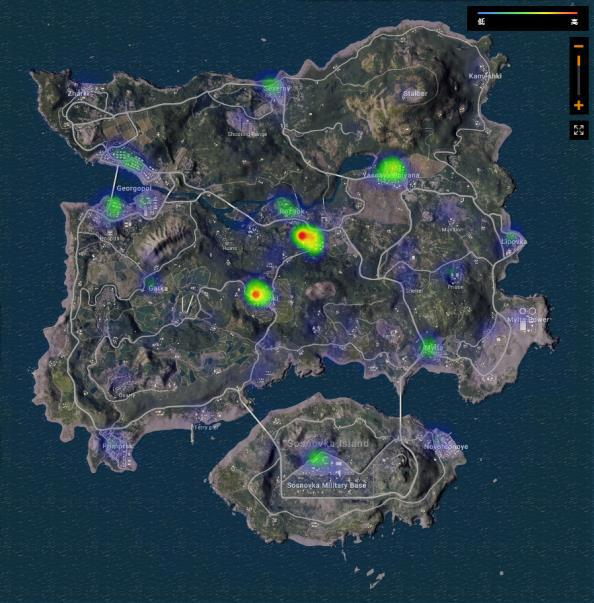{width=50%}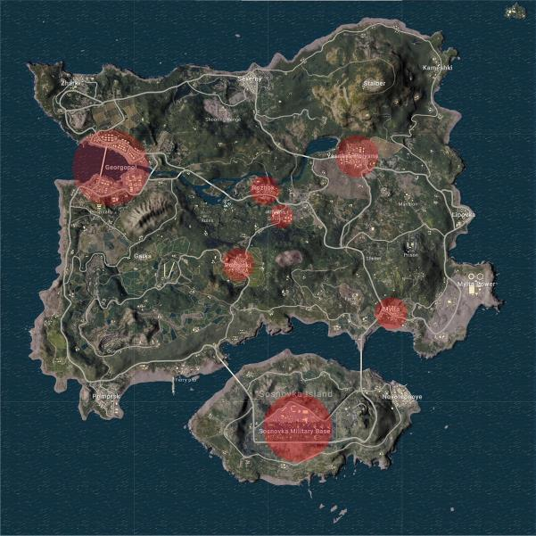{width=50%}

On the other hand, the rest of players would choose safer places which we sometimes called wild places as well. Those places could barely encounter other players, in spite of low qualities of weapons and armours.

With this dataset, we try to peek at the difference with those 2 strategies and give some useful advice to those players before they opened their parachutes.

First, we need to clarify the downtown area and wild area. According to the official weapon map and the common sense of the game, I define 7 regions to be the downtown area, they are:

* Georgopol

* Yasnaya Polyana

* Rozhok

* School

* Pochinki

* Mylta

* Military Base

After defining the areas, now we need to know where the players land after they leave the plane. 

However, the dataset does not contain this information. 
In the dataset, it just provides the killers’ and victims’ location and their ranks when one player 
kicks off another. It also provides the specific time when the issue happened. 

By searching the internet, we could find that the blue zone reaches to the first white circle at 
the time of 12 minutes.

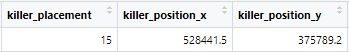{width=50%}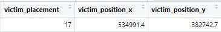{width=50%}

Based on above information, we could predict the location of landing by using kicking off event if we limit the time before the second blue zone comes. That is to say, if the kicking off event just happens a few minutes later after the game starts, the location of killers or the victim is of high possibility next to where they landed.

1. Calculate the distance between the canter of 7 downtown area and kicking off location by algorithm
2. Sort the above result by players’ placement(ranking)

After that, we got 4 value:

A. chengqu_t5 Player lands in downtown area and ranking top 5
B. chengqu_b Player lands in downtown area but ranking after No.5
C. yequ_t5 Player lands in wild area and ranking top 5
D. yequ_b Player lands in wild area and ranking after No.5
The codes are attached in the “.r”. It takes some time to run it since it contains too much data. 

Then, we could use Chi-Squared Test to see if it really has differences between 2 strategies.

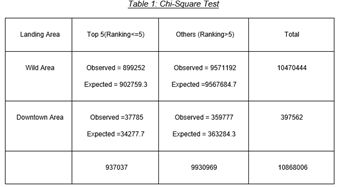

Ho: There is no association between Landing Area and Ranking
H1: Ranking is not independent of Landing Area

The output of Chi-Squared Test shows in the following picture:

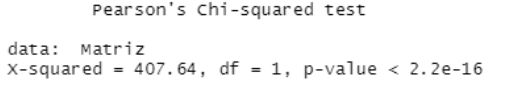

**Landing in the Downtown Area is more likely to be top 5 in ranking**

The p-value is less than 0.05 which means we could draw a preliminary conclusion that there is a difference between 2 strategies. Landing in the Downtown Area has 9.5% possibility of ranking in the top 5 and landing in Wild Area has 8.5% possibility. 

It’s reasonable to explain this result. Although the Downtown Area is risky, it has valuable armours and weapons which could increase the possibility of living. After landing in the downtown area, players even could just find valuable armours and just leave. It is also a good 
strategy of surviving.

If you land in a Wild Area, you could survive at the beginning of the game, however you also have to move to another place to find armours and weapons to survive because a single wild place could not fit the requirement of enough good equipment. During this swifting place period, you are very likely to be killed by other players who are already there. And the players from Downtown Area who with great armour and full accessories in guns are much easier to 
control their guns than you if your accessories are not enough, which means killed by them easily.

In spite of the difference between them being 1%, we hope this could give you some advice to 
choose the landing place.

## The Final Playzone Analysis

PUBG players who survived from landing will face more hostile and precarious conditions as they pursue the number one spot. The ["Blue zone"](https://pubg.fandom.com/wiki/The_Playzone) is a core features of the game and it limits the space in the game for players while the ["Playzone"](https://pubg.gamepedia.com/The_Playzone) also known as “The Circle” is the area the players must stay in. If existing inside the blue zone, players will take damage every second
as shown in following figure. This forces players closer to each other as the game progresses in order to speed up the game. Therefore, in order to keep survival, players have to wisely work out the hiding strategy and wipe out enemies through the course of the game, but the precondition is that they should stay in the play zone until the competition finishes.

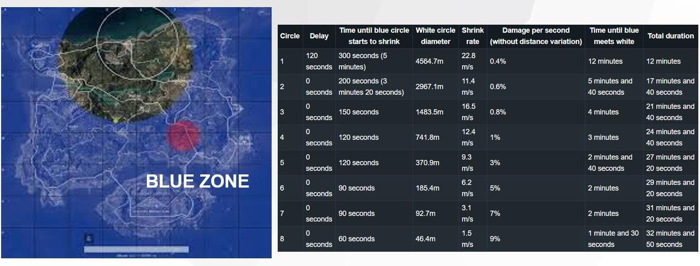

Playzone has a total of 8 circles, with the 8th one being the final circle. Details are shown in figure. The radius of the playzone gradually decreases during the competition, making the playable area of the map smaller and worse. Therefore, it is crucial for players to make shooting 
predictions for multiple play zones before engaging in battles. If players failed to make a correct 
prediction and chose a wrong area with high risks, they would be trapped into a rough game and even lose the game. In this case, the playzone analysis can give useful advice to players to predict shelters in advance, thus providing comprehensive and **scientific strategies for successful survival and eye-catching ranking in this competition**.

### Data Preparation

With the current dataset, we only keep the coordinate positions of killers and victims between 0 and 800000, removing all other invalid outliers. Using R studio, we installed, and loaded packages needed and set the working directory to manage files location. Next, we read the csv 
file and create a data frame named “df_pubg”. Since the final circle would provide the most significant survival guides, indicating the final replacement, we only focus on the shooting distribution of the final circle. In this case, we convert gaming time to 8 circle categories based 
on “Circle” details shown in above figure.

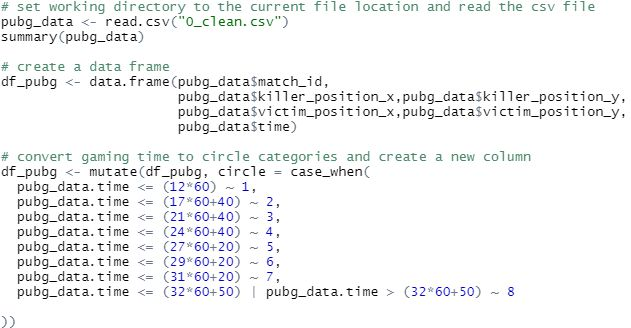

### The Probability Density Distribution of Playzone

Firstly, we used the [two-dimensional kernel density estimation](https://rdrr.io/cran/MASS/man/kde2d.html)
(the kde2d function) with an axis-aligned bivariate normal kernel, evaluated on a square grid, to estimate the probability density of the play zone location based on the killers’ positions, representing the survival locations with high probability. As shown in following figure, we can clearly see the probability density distribution of survival populations, thus the possible playzone locations, however, there is no clear content meaning behind.

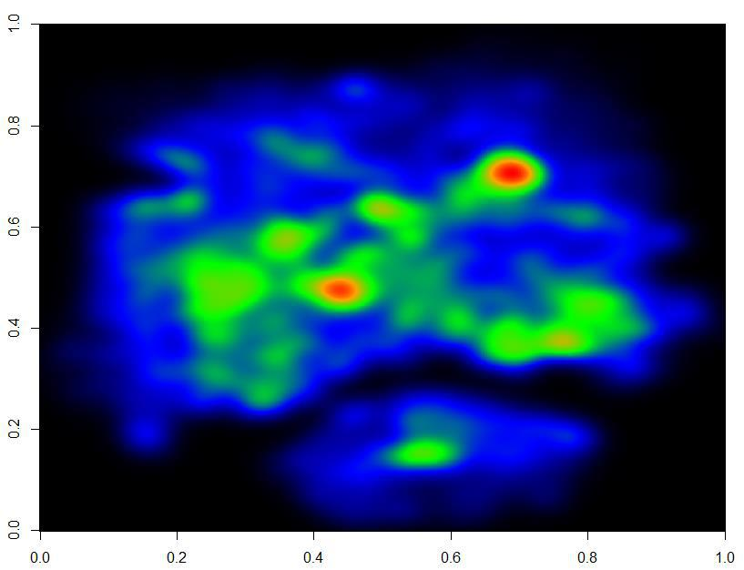

To better understand the meaning behind the distribution of killers’ positions density in the real map, thus the final playzone, we try to plot the heatmap based on the pub ERANGEL map background. So, we import pubg map: ERANGEL to R studio. Next, we use imager to load the EANGEL map in analysis.

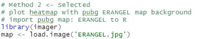

We use the killers’ positions in x axis and y axis to plot the distribution of killer population density in circle 8 as we believe the killer’s positions highly represent the possible high frequent survival positions, thus the final play zone locations. We used “options(scipen=999)” to print 
the numeric value in fixed notation before plotting the graph to help us well representing the x and y-axis values. Moreover, multiple modifications for plotting settings have been made to deliver a clear visualization as below. Eventually, we plot the distribution of survival killers in 
the final playzone in the figure, which shows the safest hidden place for players.

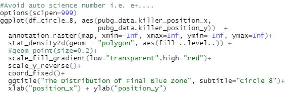
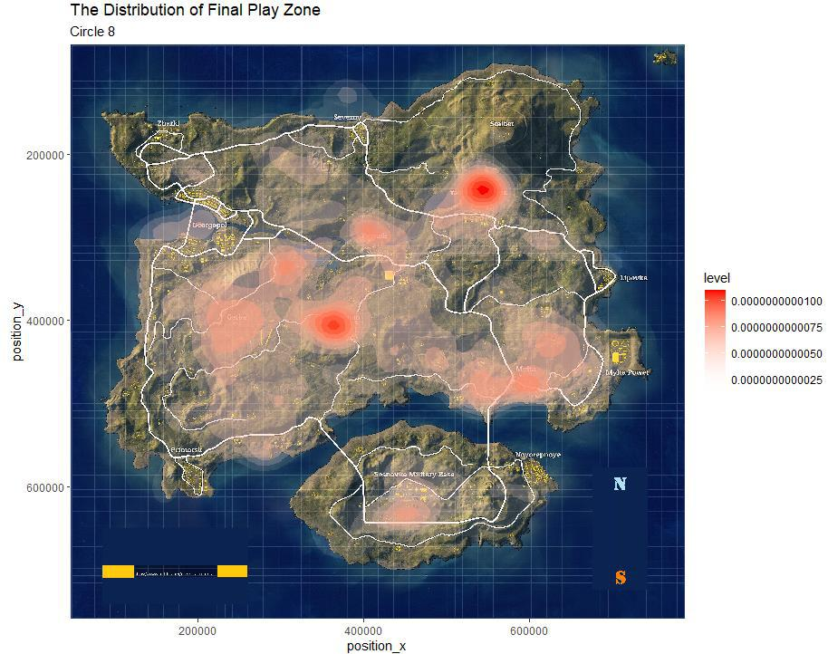

### Interpretation of Blue Zone Analysis

From the distribution of the playzone, we could find there are a large number of fierce fighting occurring in several areas, which are highly possible final playzone locations for players. Thus, it could help players make better shelter decisions in advance.

Besides, the places with more red concentration hold more survival players. It is obvious that the top 2 areas with more survival numbers are “Yasnaya Polyana” and “Pochinki”. This phenomenon is mainly caused by the radius of the play zone circle gradually decreasing which forces them to gather in these areas.

Next, Mylta, Gaka, Roznok, Sosnovka Military Base also saw the fierce and frequent conflicts, a lot of people converging into these areas. The reason may be more shelters for them to hide. But things backfired, these places also turn into dangerous areas which are full of risk and death.

Therefore, after the playzone analysis, we could get the result that the highly clustered areas are the highly possible final play zone locations for players, they are Yasnaya Polyana and Pochinki respectively. Players could choose these high possible probability areas as their 
directions of the movements to final circles.

## Weapon Analysis

Many PUBG players would face the dilemma of choosing weapons when they found different kinds of guns in a single room. Although they could carry 2 main weapons and 1 secondary 
weapon, they could only use one or two guns when they encountered other players. Thus, their main concerns when selecting weapons are which weapon would let them have a higher surviving possibility in a specific situation. By analysing the dataset, we try to find the better 
choice based on facts for players when they are picking weapons.

The previous only tries to build models to predict the ranking. They did not find suggestive solutions to general players about how to maximize the surviving possibilities and make more kills. In this project, we would do our best to find contributive results for players no matter the 
green hands or masters about survival and improving ranks as well.

### Data Understanding and Preparation

After installing and loading packages, we set the working directory to source file location and then read the csv data and form a table named “my_data_orig”.

We exclude records of several kinds of cause of death that have nothing to do with weapons in “killed_by”. For example, players will die if they fall from a height, cracked heavily by a car or motorbike, or not survive in the red/blue zones. In addition, what we already know is all the records are created on the map “ERANGEL”. Since we are going to do the weapon analysis, we will focus on the “killed_by”, “killer_name”, “killer_placement”, “match_id” and “time”.

We create a new data table “my_data” by selecting a subset from the original data. All the records in which the death is not caused by weapons and 5 columns mentioned above are 
selected. The data table which consists of 7,629,499 records is the table we are going to use in the following analysis.

When we check the summary, we find that the ranges of killer_placement and time are [1, 99] and [58, 2374 (seconds)].

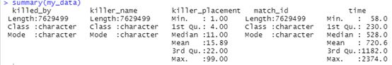

We then create histograms for both variables. From “kills in different times” we can see that in the prophase period, from around 100 to 500 seconds there appears to be a peak value of kills. Also, there are relatively fewer kills before 100 seconds and after 1800 seconds.

It is reasonable since at first 10 seconds the players are in the plane, and then after they jump when they are still in the air, not yet on the ground it is more difficult to kill. But after they landed, it has the most population at the beginning of the game, and it is easier for some green 
hands to die. As for the time after 1800, the number of players remaining is few, then the kills are certainly to decrease.

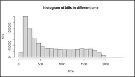{width=50%}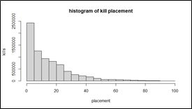{width=50%}

Then we come to the “kill placement”. It appears that players ranking a higher level are making more kills.

### The Kills in Every Match

Since the data records every kill information, we need to count the number of kills of every match. First add a column of 1 named “count” in “my_data” for further use. Then use 
“aggregate” to count kills by group by match id.

In these 118838 matches recorded, kills caused by weapons in every match ranged from 6 to 95. The histogram shows that 60-65 kills are the most likely to appear.

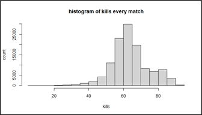{width=60%}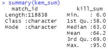{width=40%}

### Kills of Each Weapon in Different Periods

There are 8 circles in a game of PUBG, data of the start time of the game and 8 circles is recorded in “start_time”. We primarily analyse three stages of the game, prophase, metaphase and anaphase period. Prophase is defined as the first 3 circles, metaphase is the next 3 circles, 
anaphase is the last 2 circles.

We will analyse kills of each weapon of different stages and the whole game. We made three subsets of “my_data” by dividing time and analysing them separately. Kills caused before 1300 are divided into prophase (kam_pro), in and after 1300 but before 1760 are divided into metaphase (kam_meta), in and after 1760 are belonging to anaphase (kam_ana).

We count the number of kills of each weapon in different stages, divide it by total number of matches (118838), and get a mean of kills of each weapon (pro/meta/ana_kill_mean). Then used “full_join” to join three tables using mean but not sum, created a new table named “kam_ft” and a new variable “total_kill_mean” representing the mean of kills in the whole game in different matches.

New variables of percentage of kills of each weapon in total kills of different stages (eg.kam_ft$pro_kill_mean*100/sum(kam_ft$pro_kill_mean)) were created since the total kills were different among different stages and it was not appropriate to compare the mean of kills of each weapon in different stages directly. The final table looks as shown.

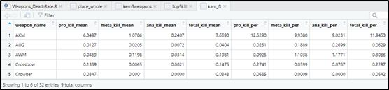

We started to analyse the data and visualize the result. After checking the percentage of death caused by different weapons of each period and the whole game, list top 5 weapons caused most deaths, create histograms and table to better observe the results.

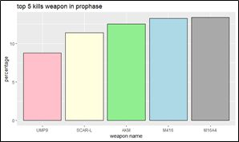{width=50%}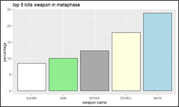{width=50%}

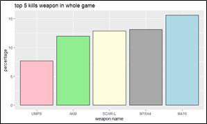{width=50%}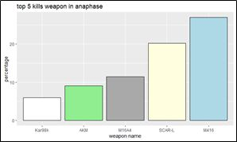{width=50%}

There are differences between prophase period and latter period. These figures and tables record the top 5 kills of weapons, in metaphase and anaphase period, the top 5 weapons are the same both in categories and ranks. However, in the prophase, “UMP9” instead of “Kar98k” is in top 5, the ranks are also different.

In addition, in metaphase and anaphase, the proportion of death caused by M416 is as high as around 25%, which means almost a quarter of total deaths are caused by M416. In prophase the proportion of M416 is just ranked No.2.

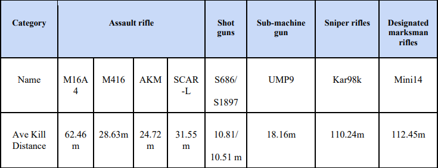

According to the weapon information table, it is better to use Sniper rifles like Kar98k in the middle and anaphase but not prophase. M416 is very useful in killing, especially in middle and later periods.

In order to further explore the weapons in different periods, we create a bar plot to compare the proportion of death. Too many kinds of weapons made the overview of the percentage of the kill difficult to read. We tried to make some selection and zoom into the extreme position.

Death caused by “S686”, “S1987” and “UMP9” account for a greater proportion of all deaths in prophase than metaphase and anaphase. “Mini14” and “Kar98k” are just the opposite. 
According to the Weapon Information (excerpts), the former 3 weapons have shorter average kill distance and latter 2 larger. So we recommend the former kinds of weapons in prophase and latter kinds of weapons in later periods.

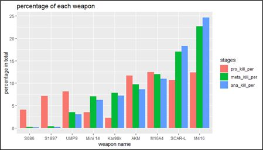

### Kill Every Match of Top Weapons

Then we count the total death caused by every kind of weapon in every match (118838 matches) by grouping “killed_by” and “match_id” and count kills, filling the NA using 0. Select top 3 weapons in total death and create a new boxplot.

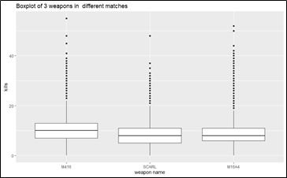{width=60%}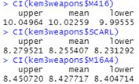{width=40%}
The confidence intervals of population mean of all three weapons are calculated. None of three intervals appear to overlap with others. 

In the meantime, we do a hypothesis testing:
H0: all population means of the three weapons are equal.
H1: at least one population mean is different.

We first do ANOVA but find it may not be distributed normally. Then we do a Kruskal-Wallis test and Multiple pairwise-comparison.

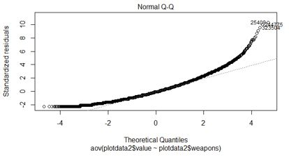

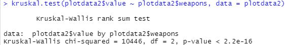
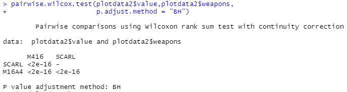

Since the p value is less than 0.01, ~~we reject the null hypothesis~~ and conclude that at least one population mean is different.

M416 has the largest population mean, M16A4 the second and SCARL the smallest. That is, M416 is recommended in the whole game if players are aiming at making more kills.

### Weapons and Placement

All above we have analysed about weapons is focused on the death, now we are going to explore whether there are differences in the final placement using different weapons.

We remove the duplicates of death records made by the same killer and same weapon in every match. Then make several subsets by identifying the specific weapon names, create histograms of the placements of killers using different weapons.

Killers using M416 have a higher possibility of getting better ranks. UMP9 also performs well but appears more ranks around 25-20. Players using P92 and S1897 were mostly ranked at 20-25.

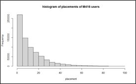{width=50%}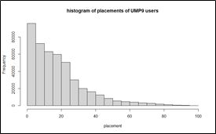{width=50%}
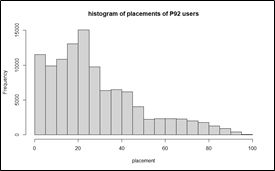{width=50%}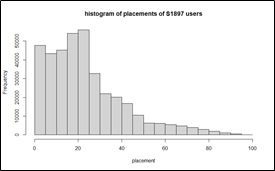{width=50%}

# Conclusion & Recommendation
In conclusion, we have found out the strategies the players who have a higher probability of surviving in the match take by analysing the relationships among death rate and 3 different strategies from over 120K matches. They are:

* Landing in the Downtown Area is more likely to be top 5.

* Top 3 highly possible locations in the final blue zone are Yasnaya Polyana and Pochinki respectively.

* Play zone with Fiercest and Most conflits: Yasnaya Polyana and Pochinki. Avoiding entering the fierce shooting areas in the next round competition.

* M416, M16A4, SCAR-L and AKM are recommended. In the first 3 circles UMP9 performs well, too. In the later periods Kar98k. 

There are also some limitations and concerns with our analysis due to the protection of official confidential information and data. If other related datasets can also be brought in our project, it will enhance the amount and accuracy of strategy insights. For example, we could investigate the survival strategy in different weather conditions. We can also explore the strategies in different battle systems including first-person perspective and third-person perspective.
