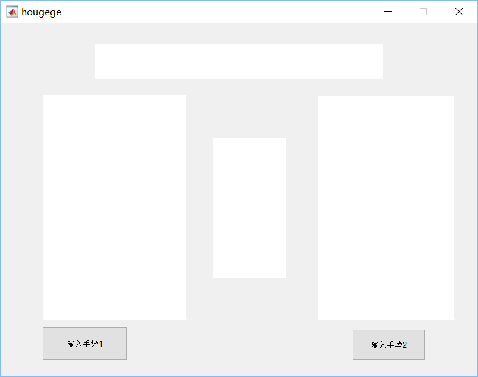
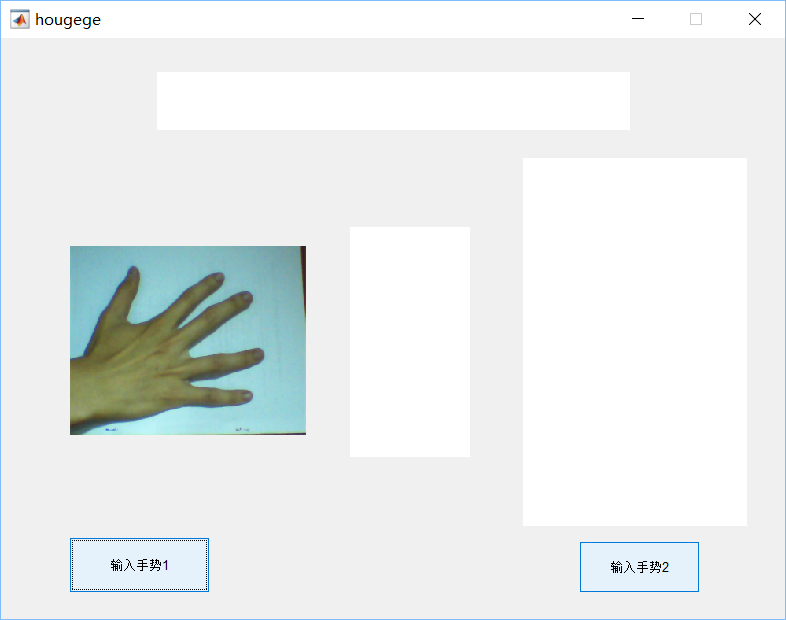
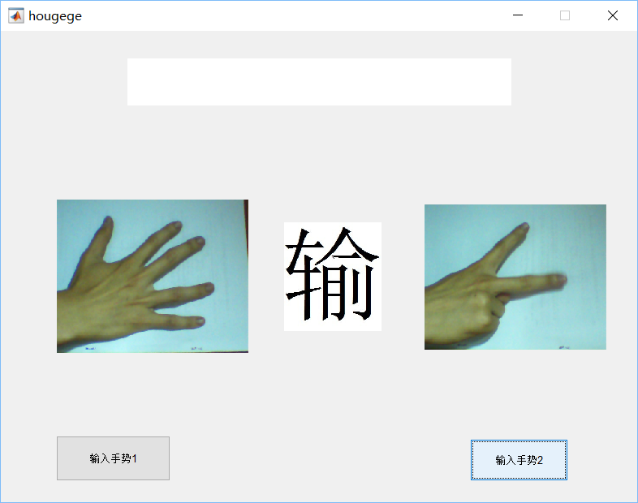

# [DOWNLOAD PROJECT](https://github.com/King-S-Wang/MATLAB-Hand)

# Abstract


Image recognition always looks out of reach, in order to better understand the image recognition.We start from the gesture recognition, the simple guess quiz problem - only three different possibilities, through the algorithm to achieve the image content identification.And on the basis of the results of the judgment of quiz. Judgment in addition to being able to distinguish between the stone, scissors, cloth, the wrong gesture to recognize and feedback.


# Models and methods

There are only three possibilities for the result of guessing in general-fist, scissors, and cloth. Therefore, if we want to perform image recognition, we must let the machine know the difference between the three. Obviously, fists, scissors, and cloth (hereafter referred to as the content of guessing for convenience), people are identified by the difference in appearance. Therefore, we consider letting the machine perform image processing to take out the contours of the identified boxing guesses after the picture is collected, and judge the specific content of the boxing guesses by the difference of the contours. Based on this, we can enter two pictures for the machine to recognize the content of the boxing, and then give a value respectively, and through the comparison of the two values, we can finally get the result of the boxing.

We get the result through a step-by-step improvement combination:


## Algorithm implementation

The core calculation is: *cut.m* *gaussFilter.m* [feature1.m]
These three are function files, *cut.m* and *gaussFilter.m* are the sub-function files of *feature1.m*. *feature1.m* is the sub-function file of *a2.m*, and *a2.m* is the temporary file used for preliminary debugging.

### cut.m
```{matlab eval=FALSE}
function featoutput=cut(Grinput,Indtaginput,BinNum,level)
%Divide the image into four pieces and count their histograms, respectively
if level==0
    return;
end
[height,width]=size(Grinput);  %Gradient map size
%Partition
half_height=ceil(height/2);
half_width=ceil(width/2);
Gr_ori1=Grinput(1:half_height,1:half_width);
Gr_ori2=Grinput(1:half_height,(1+half_width):2*half_width);
Gr_ori3=Grinput((1+half_height):2*half_height,1:half_width);
Gr_ori4=Grinput((1+half_height):2*half_height,(1+half_width):2*half_width);
Indtag_ori1=Indtaginput(1:half_height,1:half_width);
Indtag_ori2=Indtaginput(1:half_height,(1+half_width):2*half_width);
Indtag_ori3=Indtaginput((1+half_height):2*half_height,1:half_width);
Indtag_ori4=Indtaginput((1+half_height):2*half_height,(1+half_width):2*half_width);
% Start counting four constituencies
totalnum=0;
for i=1:level
    totalnum=totalnum+4^i*BinNum;
end
featoutput = zeros(1,totalnum);
feat1 = zeros(1,BinNum);
feat2 = zeros(1,BinNum);
feat3 = zeros(1,BinNum);
feat4 = zeros(1,BinNum);


for i=1:BinNum
    feat1(i) = sum(Gr_ori1(find(Indtag_ori1==i)));
end

for i=1:BinNum
    feat2(i) = sum(Gr_ori2(find(Indtag_ori2==i)));
end
 
for i=1:BinNum
    feat3(i) = sum(Gr_ori3(find(Indtag_ori3==i)));
end
 
for i=1:BinNum
    feat4(i) = sum(Gr_ori4(find(Indtag_ori4==i)));
end
if (level-1)~=0
    totalnum1=0;
    for i=1:level-1
        totalnum1=totalnum1+4^i*BinNum;
    end
    feat_cut1 = zeros(1,totalnum);
    feat_cut2 = zeros(1,totalnum);
    feat_cut3 = zeros(1,totalnum);
    feat_cut4 = zeros(1,totalnum);
    feat_cut1=cut(Gr_ori1,Indtag_ori1,BinNum,level-1);
    feat_cut2=cut(Gr_ori2,Indtag_ori2,BinNum,level-1);
    feat_cut3=cut(Gr_ori3,Indtag_ori3,BinNum,level-1);
    feat_cut4=cut(Gr_ori4,Indtag_ori4,BinNum,level-1);
    featoutput=[feat1,feat2,feat3,feat4,feat_cut1,feat_cut2,feat_cut3,feat_cut4];
else featoutput=[feat1,feat2,feat3,feat4];
end
end
```

### gaussFilter.m

Gaussian filtering is a linear smoothing filter, which is suitable for eliminating Gaussian noise and is widely used in the denoising process of image processing. In layman's terms, Gaussian filtering is the process of weighted averaging the entire image. The value of each pixel is obtained by weighted averaging of itself and other pixel values in the neighborhood. The specific operation of Gaussian filtering is to scan each pixel in the image with a template (or convolution, mask), and use the weighted average gray value of the pixels in the neighborhood determined by the template to replace the value of the center pixel of the template.

```{matlab eval=FALSE}
function G=gaussFilter(segma,kSize)
% Creates a 1-D Gaussian kernel of a standard deviation 'segma' and a size
% In theory, the Gaussian distribution is non-zero everywhere. In practice,
% it's effectively zero at places further away from about three standard
% deviations. Hence the reason why the kernel is suggested to be truncated
% at that point.
% The 2D Gaussian filter is a complete circular symmetric operator. It can be
% seperated into x and y components. The 2D convolution can be performed by
% first convolving with 1D Gaussian in the x direction and the same in the

if nargin<1 % nargin is function's input
    segma=1;
end
if nargin<2
    kSize=2*(segma*3);
end
 
x=-(kSize/2):(1+1/kSize):(kSize/2);
G=(1/(sqrt(2*pi)*segma)) * exp (-(x.^2)/(2*segma^2));
```

### feature1.m

We combined cut.m and gaussFilter.m to write the main function featur1.m, responsible for the calculation. It can calculate the picture and output the matrix of [1,3], and we can judge the boxing content based on the matrix's value.

```{matlab eval=FALSE}
function f1=feature1(im,Angle,BinNum,level,totalnum)    
    im=mat2gray(im);   %CHANGE+
    im=double(im);
    [height,width]=size(im);
    BW=edge(im,'canny'); 
    % Uses grayscale or a binary image im as its input,
    % And return a binary image BW of the same size as im,
    % Is 1 where the function detects the edge, and 0 elsewhere.
    % Adopting Canny operator has better 
    %   edge positioning accuracy and anti-noise ability
    
    G=bwlabel(BW,8);
    filter=gaussFilter(1);
    %Imgfilter=conv2(G,filter,'same');
    %G=conv2(Imgfilter,filter,'same');
    %figure;imshow(G);
    
    f1=zeros(1,totalnum);    
    %% Gradient and Gradient angle Computation
    [GradientX,GradientY]=gradient(double(G));
    % calculate the norm of gradient
    Gr=sqrt(GradientX.^2+GradientY.^2);
    % Calculate the angle
    index=find(GradientX == 0);
    GradientX(index)=1e-5;
    YX=GradientY./GradientX;
    if Angle==180,A=((atan(YX)+(pi/2))*180)./pi; end
    if Angle==360,A=((atan2(GradientY,GradientX)+pi).*180)./pi; end
    %% Spatial / Orientation Binning
    nAngle=Angle/BinNum;
    IndTag=ceil(A./nAngle);
    for i=1:BinNum
        f1(i)=sum(Gr(find(IndTag==i)));
    end
    feat=cut(Gr,IndTag,BinNum,level);
    f1((1+BinNum):totalnum)=feat;
    f1=f1./(height*width);
end

```

{width=50%}{width=50%}

{width=50%}{width=50%}

### a2.m(For testing)
a2.m is the basic project we use for debugging.

```{matlab eval=FALSE}
clear;
clc;
BinNum=36;
Angle=360;
level=2;
totalnum=BinNum;
flag=0;
for i=1:level
    totalnum=totalnum+4^i*BinNum;
end
fstandard=zeros(3,totalnum);
for n=1:3
    imgname=sprintf('%d.bmp',n);
    im=imread(imgname);
    if size(size(im),2)==3
       im=rgb2gray(im);
    end
    f=feature1(im,Angle,BinNum,level,totalnum);
    fstandard(n,1:totalnum)=f(1,1:totalnum);
end
while(1)
    tag=zeros(1,2);
    for n=1:2
        xm=sprintf('Pleases input No.%d figure',n);
        fname=input(xm,'s');
        imidentify=imread(fname);
        if n==1 subplot(1,3,1);imshow(imidentify);end
        if n==2 subplot(1,3,3);imshow(imidentify);end
        if size(size(imidentify),2)==3
            imidentify=rgb2gray(imidentify);
        end
        fidentify=feature1(imidentify,Angle,BinNum,level,totalnum);
        distance=zeros(1,3);
        for i=1:3
            for j=1:totalnum
                distance(1,i)=distance(1,i)+sqrt((fidentify(j)-fstandard(i,j))^2);
            end
        end
    %%
D1L=1.8;D1R=4.0; %cloth distance(1)Threshold  %D1L=1.9-->1.8  D1R=4.5-->4.0
D2L=4.5;D2R=7  ; %scissors distance(2)Threshold %D2L=4.9-->4.5  D2R=5.5-->7
D3L=8.0;D3R=26.1;%stone distance(3) Threshold %D3L=9 8-->9 D3R=24.1-->26.1
XX=5.28;               
if distance(1)==0
            tag(1,n)=1;disp('a is cloth');
        elseif distance(2)==0
            tag(1,n)=2;disp('b is scissors');
        elseif distance(3)==0
            tag(1,n)=3;disp('c is stone');
        else
              if distance(3)>D3L||distance(2)>D3L||distance(1)>D3L
                 tag(1,n)=3;disp('c is stone');
              
              elseif distance(1)<D1R&distance(2)>D2L&distance(2)<D2R&distance(3)<XX
                 tag(1,n)=1;disp('a is cloth');
              elseif distance(1)>D1R&distance(2)<5.8&distance(3)<XX
                 tag(1,n)=2;disp('b is scissors');
              else
                  disp('Invalid gesture! ! please enter again! !');
                  tag(1,n)=4;break;
 
              
            end
         end
    end   
    
        
  
    if tag(1,1)==4||tag(1,2)==4 continue;
    end
    if (tag(1,1)==1&&tag(1,2)==3)||(tag(1,1)==2&&tag(1,2)==1)||(tag(1,1)==3&&tag(1,2)==2)
        subplot(1,3,2);imshow('win.jpg');
    end
    if (tag(1,1)==1&&tag(1,2)==1)||(tag(1,1)==2&&tag(1,2)==2)||(tag(1,1)==3&&tag(1,2)==3)
        subplot(1,3,2);imshow('peace.jpg');
    end
    if (tag(1,1)==1&&tag(1,2)==2)||(tag(1,1)==2&&tag(1,2)==3)||(tag(1,1)==3&&tag(1,2)==1)
        subplot(1,3,2);imshow('lose.jpg');
    end
 
    xn=input('Continue to play(c) or exit(q):','s');
    switch(xn)
        case 'c'  
            continue;
        case 'q'  
            break;
    end
end

```

{width=40%}{width=60%}

### hougege.m

Use GUIDE to create a GUI program named hougege. When running the GUI, the program first starts to run from the entry point of the main function, that is, from function varargout = hougege(varargin). Varargin is an input parameter, and varargout is an output parameter. When creating the GUI, varargin is empty. When the GUI control object is triggered, varargin is a 1*4 unit array. The first unit stores the name of the callback function in the space, and the second to fourth units store the input parameters of the callback function, respectively, hObject: the GUI object handle corresponding to the current callback function, eventdat: additional parameters, and handles: all the data of the current GUI Structure.

gui_Singleton = 1;Ensure that only one instance of the GUI program can be run, that is, only one window can be opened.

Then define a structure gui_State, which describes the status of the GUI, including the name of the gui, running instances, initialization functions, output functions, layout, and callback functions. The structure has 6 fields: the first field is gui_Name, and the field value is mfilename. The mfilename function is used inside the M file and returns the name of the currently running M file; if used on the command line, it returns an empty string. The second field is gui_Singleton, which sets whether to generate only a single GUI instance. The third field is gui_OpeningFcn, the field value is the current GUI OpeningFcn function handle. The fourth field is gui_OutputFcn, and the field value is the handle of the OutputFcn function of the current GUI. The fifth field is gui_LayoutFcn, which is used to create a GUI instance. When the field value is empty, first check whether the last GUI initialization is completed. If not, delete the handle created last time and recreate it. The sixth field is gui_Callback. The initial value is empty, which means that only OpeningFcn and gui_OutputFcn are run, and Callback is not run.

Then the program passes gui_State.gui_Callback = str2func(varargin{1});Respectively obtain the CreateFcn callback function of the figure and the included controls, and create each control. After the figure and each control are created, the program will call OpeningFcn to initialize, then run OutputFcn, and output the handle of the figure as an output parameter. At this time, the GUI interface is displayed on the screen. After that, the program is in a waiting state, waiting for the user's operation. gui_mainfcn is the default processing function of the GUI, which is used to process GUI creation, GUI layout and callback functions. When the program calls the gui_mainfcn function, it will add an event listener to the figure and each control to monitor the user's operations on the figure and each control. For example: when the user clicks a pushbutton button with the mouse, the program will monitor this time, and then call the button's callback function pushbutton_callback to process the event. When the user clicks the close button of the figure, it will call its CloseRequestFcn callback function to execute the operation of closing the window and so on.

```{matlab eval=FALSE}
function varargout = hougege(varargin)
% HOUGEGE M-file for hougege.fig
%      HOUGEGE, by itself, creates a new HOUGEGE or raises the existing
%      singleton*.
%
%      H = HOUGEGE returns the handle to a new HOUGEGE or the handle to
%      the existing singleton*.
%
%      HOUGEGE('CALLBACK',hObject,eventData,handles,...) calls the local
%      function named CALLBACK in HOUGEGE.M with the given input arguments.
%
%      HOUGEGE('Property','Value',...) creates a new HOUGEGE or raises the
%      existing singleton*.  Starting from the left, property value pairs are
%      applied to the GUI before hougege_OpeningFunction gets called.  An
%      unrecognized property name or invalid value makes property application
%      stop.  All inputs are passed to hougege_OpeningFcn via varargin.

gui_Singleton = 1;
gui_State = struct('gui_Name',       mfilename, ...
                   'gui_Singleton',  gui_Singleton, ...
                   'gui_OpeningFcn', @hougege_OpeningFcn, ...
                   'gui_OutputFcn',  @hougege_OutputFcn, ...
                   'gui_LayoutFcn',  [] , ...
                   'gui_Callback',   []);
if nargin && ischar(varargin{1})
    gui_State.gui_Callback = str2func(varargin{1});
end
 
if nargout
    [varargout{1:nargout}] = gui_mainfcn(gui_State, varargin{:});
else
    gui_mainfcn(gui_State, varargin{:});
end
% End initialization code - DO NOT EDIT
```

### Others(Fanhui.m)

Next, on the basis of a2, we wrote a1.m through GUI design and other sub-functions, and designed the corresponding human-computer interaction interface a1.fig. So far we have realized the gesture recognition function of the guessing box.

```{matlab eval=FALSE}
function varargout = fanhui(varargin)
gui_Singleton = 1;
gui_State = struct('gui_Name',       mfilename, ...
                   'gui_Singleton',  gui_Singleton, ...
                   'gui_OpeningFcn', @fanhui_OpeningFcn, ...
                   'gui_OutputFcn',  @fanhui_OutputFcn, ...
                   'gui_LayoutFcn',  [] , ...
                   'gui_Callback',   []);
if nargin && ischar(varargin{1})
    gui_State.gui_Callback = str2func(varargin{1});
end
if nargout
    [varargout{1:nargout}] = gui_mainfcn(gui_State, varargin{:});
else
    gui_mainfcn(gui_State, varargin{:});
end
% End initialization code - DO NOT EDIT
% --- Executes just before fanhui is made visible.
function fanhui_OpeningFcn(hObject, eventdata, handles, varargin)
% This function has no output args, see OutputFcn.
% hObject    handle to figure
% eventdata  reserved - to be defined in a future version of MATLAB
% handles    structure with handles and user data (see GUIDATA)
% varargin   command line arguments to fanhui (see VARARGIN)
% Choose default command line output for fanhui
handles.output = hObject;
% Update handles structure
guidata(hObject, handles);
% UIWAIT makes fanhui wait for user response (see UIRESUME)
% uiwait(handles.fanhui);
% --- Outputs from this function are returned to the command line.
function varargout = fanhui_OutputFcn(hObject, eventdata, handles) 
% varargout  cell array for returning output args (see VARARGOUT);
% hObject    handle to figure
% eventdata  reserved - to be defined in a future version of MATLAB
% handles    structure with handles and user data (see GUIDATA)
% Get default command line output from handles structure
varargout{1} = handles.output;
% --- Executes on button press in pushbutton1.
function pushbutton1_Callback(hObject, eventdata, handles)
close(handles.fanhui);
% hObject    handle to pushbutton1 (see GCBO)
% eventdata  reserved - to be defined in a future version of MATLAB
% handles    structure with handles and user data (see GUIDATA)
```

Varargin is the abbreviation of "Variable length input argument list", it provides a function variable parameter list mechanism, allowing the caller to change the number of input parameters as needed when calling the function.

Varargout can be regarded as the abbreviation of "Variable length output argument list". When defining the m function in matlab, we can get a variable number of return values through varargout.

Nargin returns the number of input parameters by calling the currently executing function, and only uses the nargin syntax function in the function body.

Nargout points out the number of output parameters (nargin points out the number of input parameters).

Feiyang execution effect: button one input gesture one, button two input gesture two, (invalid gesture re-enter) image recognition is performed after all input is completed, and comparison is made after recognition, and the results of "lose", "win", and "flat" are obtained . Finally, you can choose to perform initialization and exit.

{width=40%}

## Result
{width=50%}{width=50%}
{width=50%}{width=50%}
{width=50%}{width=50%}

## Summarize

The modification program we made is still very initial. Due to the picture parameter settings, only a given picture can be recognized. The calculation result will be too large for other images, resulting in a stone, which needs further improvement. In addition to this improvement, we can also improve the algorithm, through MATLAB's built-in camera function to obtain pictures and calculate the results, reducing the impact of other background factors.

On the basis of this program, we can identify other images, such as LOGO and some signs in life, through the improvement of the algorithm, and realize the function of machine learning through networked image search.

