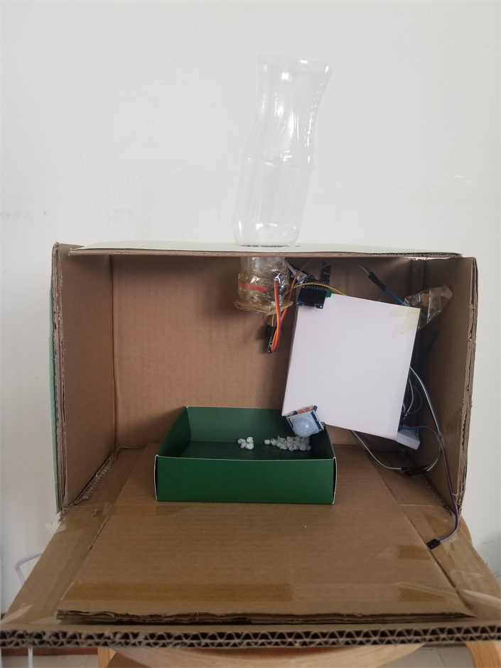
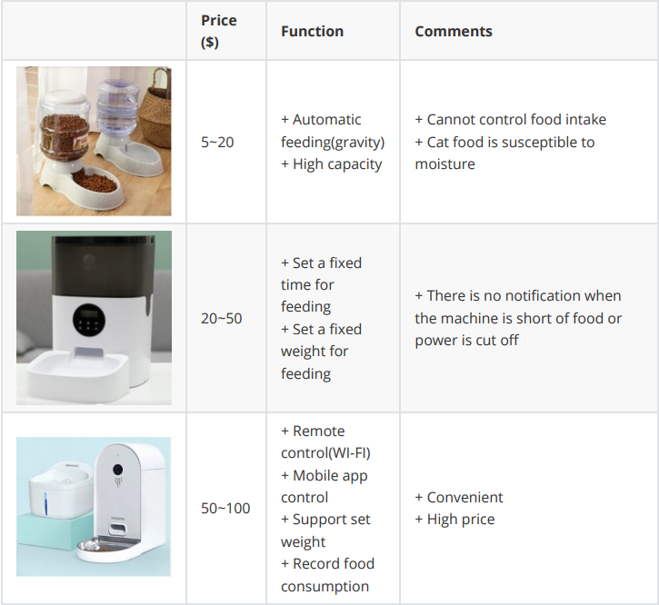
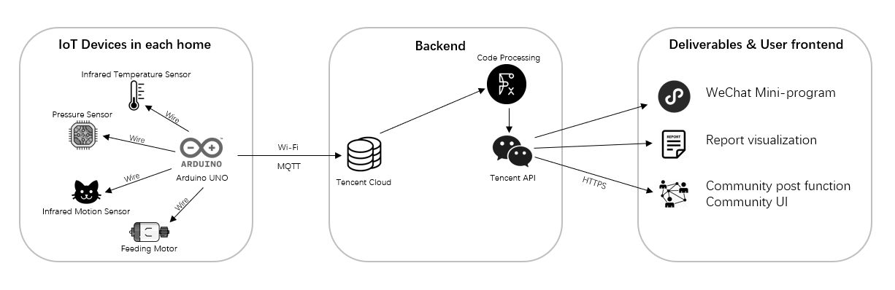
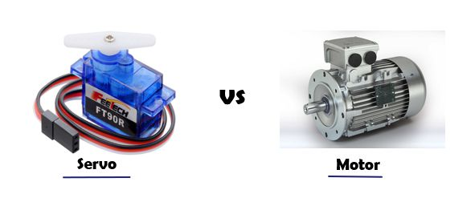
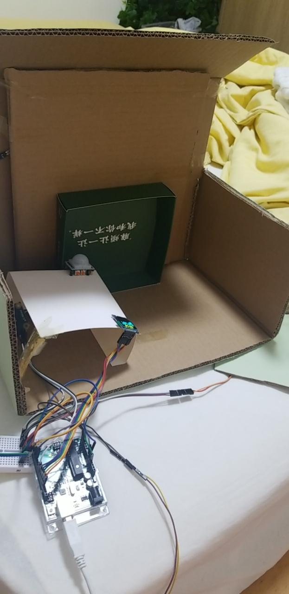
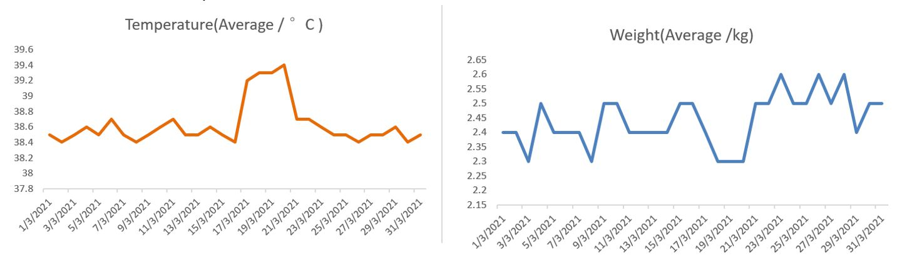
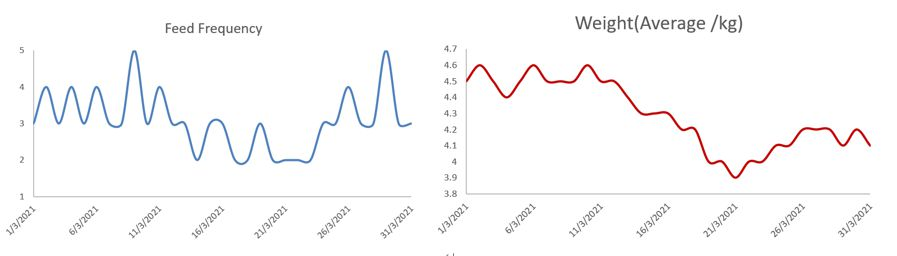
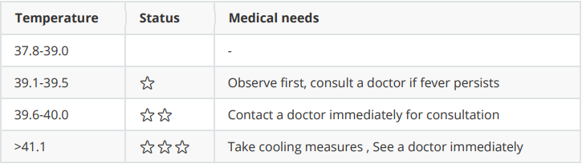
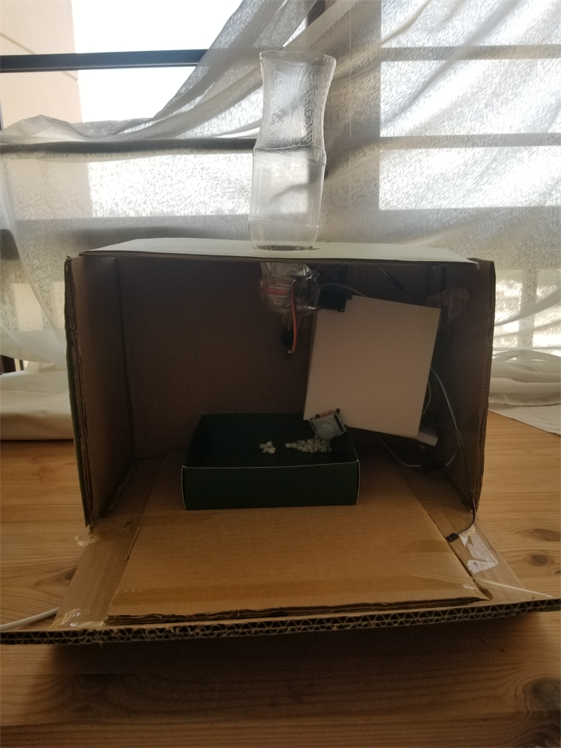

# Introduction

We are team of 6 students from Singapore Management University. This semester we were doing an Internet of Things project on pet foster industry in the past 3 months using the hardware and network knowledge we’ve got.

Our IOT solution helps to remotely feed cat and collect health statue data of cats including cat temperature and weight.


# Problem Statement

One of the worst things a cat lover can experience is the loss of their beloved cat.

When we consider illness and death in cats, one important thing is that cats are very good at hiding their illness as a survival measure, which allows cats to be sick for a long time before anyone is aware. This can be especially true for those who spend daytime with their cat and don’t notice subtle changes like weight loss, shedding, sleeping more, or a dull hair coat. As our cats get older, we may believe that symptoms such as weight loss, less activity, and/or lethargy are from them slowing with age rather than from an illness.

In addition, eating disorders may also have bad effect on cats’ health. Obesity in pet cats is a growing problem. Obesity in pet cats not only affects their appearance and animal welfare, but the extra weight and excess fat can also lead to many health risks like liver disease, diabetes,
breathing disorders, pain from physical exertion and even shorten the life of pets. Moreover, household pet cat breeding has become more refined in recent years, and owners have become more aware of the relationship between their cats' eating habits and their weight. Another eating disorder, a loss of appetite, can come from medication, diabetes, kidney disease, pancreatitis, gastrointestinal issues, immune disease, cancer, exposure to toxic substances, stress, or changes in the environment or food among other things.

It is urgently for cats to have health monitoring to track their statues, which ensure their safety from time to time.

# Are Existing Solutions Sufficient?

Cat feeder as a way to save owners who can't feed their cats at home every day, has been invented these years. There are actually 3 main kinds of feeding machine, including automatic gravity machine, automatic feeding machine and smart feeding machine. But what they have done so far?

Although gravity device is pretty easy to serve, the food would constantly fall in tray for cats to eat, which would cause obesity. Also the food exposed become moldy which is unhealthy to eat. Another thing is that it doesn’t record the food cats have eat accurately.

The automatic machine works better than previous one as it feed cats in fixed amount and fixed time, while no exception of extra need could be detected.

The smart one would definitely address these problems like recording intake, allowing remote control. And part of our solution would cover these either while we also include other unique function of health detection.



The owner will inevitably care about the safety and health of the pets at home while working while It is troublesome to take the temperature and weight of cat on a daily basis.

So some pet owners often could not tell cats health state and whether it get overfeed ,underfeedor even get a cold until it is too late as pets can’t speak for themselves. But in current status, There is almost no IOT solution on detecting health state of cats.

With all these factors in mind, we decided to build an IOT device to ‘save’ these ‘left-behind’ cats.

# Stakeholders

**The stakeholder of this product is cat owners.**

As we mentioned before, with increasing social and work pressure, more and more young people living alone choose to keep pets to accompany with them, which greatly eases their loneliness.

The reason they need our device is that they care about the cats left behind about their health.

With our IOT device, cat owners can get the temperature and weight data on a daily basis. Also the feeding process is remotely controlled and accurate food intake is recorded for owners’ reference. The records then could be referred to set future feeding amount.

As long as the product is set at a reasonable price, the cat owners will be glad to accept.

# Solution Design

## Success and acceptance criteria

### Acceptance Criteria:

* System must be able to detect the approaching of the cat within 50cm

* System must be able to measure the temperature of the cat within 10cm distance and in 5 seconds

* System must be able to measure the weight of the cat in 10 seconds

* Feeding system must be able to react in 10 seconds after user's operation

### Success Criteria:

* This product must be able to acquire 10,000+ new users in 1 month after its launch

* The use community must have 1,000+ daily active users

* A 3% - 5% increase of users base is expected at the end of each season

* Auto-generated reports must have at least 70% accuracy in average

## Assumptions, constraints and dependencies

### Assumptions:

* Pet keepers will bring along their mobile phone and keep it Internet-connected

* System will not be powered off

* Infrared temperature sensor is able to give temperature readings in 5 seconds

* Infrared sensor is able to detect the moving at a sensitive level

* Pressure sensor is connected with data transform module well and it is able to transfer weight readings

### Constraints:

* Total cost of the IoT prototype cannot be more than SGD 300

* Remote cat feeding and caring system will not affect cat's normal life

* The whole system should be able to be run on battery for at least 24 hours

* The total number of power plugs required to install all the devices in the house cannot exceed 5

### Dependencies:

* Database must be set up before sensor data can be transmitted to the backend

* IoT gateway must be set up and connected to Wi-Fi before the sensor data can be acquired and sent to the backend

* Wechat mini-programme should be developed and user community should set up before the user can share reports at that platform

## System architecture


At the device-end, we have infrared motion sensor to detect the cat’s approach, infrared temperature sensor to measure the cat’s temperature, pressure sensor to measure the cat’s weight, and feeding servo to control the feeding process and feeding amount. All of these sensors are connecting to the Arduino main-chip by wires. Arduino UNO is working like a central processor to monitor all sensors. After that, the Wi-Fi module connected to Arduino will upload collected data to Tencent Cloud. After processing, data will be sent to WeChat mini-program which is our frontend. For MVP, we only have the WeChat mini-program platform which can
present a simple report of cat’s temperature and weight readings. For a mature business product, we will add some advanced features into it, such as report auto-analysis, report visualization and user community.

## Sensor Modalities


## Module Selections

### Main-chip Selection

In our project, we chose Arduino UNO as the main-chip rather than others, such as Micro:bit, Raspberry PI, etc. due to the following advantages:

* Functionality

Arduino product is very friendly and widely used for entry level learners. It has a lot of pinport and be able to connect various modules.

* Feasibility

Although Arduino UNO is relatively large, if we would like to combine all parts in a certain limited space to make it as a mature product, we are able to transfer the entire code to a smaller chip like [Arduino Micro](https://www.arduino.cc/en/main/products), [Arduino Nano](https://www.arduino.cc/en/main/products).

* Programmability

Arduino is easier to code and it provides some supporting software as well, like BLYNK.

* Community

Arduino has a mature user community and provides plenty of support information and
problem solutions, it’s easier for beginners to learn and debug.

* Affordability

By considering the cost, Arduino is not expensive, but the computational capability is not bad.

### Servo vs Motor



For the feeding engine, we chose servo rather than motor because motor needs to have a relay in the circuit to increase the pick-up current. Secondly, by considering project-based requirement, we need to control the amount of food to feed cat at each time. Servo is able to be set to rotate to a certain angle then roll back.

## Arduino Codes

First thing to do is setup the Arduino environment and all pin ports.

```{c eval=FALSE}
#include <Wire.h>//Use Wire library
#include <Adafruit_GFX.h>//Use Adafruit_GFX.h library
#include <Adafruit_SSD1306.h>//Use Adafruit_SSD1306.h library
#include "dht11.h"
#include <MsTimer2.h> //Time-clock Library 
#include <Servo.h>  //Arduino IDE Servo library

//define Servo inout
#Define Servo_Pin      5                   
//press value pin
int fsrPin = 14;     // A0 port
int fsrReading;

//display value pin
const uint8_t OLED_CS = 9;
//Define OLED 12864 CS port to arduino 9
const uint8_t OLED_DC = 10; 
//Define OLED 12864 DC port to arduino 10
const uint8_t OLED_RESET = 11;
//Define OLED 12864 RES port to arduino 11
const uint8_t OLED_MOSI = 12;
//Define OLED 12864 D1(MOST) port to arduino 12
const uint8_t  OLED_CLK = 13;
//Define OLED 12864 D0(CLK) port to arduino 13
Adafruit_SSD1306 display(OLED_MOSI, OLED_CLK, OLED_DC, OLED_RESET, OLED_CS);


//movement test
int Move_Sensor_pin = 8;

//Temperature
int incomingByte = 0;                    
// Receive data byte
String inputString = "";                 
// Store  data byte
boolean newLineReceived = false;         
// Last data end flag
boolean startBit  = false;               
//protocol Start sign
String returntemp = "";           
//Store return value
char temp[100] = {0};

//motuo
Servo myservo;      
//Define the servo object myservo
/*printfFormat string initialization*/
int serial_putc( char c, struct __file * )
{
  Serial.write( c );
  return c;
}
void printf_begin(void)
{
  fdevopen( &serial_putc, 0 );
}


```

Following code chunk is the main part.

```{c eval=FALSE}
void setup(void) {
  //common
  Serial.begin(9600);
  
  //movement
  pinMode(Move_Sensor_pin,INPUT);
  //Set the infrared interface of the human body to the input state

  //display
  display.begin(SSD1306_SWITCHCAPVCC);
  //initialization OLED 12864
  display.clearDisplay();   // Clean screen
  display.setTextSize(2);   //Set word font to 2
  display.setTextColor(WHITE);//Set word color to white
  display.setCursor(0,0);   //Position the cursor in column 0, row 0
  display.print("  SMU-IoT");//Display characters
  display.setCursor(0,16); 
  display.print("Team03");
  display.setCursor(0,32); 
  display.print("CatYou"); 
  display.setCursor(0,48); 
  display.print("0ighting"); 
  display.display();//Display

  //Temperature
  Wire.begin(0);
  //Wire.begin();         
  //join i2c bus (address optional for master)

  //motuo
  printf_begin();
  //Set the servo control pin to 5
  myservo.attach(Servo_Pin);
  //Initialize the servo position 0
  myservo.write(0);
}
uint16_t result;
float temp1;


void loop(void) {
  Serial.print("run");
  delay(500);
  fsrReading = analogRead(fsrPin); //heavy
  delay(2000);
  display.clearDisplay();
  display.setCursor(0,0); //Position the cursor in column 0, row 0
  display.print("  SMU-IoT");//Display characters
  display.setCursor(0,16); 
  display.print("presre "); display.print(fsrReading);
  Serial.print(fsrReading);
  
  Wire.beginTransmission(0x5A);
  Wire.write(0x07);                // sends instruction byte
  Wire.endTransmission(false);     // stop transmitting
  Wire.requestFrom(0x5A, 3);   //Send data n-bytes read
  result = Wire.read(); //Receive DATA
  result |= Wire.read() << 8; //Receive DATA
  uint8_t pec = Wire.read();
  temp1 =  result*0.02-273.15;  //Temperature value conversion
  Serial.print(temp1);

  float fTemp = temp1;
  display.setCursor(0,32); 
  display.print("Temp "); 
  display.print(fTemp);
  display.display();

  while (newLineReceived)// and digitalRead(Move_Sensor_pin)>0
  { 
    Serial.print("run1");
    delay(500);
    while(inputString.indexOf("SERVO") == 1)
      //If the string value "SERVO" to be retrieved appears
       {//$SERVO,90# 
       int i = inputString.indexOf("#",7);  
      //Retrieve the position of the character string "#" from the received data starting with 7
       if(i > 0)        
         //If retrieved
       {String temp = inputString.substring(7, i);  
         //Extract the characters between the specified subscript 7 to i in the string and assign them to temp
         int Pos = temp.toInt();
         //Convert string temp to integer
         if(Pos >=0 && Pos <= 180)
           //If the angle of the steering gear to be rotated in the received agreement is within 0-180
         {myservo.write(Pos);
           returntemp = "$SERVO,0,#"; 
           //Return matching success
          Serial.print(returntemp);
          //Return protocol packet     
          inputString = "";   
          // clear the string
          newLineReceived = false;}
         else
         { returntemp = "$SERVO,1,#";  
           //Return match failed
            Serial.print(returntemp); 
            //Return protocol packet      
            inputString = "";   
            // clear the string
            newLineReceived = false;
            break;    
         }
       }
       }

        if(inputString.indexOf("SERVO") == -1)  
          //If the string value "TH" to be retrieved does not appear
       {    
           break;}
       }


    while(inputString.indexOf("TH") == 1){
    //int fTemp = (float)DHT11.temperature;
    //fTempAssigned to the temperature value read in floating point type
       //int  weight = DHT11.humidity;
       //iHumidity Assign value to the humidity value read
       Serial.print("run2");
      delay(500);
        fsrReading = analogRead(fsrPin); //heavy
        Wire.beginTransmission(0x5A);
        Wire.write(0x07);                // sends instruction byte
        Wire.endTransmission(false);     // stop transmitting
        Wire.requestFrom(0x5A, 3);   //Send data n-bytes read
        result = Wire.read();        //Receive DATA
        result |= Wire.read() << 8;  //Receive DATA
        uint8_t pec = Wire.read();
        temp1 =  result*0.02-273.15;  //Temperature value conversion
        float fTemp = temp1;
        float weight=fsrReading;  //weightAssigned to the weight read
        Serial.println(fsrReading);
        
       //Parsing switch
       // $TH,1#
       
       memset(temp, 0x00, sizeof(temp));
       //Empty the temp array
       dtostrf(fTemp, 3, 1, temp);  // Equivalent to %3.2f
       String sTemp = temp;
       //The string in the array temp is assigned to sTemp
       String sWt =  "";    
       sWt += weight;
       returntemp = "$TH,T" + sTemp + ",H" + sWt + "#";
       Serial.print(returntemp); //Return protocol packet  
       inputString = "";   // clear the string
       newLineReceived = false;
      
       if(inputString.indexOf("TH") == -1)
         //If the string value "TH" to be retrieved does not appear
       {
       break;} 
      }
}

void serialEvent()
{
  while (Serial.available()) 
  {    
    incomingByte = Serial.read();
    //Read byte by byte, the next sentence is to put the read into the string array to form a completed data packet
    if(incomingByte == '$') 
      //If the serial port receives data, it enters the loop
    {
      startBit= true;
      //If the incoming byte is'$', start reading
    }
    if(startBit == true)
    {
       inputString += (char) incomingByte;     
      // The full-duplex serial port does not need to add a delay below, and half-duplex has to be added
    }  
    if (incomingByte == '#') 
    {
       newLineReceived = true;
      //If the incoming byte is'#', the reading ends
       startBit = false;
    }
  }
}
```

## UI Vedio


## Challenges

### Coding
There are several modules/sensors involved in the product. Coding parts of the collaboration in between different modules and connections with the main-chip is complicated and much time consumption required for debugging.

### Object
The purpose of the project is to build up a remote cat-feeding device. But neither of us is a cat-keeper although we are cat-lovers. Therefore, we lack an object which is a cat to test our MVP.

### Cost
The budget is limited so we have less chance to explore additional features to compete with the current products in the market. Therefore, trade-off decisions should be made during blueprinting of the project.


## Limitations

### Recognition
Currently, this product is only applicable for a single cat per device since it cannot recognize and differentiate more than one cat and record their measurement individually.

### Extendibility
So far, this product is designed to be applicable for cat-feeding merely. This product needs some updates if the user wants it to be applied to other pets or bigger pets, like dogs. A stronger feeding servo, a larger feeding container and more pressure sensors might be required.

### Actionability
For now, there is no react - response relationships in between the motion sensor(approach detection sensor) and WeChat mini-program(control part). Therefore, the user won't know whether the cat is coming by motion sensor directly. But the motion sensor is controlling the start up of pressure sensor and temperature sensor, user is able to know the cat's approach by receiving temperature and weight readings. For further development, a camera module can be applied to improve the cat's recognition and approach detection precision.

## Insights of Data Analysis
We conducted data simulations by consulting cat owners and inquiring about relevant data analysis.

Firstly, when the cat's body temperature is higher than normal, the body weight and food intake tend to decrease.

We used this device to feed and record the state of health of the cat for a month. The weekly statistical data seems stable, but the daily temperature had some obvious fluctuations. From March 17th to March 21st , since the body temperature is higher than the cat's average body temperature, it can be inferred that the cat has a fever. Meantime, the cat sleep more and had less interaction with the owner. During this period, the cat's weight and food intake have decreased. During other times, the cat's food intake and body temperature are normal, and the cat's condition is healthy.



Secondly, if the cat's food intake has dropped significantly and the weight has also dropped, the cat may be sick. When this situation persists for more than three days, we will issue an alarm to remind the owner to pay attention to the cat's condition and seek medical treatment in time.





In conclusion , different cats may have different normal temperature.

We set the alarm threshold for abnormal cat temperature as 39.2℃ according to the figure below. However, the body temperature of kittens may be higher. Also, through this experiment, we found individual differences in cats, so this critical temperature should be manually adjusted according to different ages and breeds of cats.

In summary, our data measurement has a high degree of accuracy. It can monitor and record the cat's abnormal condition, even the small abnormality, so that the cat feeder can realize the cat's physical discomfort in time.

# Learnings and Discussions



The key words we got from this project are motivational and solution fit. As a project involve both technology and non-tech parts. The original idea of the key point was solution deployment, but it is equally critical to address the needs of users according to meaningful feedback from
instructors. It is important to identify stakeholders and corresponding problems that exist to address accordingly. It highlights the problem identification part, which took us much time on adjusting prototype design. This kind of work worried us a lot at first. Additionally, as specialties of
different members in our team are diverse, the division and collaboration are another point of our project. With clear allocation, the technique part and non-tech part are properly finished by 2 subgroups.

But as the limitation of time, we could not do detailed market investment though it is strongly needed for commercial product.

Though with the limitations of time and budget, we complete the project with great achievement. We like to thank for the meaning guidance and timely feedback and follow-up of prof and Instructors to help us design and complete project in organized way. May our product would provide cats and owners with a more comfortable life.


