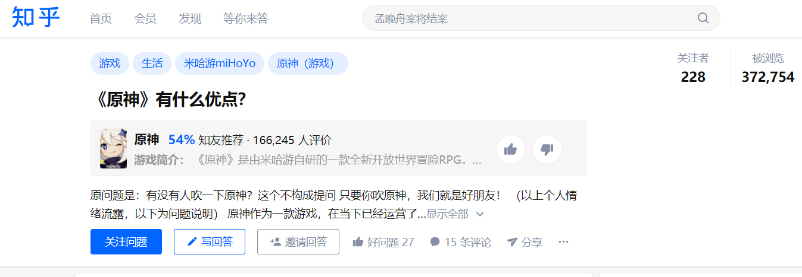
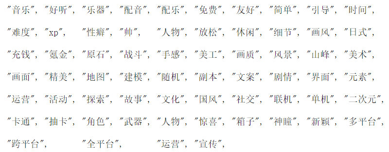

# 1 Introduction

Genshin Impact is a popular game. Since its public testing, the number of players and the cash flow within the game has repeatedly hit history records. In order to find what's the factors which players care about most, I download players' answers about ["What are the advantages of 'Genshin Impact'?"](https://www.zhihu.com/question/437377838) from Zhihu in text format. And I will extract data from the text by Python and visualize the result by R.



# 2 Python process step

## 2.1 Import data from text file

```{python eval=FALSE}
with open('data/advantage.txt',encoding="utf8") as f:
    text=f.read()
```
## 2.2 Extract key word from the feedback

You could add keywords in keywords.text. If you want to run in Rmarkdown, due to the length limit, you have to split the keywords into 2 texts. You could take a glimpse of all the keywords below.

```{python eval=FALSE}
# Following code for Python
with open('data/keywords.txt',encoding="utf8") as f:
    keywords=f.read().split()
    
    
# Following code for R  only
with open('data/keywords1.txt',encoding="utf8") as f:
    keywords1=f.read().split()
with open('data/keywords2.txt',encoding="utf8") as f:
    keywords2=f.read().split()
count=0
for i in keywords1:
  print("\"",i,"\"",",",sep="",end="\t")
  count+=1
  if count>9:
    count=0
    print("\n")
for i in keywords2:
  print("\"",i,"\"",",",sep="",end="\t")
  count+=1
  if count>9:
    count=0
    print("\n")

```


## 2.3 Count the number of occurrences of keywords

This counting for keywords function is realized by re package in Python. I store the result in DataFrame by Pandas. It could let me much easy to convert the output to csv file for R to analysis.

```{python eval=FALSE}
import re
import pandas
DataTable = pandas.DataFrame(columns=['keywords','num'])
count=0
for i in range(len(keywords)):
    temp=re.findall(r'{}'.format(keywords[i]),text)
    DataTable.loc[i]=[keywords[i], len(temp)]
```
## 2.4 Output by Python

Since our result have Chinese words, you need to change the saving setting to "utf_8_sig".

```{python eval=FALSE}
DataTable.to_csv("result.csv",encoding="utf_8_sig",index=False)
```
# 3 Visualize result by R

## 3.1 Install packages and import data

Thanks to python, now we could use R to make our data vivid. In my opinion, it's a good idea to visualize the result by WordCloud graph. First, we could take a look at our data by DT package.

```{r warning=FALSE}
packages=c('tidytext','widyr','wordcloud','DT','ggwordcloud',
           'textplot','lubridate','tidyverse','tidygraph','ggraph','igraph')
for (p in packages){
  if(!require(p,character.only=T)){
    install.packages(p)
  }
  library(p,character.only = T)
}

keywords=read_csv("data/result.csv")
DT::datatable(keywords)
```

## 3.2 WordCloud graph

You could observe the result from following graph. The bigger word size it is, the more frequent that word appears. Thus, you could know what did the players mention more in the Zhihu, to explain why Genshin Impact is a good game/ why they enjoy this game..

```{r}
wordcloud(keywords$keywords,
          keywords$num)

```

## Limitation

Since this time I do not have much time to do this project, I only collect data from Zhihu Platform. Thus, this result could not represent all players in Genshin Impact. In the future, I could write a Incremental Web Crawler by Python to get more information on each communication platform. So I could draw a more convening result from my observation.

